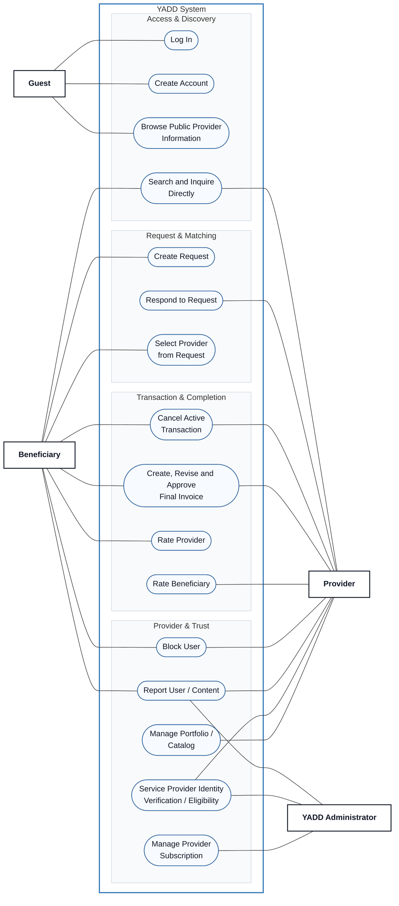

# Use Case View 00 — YADD Main Overview

> **Status:** `REVIEW DRAFT — NOT BASELINED — SYNCHRONIZED THROUGH DEC-090`
>
> **Purpose:** High-level overview of the single YADD Use Case Model. Detailed `<<include>>`, `<<extend>>`, lifecycle and precondition semantics are intentionally delegated to focused Views 01–04.

## Source basis

- `docs/00-governance/02-decision-register.md`
- `docs/03-analysis/08-use-cases.md`
- `docs/03-analysis/10-UML.md`
- DEC-066..090, especially DEC-067/072/077/078/085/086/087/088/089/090.

## Diagram

## Reading note

This overview answers only two questions: **Who interacts with YADD?** and **What major goals does each Actor have?** It intentionally avoids relationship-level detail so the diagram remains readable at repository and report scale.

`Block User` and `Report User / Content` remain separate Use Cases because the current model explicitly treats blocking and reporting as independent concepts.