# Use Case View 00 — YADD Main Overview

> **Status:** `REVIEW DRAFT — NOT BASELINED — SYNCHRONIZED THROUGH DEC-077`
>
> **Purpose:** High-level overview of the single YADD Use Case Model. Detailed `<<include>>`, `<<extend>>`, lifecycle and precondition semantics are intentionally delegated to the detailed view below and the focused Views 01–04.

## Source basis

- `docs/00-governance/02-decision-register.md`
- `docs/03-analysis/08-use-cases.md`
- `docs/03-analysis/10-UML.md`
- DEC-066..077, especially DEC-067/072/077.

## Main Overview Diagram

## Reading note

This overview answers only two questions: **Who interacts with YADD?** and **What major goals does each Actor have?** It intentionally avoids relationship-level detail so the diagram remains readable at repository and report scale.

`Block User` and `Report User / Content` remain separate Use Cases because the current model explicitly treats blocking and reporting as independent concepts.

---

# Detailed Main Use Case View

> **Status:** `REVIEW DRAFT — NOT BASELINED — DETAILED MAIN VIEW — SYNCHRONIZED THROUGH DEC-077`
>
> **Purpose:** Detailed Actor–goal expansion of the same YADD Use Case Model shown above. This view preserves the decomposed Main Diagram Use Cases and the approved/derived UML relationships currently documented in `08-use-cases.md`.
>
> **Visual convention:** The detailed Mermaid view follows the academic reference layout: external Actors are distributed around the system boundary. Guest/Beneficiary are kept on the left, Provider/Administrator on the right, and Provider specializations remain close to Provider. Invisible internal lanes are used only to control layout; they are not model elements.

## Detailed source basis

- `docs/00-governance/02-decision-register.md`
- `docs/03-analysis/05-SRS.md`
- `docs/03-analysis/06-business-rules.md`
- `docs/03-analysis/07-lifecycles.md`
- `docs/03-analysis/08-use-cases.md`
- `docs/03-analysis/10-UML.md`
- DEC-066..077, especially DEC-067/069/070/071/072/073/074/076/077.

## Detailed Diagram

```mermaid
%%{init: {"flowchart": {"curve": "linear", "nodeSpacing": 26, "rankSpacing": 34, "htmlLabels": true}}}%%
flowchart LR

    subgraph LEFT_ACTORS[" "]
        direction TB
        G2["Guest"]:::actor
        B2["Beneficiary"]:::actor
    end

    subgraph SYS2["YADD System — Detailed View"]
        direction LR

        subgraph BENEFICIARY_LANE[" "]
            direction TB
            LOGIN2(["Log In"]):::usecase
            REGISTER2(["Create Account"]):::usecase
            BROWSE2(["Browse Public Content"]):::usecase
            SEARCH2(["Search Providers"]):::usecase
            PROFILE2(["View Provider Profile"]):::usecase
            VIEW_PORTFOLIO2(["View Portfolio / Catalog"]):::usecase
            MANAGE_ACCOUNT2(["Manage Account"]):::usecase

            CREATE_REQ2(["Create Request"]):::usecase
            CLOSE_REQ2(["Close Open Request"]):::usecase
            COMPARE2(["Compare Provider Responses"]):::usecase
            SELECT2(["Select Provider"]):::usecase

            REVIEW_INV2(["Review Final Invoice"]):::usecase
            APPROVE_INV2(["Approve Final Invoice"]):::usecase
            REQUEST_REV2(["Request Invoice Revision"]):::usecase
            COMPLAINT2(["Raise Transaction Complaint"]):::usecase
            RATE_PROVIDER2(["Rate Provider"]):::usecase
        end

        subgraph SHARED_LANE[" "]
            direction TB
            CHAT2(["Communicate / Inquire"]):::usecase
            REQUEST_START2(["Request Transaction Start"]):::usecase
            CONFIRM_START2(["Confirm Transaction Start"]):::usecase
            CREATE_TX2(["Create Active Transaction"]):::systemuc
            CANCEL_TX2(["Cancel Transaction"]):::usecase
            COMPLETE_TX2(["Complete Transaction"]):::systemuc
            BLOCK2(["Block User"]):::usecase
            REPORT2(["Report User / Content"]):::usecase
            VALIDATE_RESPONSE2(["Validate Response Eligibility"]):::systemuc
        end

        subgraph PROVIDER_LANE[" "]
            direction TB
            VIEW_MATCHING2(["View Matching Requests"]):::usecase
            SUBMIT_RESPONSE2(["Submit Provider Response"]):::usecase
            EDIT_RESPONSE2(["Edit Provider Response"]):::usecase
            WITHDRAW_RESPONSE2(["Withdraw Provider Response"]):::usecase

            CREATE_INV2(["Create Final Invoice"]):::usecase
            REVISE_INV2(["Revise Final Invoice"]):::usecase
            RATE_BENEFICIARY2(["Rate Beneficiary"]):::usecase

            MANAGE_PROFILE2(["Manage Provider Profile"]):::usecase
            MANAGE_PORTFOLIO2(["Manage Portfolio / Catalog"]):::usecase
            SERVICE_AREAS2(["Manage Service Areas"]):::usecase
            SUBMIT_VERIFICATION2(["Submit Verification"]):::usecase

            REVIEW_VERIFICATION2(["Review Provider Verification"]):::usecase
            SUBSCRIPTION2(["Manage Provider Subscription"]):::usecase
            REVIEW_REPORTS2(["Review Reports / Flags"]):::usecase
            REVIEW_COMPLAINT2(["Review Transaction Complaint"]):::usecase
        end
    end

    subgraph RIGHT_ACTORS[" "]
        direction TB
        A2["YADD Administrator"]:::actor
        P2["Provider"]:::actor
        SP2["Service Provider"]:::actor
        PP2["Product Provider"]:::actor
    end

    %% Layout anchors: invisible only
    G2 ~~~ LOGIN2
    B2 ~~~ CREATE_REQ2
    REVIEW_VERIFICATION2 ~~~ A2
    MANAGE_PROFILE2 ~~~ P2

    %% Guest associations — left side
    G2 --- LOGIN2
    G2 --- REGISTER2
    G2 --- BROWSE2
    G2 --- SEARCH2
    G2 --- PROFILE2
    G2 --- VIEW_PORTFOLIO2

    %% Beneficiary associations — left side
    B2 --- MANAGE_ACCOUNT2
    B2 --- SEARCH2
    B2 --- PROFILE2
    B2 --- CREATE_REQ2
    B2 --- CLOSE_REQ2
    B2 --- COMPARE2
    B2 --- SELECT2
    B2 --- REVIEW_INV2
    B2 --- APPROVE_INV2
    B2 --- REQUEST_REV2
    B2 --- COMPLAINT2
    B2 --- RATE_PROVIDER2
    B2 --- CHAT2
    B2 --- REQUEST_START2
    B2 --- CONFIRM_START2
    B2 --- CANCEL_TX2
    B2 --- BLOCK2
    B2 --- REPORT2

    %% Provider associations — right side (use-case first keeps Provider on the right)
    MANAGE_ACCOUNT2 --- P2
    CHAT2 --- P2
    REQUEST_START2 --- P2
    CONFIRM_START2 --- P2
    CANCEL_TX2 --- P2
    BLOCK2 --- P2
    REPORT2 --- P2

    VIEW_MATCHING2 --- P2
    SUBMIT_RESPONSE2 --- P2
    EDIT_RESPONSE2 --- P2
    WITHDRAW_RESPONSE2 --- P2
    CREATE_INV2 --- P2
    REVISE_INV2 --- P2
    RATE_BENEFICIARY2 --- P2
    MANAGE_PROFILE2 --- P2
    MANAGE_PORTFOLIO2 --- P2
    SERVICE_AREAS2 --- P2
    SUBMIT_VERIFICATION2 --- P2

    %% Administrator associations — upper/right side
    REVIEW_VERIFICATION2 --- A2
    SUBSCRIPTION2 --- A2
    REVIEW_REPORTS2 --- A2
    REVIEW_COMPLAINT2 --- A2

    %% Provider actor specialization
    SP2 -. "«generalization»" .-> P2
    PP2 -. "«generalization»" .-> P2

    %% Approved / derived extend relationships
    PROFILE2 -. "«extend»" .-> SEARCH2
    VIEW_PORTFOLIO2 -. "«extend»" .-> PROFILE2
    CHAT2 -. "«extend»" .-> PROFILE2
    CHAT2 -. "«extend»" .-> COMPARE2
    SELECT2 -. "«extend»" .-> COMPARE2
    SUBMIT_RESPONSE2 -. "«extend»" .-> VIEW_MATCHING2
    REQUEST_START2 -. "«extend»" .-> CHAT2
    APPROVE_INV2 -. "«extend»" .-> REVIEW_INV2
    REQUEST_REV2 -. "«extend»" .-> REVIEW_INV2
    COMPLAINT2 -. "«extend»" .-> REVIEW_INV2

    %% Approved / derived include relationships
    SUBMIT_RESPONSE2 -. "«include»" .-> VALIDATE_RESPONSE2
    SELECT2 -. "«include»" .-> CREATE_TX2
    CONFIRM_START2 -. "«include»" .-> CREATE_TX2
    APPROVE_INV2 -. "«include»" .-> COMPLETE_TX2

    classDef actor fill:#FFFFFF,stroke:#111827,stroke-width:1.8px,color:#111827,font-weight:bold;
    classDef usecase fill:#FFFFFF,stroke:#3F6FA5,stroke-width:1.35px,color:#111827;
    classDef systemuc fill:#FFF8E6,stroke:#B7791F,stroke-width:1.35px,color:#111827;

    style SYS2 fill:#FFFFFF,stroke:#2F75B5,stroke-width:2.4px
    style LEFT_ACTORS fill:transparent,stroke:transparent
    style RIGHT_ACTORS fill:transparent,stroke:transparent
    style BENEFICIARY_LANE fill:transparent,stroke:transparent
    style SHARED_LANE fill:transparent,stroke:transparent
    style PROVIDER_LANE fill:transparent,stroke:transparent
```

## How to read the detailed view

- `Guest` and `Beneficiary` are positioned outside the **left** side of the YADD boundary.
- `Provider` and `YADD Administrator` are positioned outside the **right** side, matching the supplied academic reference style.
- `Service Provider` and `Product Provider` remain close to `Provider` because they are Actor specializations.
- Solid lines are Actor associations. Their direction in Mermaid is used only to keep Actors on the intended side; it does not add behavioral direction to the UML association.
- Dashed `«extend»` and `«include»` relationships preserve the current approved/derived model relationships.
- Gold Use Cases are included system behavior and are **not independent Actor goals**.

## Authentication boundary

`Log In` and `Create Account` are **not** mechanically included by every protected Use Case. Authentication is a precondition for protected Beneficiary/Provider goals. A Guest may see a protected CTA, but must authenticate before the protected action can be executed.

## Lifecycle / state dependencies that are intentionally not `include` or `extend`

| Use Case | Required dependency / precondition |
|---|---|
| `Rate Provider` | Transaction must already be `Completed`; the Beneficiary rating is then required by the current model. |
| `Rate Beneficiary` | Transaction must already be `Completed`; the Provider rating remains optional. |
| `Cancel Transaction` | Transaction exists and is in a cancellable active state. |
| `Close Open Request` | Request is `Open` and no Provider has been selected. |
| `Edit Provider Response` | An active response exists; Request remains `Open`; no Provider has been selected. |
| `Withdraw Provider Response` | An active response exists; Request remains `Open`; no Provider has been selected. |
| `Review Final Invoice` | Final Invoice is `Pending Customer Approval`. |
| `Revise Final Invoice` | Beneficiary previously requested an invoice revision. |
| `Review Provider Verification` | A verification submission exists. |
| `Review Transaction Complaint` | A Transaction complaint exists. |
| `Submit Provider Response` | Provider is Verified, Subscription is Active and Request is Open; the mandatory eligibility check is modeled by `Validate Response Eligibility`. |

## Coverage note

The detailed diagram is an **expansion of the overview above**, not a replacement and not a separate model. The three transparent internal lanes exist only to create a balanced Mermaid layout: Beneficiary-oriented Use Cases are closer to the left boundary, shared interactions stay central, and Provider/Administrator Use Cases stay closer to the right boundary.