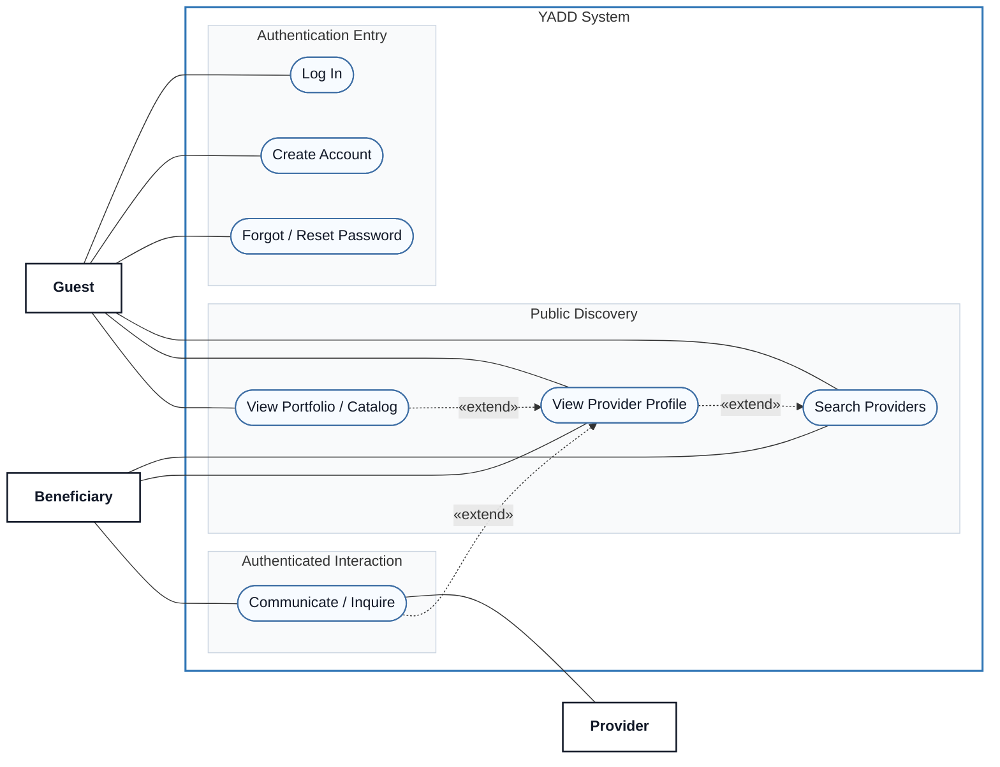

# Use Case View 01 — Public Access & Discovery

> **Status:** `REVIEW DRAFT — NOT BASELINED — SYNCHRONIZED THROUGH DEC-091`
>
> **Purpose:** Focused view of Guest/public discovery, authentication entry points and authenticated direct inquiry.

## Source basis

- `UC-00 — Browse Public Provider Information`
- `UC-01 — Search and Inquire Directly`
- `UC-10 — Manage Portfolio / Catalog` (public viewing aspect only)
- DEC-036/046/064/077/078/080
- Approved relationship table in `docs/03-analysis/08-use-cases.md`.

## Diagram

## Semantic constraints

- Guest may search, open the public Provider Profile and view public Portfolio/Catalog content.
- Public Provider Profile excludes phone/direct private-contact data and sensitive Verification, Subscription, Transaction and Report data.
- `Communicate / Inquire` requires an authenticated user. A Guest attempting a protected CTA is redirected to `Log In` or `Create Account`.
- Authentication is a **precondition**, not an `<<include>>` relationship.
- Returning users may use `Forgot / Reset Password`: phone OTP is primary; verified Email may be an additional recovery channel. No Username, security questions, invented OTP lifetime, resend limit or lockout threshold is introduced.
- **Location UI synchronization:** public search exposes Neighborhood to the user; District is derived internally from the selected Neighborhood.
- The three `<<extend>>` relationships shown above are the approved relationships from the current Use Case model.
