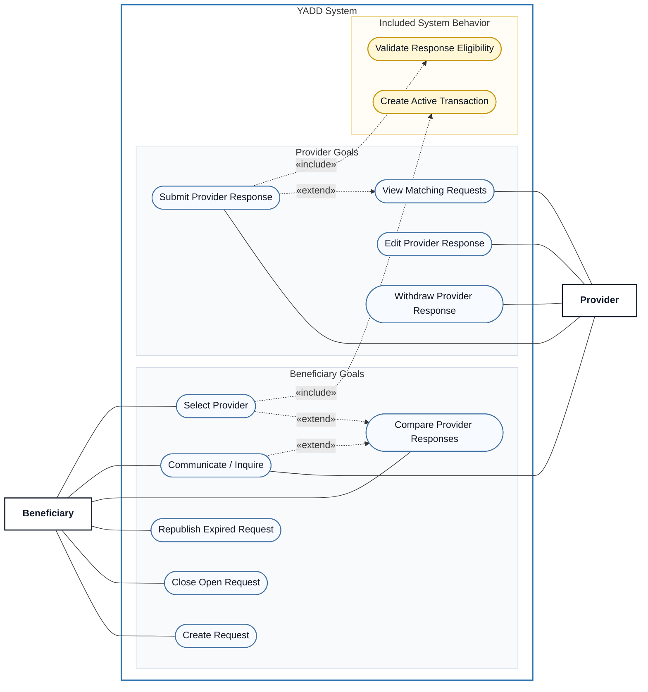

# Use Case View 02 — Request & Provider Response

> **Status:** `REVIEW DRAFT — NOT BASELINED — SYNCHRONIZED THROUGH DEC-090`
>
> **Purpose:** Focused view of the published Request route from request creation through Provider Responses, comparison and Provider selection.

## Source basis

- `UC-02 — Create Request`
- `UC-03 — Respond to Request`
- `UC-04 — Select Provider from Request`
- DEC-013/014/041/043/047/066/070/077/081/082/085/086
- Approved relationship table in `docs/03-analysis/08-use-cases.md`.

## Diagram

## Semantic constraints

- Request Closure is allowed before Provider selection and is not Transaction Cancellation.
- A Provider may keep only one active Provider Response per Request.
- `Edit Provider Response` and `Withdraw Provider Response` require an existing active response, an `Open` Request and no selected Provider.
- `Validate Response Eligibility` is mandatory for a new Provider Response and enforces type-specific eligibility + Active Subscription + Open Request. SERVICE requires Identity Verified; PRODUCT does not require Government-ID verification.
- `Select Provider` always creates one Active Transaction for the selected Provider and closes the Request to new responses.
- `Communicate / Inquire` before selection is optional and therefore extends comparison rather than being required by it.

## DEC-081/082/085/086 synchronization

- Request inactivity: reminders at 24h/48h and Expired at 72h; meaningful Beneficiary activity resets the clock, Provider Response arrival alone does not; Republish creates a new editable Request and never reopens the expired one.
- User-facing Request location uses Neighborhood only; District is derived internally from the selected Neighborhood.
- Provider Response has no independent expiry; it ends with Withdraw/Selection/Request Close/Expiry.
- Submit Provider Response eligibility is type-specific: SERVICE requires Identity Verified; PRODUCT requires Account/Profile eligible; both require Active Subscription.
