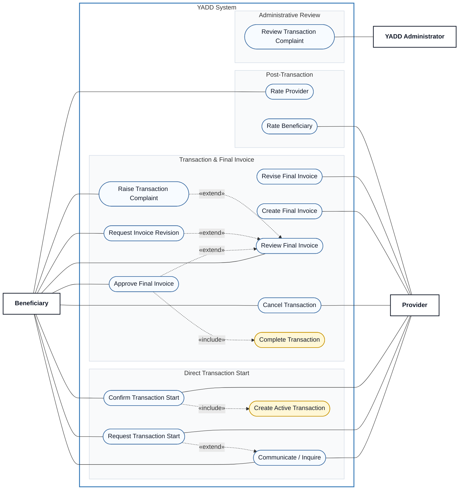

# Use Case View 03 — Transaction, Invoice & Rating

> **Status:** `REVIEW DRAFT — NOT BASELINED — SYNCHRONIZED THROUGH DEC-091`
>
> **Purpose:** Focused view of direct Transaction start, cancellation, Final Invoice review/revision/approval, complaint handling and post-transaction ratings.

## Source basis

- `UC-01 — Search and Inquire Directly` (transaction-start portion)
- `UC-05 — Cancel Active Transaction`
- `UC-06 — Create, Revise and Approve Final Invoice`
- `UC-07 — Rate Provider`
- `UC-07B — Provider Rates Beneficiary`
- DEC-025/046/048/050/051/063/069/071/073/075/077/082/083/084/086/087/088/090/091
- Approved relationship table in `docs/03-analysis/08-use-cases.md`.

## Diagram

## Semantic constraints

- Chat alone never creates a Transaction.
- `Create Active Transaction` occurs only after the other party confirms a transaction-start request in the direct-search route **and** the Provider satisfies current new-interaction eligibility, including Active Subscription under DEC-086.
- `Cancel Transaction` requires an existing Transaction in a cancellable active state.
- `Review Final Invoice` requires a Final Invoice in `Pending Customer Approval`.
- `Revise Final Invoice` requires a previous Beneficiary revision request; this is a precondition, not an `include` / `extend` relation.
- Invoice approval completes the Transaction.
- `Review Transaction Complaint` requires an existing complaint and is an asynchronous administrative goal.
- Administration reviews YADD evidence and platform-policy compliance only; it does not decide Payment, Refund, Compensation or other external financial entitlement.
- `Rate Provider` and `Rate Beneficiary` require `Transaction = Completed`; Beneficiary rating of Provider is required by the current model, while Provider rating of Beneficiary is optional.

## DEC-082/083/084/086/087 synchronization

- Direct Transaction Start confirmation expires after 12h; one pending request per pair.
- Expired Subscription blocks creation of a new Direct Search Transaction until renewal, while Provider Portal access and ongoing Transactions remain available.
- Cancellation is allowed until before invoice approval/Completed.
- Final Invoice reminders at 24h/48h and Overdue at 72h; no Auto-Approval.
- Invoice revisions have no hard maximum; complaint requires reason + description and unresolved complaint ends Disputed.
- Beneficiary→Provider rating is Hybrid with Later/24h reminder and required completion before a new Transaction.
