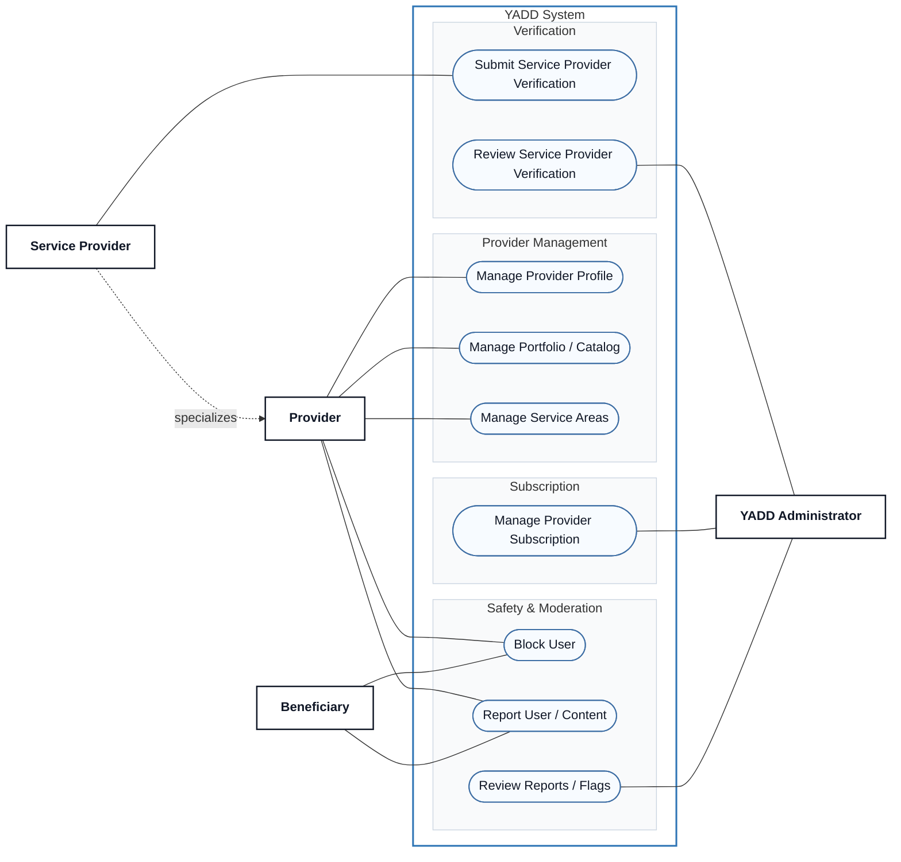

# Use Case View 04 — Provider Management, Verification & Safety

> **Status:** `REVIEW DRAFT — NOT BASELINED — SYNCHRONIZED THROUGH DEC-090`
>
> **Purpose:** Focused view of Provider profile management, verification, subscription administration and safety/report review.

## Source basis

- `UC-08 — Block and Report User / Content`
- `UC-09 — Service Provider Identity Verification / Provider Portal Eligibility`
- `UC-10 — Manage Portfolio / Catalog`
- DEC-010/035..040/042/053/054/064/074/076/077/080/085/086/088/089/090
- Current Provider activity, verification, subscription and trust/safety models.

## Diagram

## Semantic constraints

- Provider Profile is attached to the same User account; it is not a separate account.
- In MVP, a Provider Profile has one Provider Type only: `SERVICE` or `PRODUCT`; one or more categories may be selected within that type.
- `Submit Service Provider Verification` and `Review Service Provider Verification` are separate Actor goals. Government-ID verification applies to Service Provider only; Product Provider does not execute this use case in MVP.
- Final verification decision is human; AI may assist but does not decide independently.
- Provider subscription administration applies to both provider types; current operational period is 30 days, while external payment collection remains outside YADD.
- `Block User` and `Report User / Content` are separate concepts. Block does not break an Active Transaction, and administrative review outcomes follow DEC-089.
- `Review Reports / Flags` is an administrative goal triggered by existing reports/flags, not an extension relationship invented for sequence.
- Guest is intentionally absent from protected Block/Report capabilities because DEC-077 requires authentication for them.
