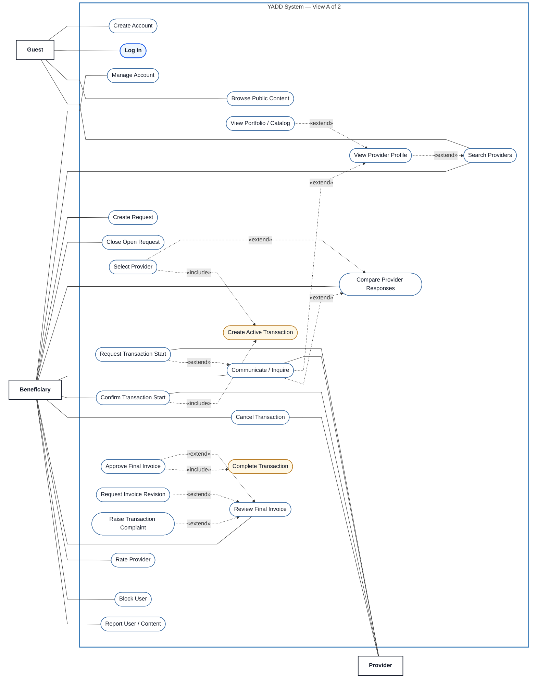

# Preview — YADD Use Case Model — View A of 2

> **Status:** `PROPOSAL / VISUAL PREVIEW — NOT BASELINED`
>
> **Purpose:** Temporary Mermaid preview for human visual review before any adoption into the formal Use Case documentation. This file does **not** replace `00-main-overview.md` and does not change the approved Use Case semantics.
>
> **Focus:** Guest / Beneficiary journey with Provider shown only where interaction is required to understand the same journey.

## Mermaid Preview

## Reading notes

- `Log In` is visually emphasized as the shared anchor intended to align with View B, but Authentication remains a **precondition** for protected actions rather than an automatic `<<include>>` relation.
- `Provider` is intentionally placed on the right edge because View B will continue from the Provider side.
- `Create Active Transaction` and `Complete Transaction` are included system behaviors, not independent Actor goals.
- This preview intentionally connects Actors mainly to principal goals and uses the documented `<<include>>` / `<<extend>>` relations to expose subordinate behavior, following the academic reference style.
- View B is not created yet; this file exists only so the team can judge View A visually in GitHub first.

## Source basis

- `docs/03-analysis/08-use-cases.md`
- DEC-066..077, especially DEC-069/071/072/077.
