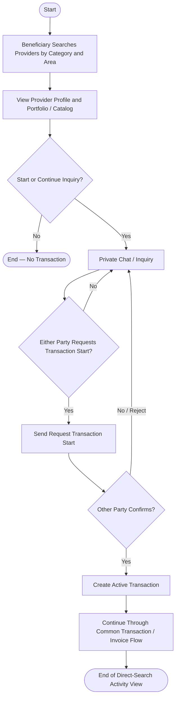

# Activity Diagram — Direct Search Route

> **Status:** `REVIEW DRAFT — NOT BASELINED`
>
> **Type:** Derived workflow view based on `UC-01 — Search and Inquire Directly` and the approved direct-start rules.

## Source basis

- `UC-01 — Search and Inquire Directly`
- `DEC-012`, `DEC-031..033`, `DEC-046`, `DEC-047`, `DEC-064`, `DEC-066`, `DEC-069`
- Current communication and Transaction-start business rules.

## Diagram

## Semantic constraints

- Private Chat by itself never creates a Transaction.
- Either Beneficiary or Provider may request Transaction Start.
- `Active Transaction` is created only after the other party confirms.
- No confirmation or rejection leaves the parties in Chat without a Transaction.
- There is no standalone `Agreement` entity/form in this route.

## Scope boundary

Cancellation, Final Invoice, Complaint, Completion and Ratings are intentionally represented in their common downstream workflows rather than duplicated here.
