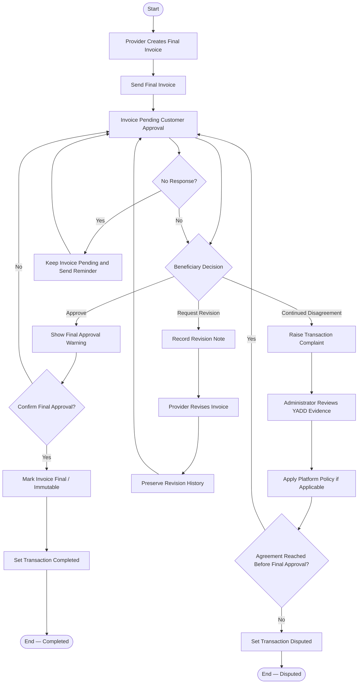

# Activity Diagram — Final Invoice, Revision and Dispute

> **Status:** `REVIEW DRAFT — NOT BASELINED`
>
> **Type:** Derived workflow view focused on the decision-heavy part of `UC-06`.

## Source basis

- `UC-06 — Create, Revise and Approve Final Invoice`
- `DEC-015/016/025/050/055/071/073`
- `BR-009..013` and current dispute rule
- `docs/03-analysis/15-invoice-approval-and-dispute.md`
- Current Invoice and Transaction lifecycles.

## Diagram

## Semantic constraints

- No response is not approval and there is no Auto-Approval.
- Revision may repeat until approval or unresolved dispute.
- Complaint itself does not automatically create `Disputed`.
- Administration reviews platform evidence and applies YADD policy only; it does not decide Payment, Refund, Compensation, or external financial rights.
- `Completed` opens post-transaction ratings in later workflows; `Disputed` does not.
- Long-pending escalation timing remains open and is not invented here.

## Presentation note

هذا الرسم يركز على decision logic للفواتير والنزاع؛ لذلك لا يكرر Create Request أو Provider Selection أو Ratings.
