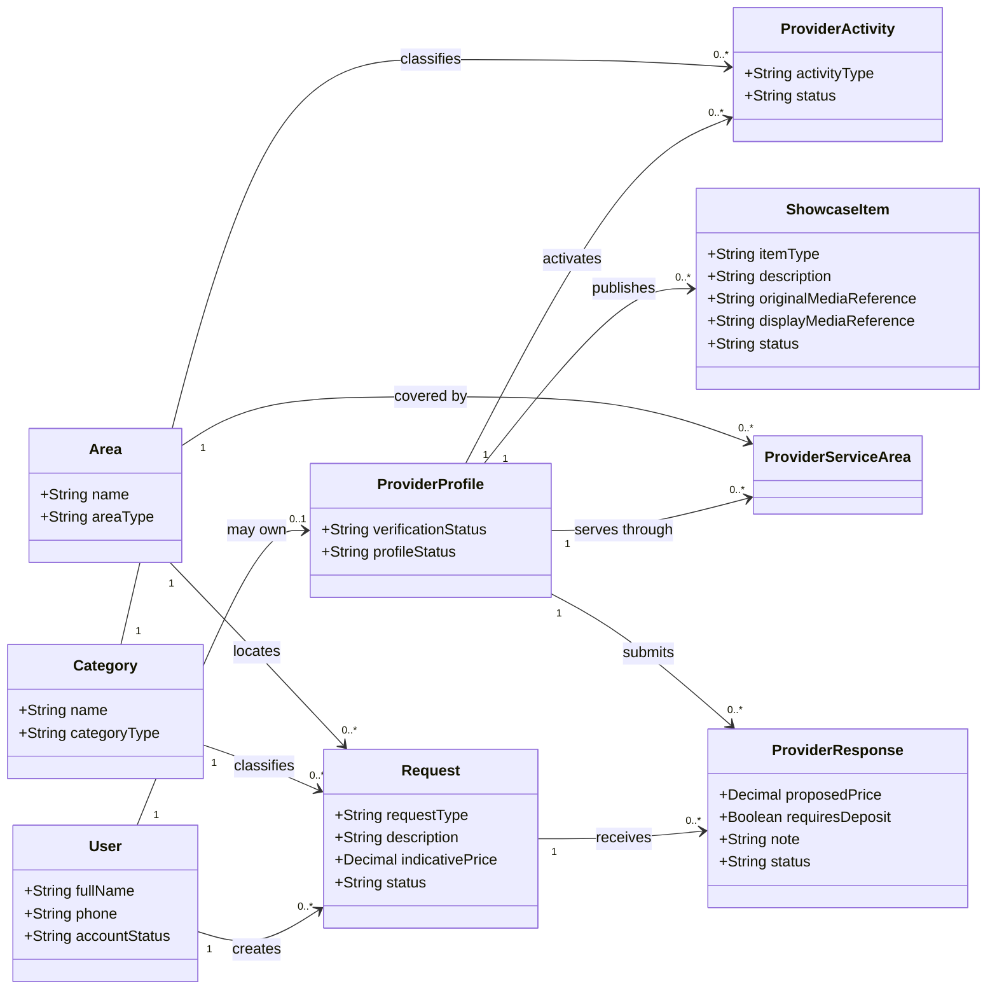
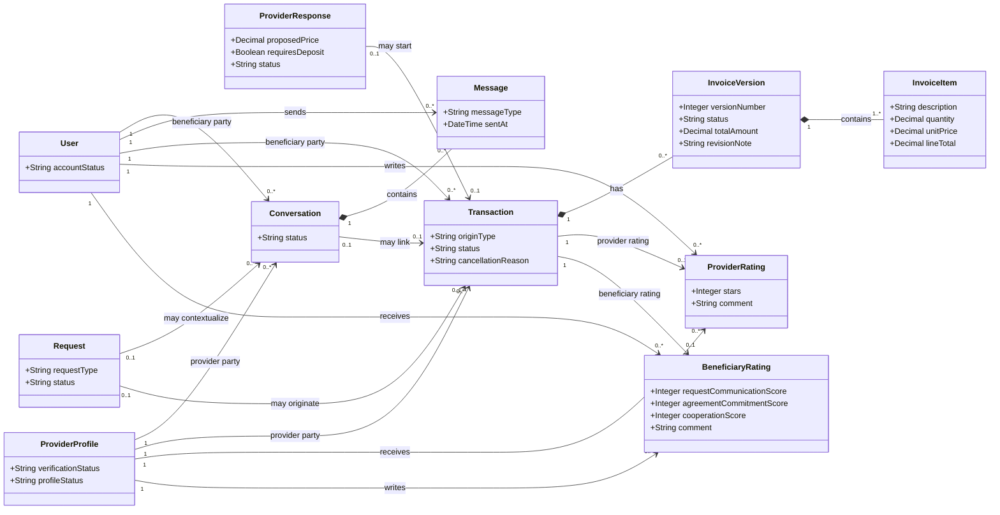
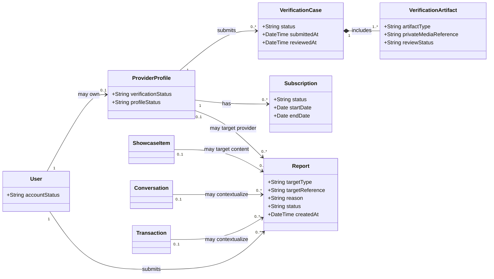

# UML Class Diagram Package — Conceptual Domain Model

> **Status:** `REVIEW DRAFT — NOT BASELINED`
>
> **Purpose:** تحويل الـConceptual ERD الحالي في `docs/03-analysis/11-ERD.md` إلى UML Class Diagram views قابلة للقراءة والمراجعة. هذه الرسومات تمثل **نموذجًا مفاهيميًا واحدًا** مقسمًا إلى Views لأسباب الوضوح وA4، وليست نماذج مستقلة أو قرارات Database Design نهائية.

## Source basis

- **Primary source:** `docs/03-analysis/11-ERD.md` — `DRAFT FOR PRELIMINARY DEFENSE — CORE SYNCHRONIZED 2026-09-05`.
- **Consistency sources:** `docs/03-analysis/05-SRS.md`, `06-business-rules.md`, `07-lifecycles.md`, `08-use-cases.md` and the current Decision Register references carried by the ERD.
- **Modeling rule:** `Beneficiary` and `Provider` are not separate account classes. One `User` may own at most one `ProviderProfile`.
- **Legacy exclusion:** no `Agreement`, no payment/refund/deposit entity, and no Transaction state named `Closed`.
- **Abstraction rule:** PK/FK implementation details are not repeated as UML attributes here; associations and multiplicities express conceptual relationships. Physical table structure remains a Chapter Four design concern.
- **Invoice abstraction:** the current conceptual ERD uses `InvoiceVersion` + `InvoiceItem` to preserve revision history. The physical design may later choose another structure while preserving that requirement.

---

## View A — Account, Provider, Discovery, Request and Portfolio

### View A constraints

- `ProviderActivity` allows Service Activity, Product Activity, or both under one Provider Profile.
- `ProviderServiceArea` models the Provider-to-Area coverage relation.
- `ShowcaseItem` conceptually unifies Portfolio and Catalog via `itemType`.
- `Request.indicativePrice` is optional/non-binding at requirements level even though Mermaid cannot express attribute nullability cleanly in this compact view.
- One active Provider Response per Provider per Request is a business constraint; it is not represented by multiplicity alone.
- `requiresDeposit` is Yes/No information only and does not create a financial entity or payment lifecycle.

---

## View B — Communication, Transaction, Invoice and Ratings

### View B constraints

- `Conversation` may exist before a Transaction; Chat alone never creates a Transaction.
- Request Route: selection can create one Transaction from one selected Provider Response.
- Direct Search Route: Transaction may exist without Request/ProviderResponse after mutual Transaction Start confirmation.
- A Request can produce zero or one Transaction only.
- Successful terminal state is `Completed`; unsuccessful terminal states include `Cancelled` and `Disputed` according to lifecycle rules.
- `InvoiceVersion` preserves revision history. An approved final invoice leads to `Transaction = Completed`.
- `ProviderRating` is at most one per Transaction and is required from Beneficiary after `Completed`.
- `BeneficiaryRating` is at most one per Transaction and is optional from Provider after `Completed`.
- Ratings do not change Transaction status.

---

## View C — Verification, Subscription and Trust / Administration

### View C constraints

- Verification evidence is sensitive and non-public; final Verified/ResubmissionRequired/Rejected decision remains human.
- AI/automated checks may assist verification but do not make the final high-impact decision alone.
- Provider verification and Provider subscription are separate conditions; `Verified` does not imply `Active` subscription.
- `Report.targetReference` remains a conceptual polymorphic reference in the current ERD. A stricter physical mapping is a Chapter Four design decision.
- A Report alone does not prove a violation or create an automatic final punishment.
- Transaction Complaint may use the Report/complaint concept and Transaction context; it does not create Payment/Refund/Compensation entities.

---

## Cross-view interpretation

The repeated classes (`User`, `ProviderProfile`, `Request`, etc.) are the **same conceptual classes** repeated only to keep each diagram readable. They must not be interpreted as duplicate implementations.

The three views together preserve the current Conceptual ERD semantics while avoiding a single oversized class diagram that would be difficult to read in A4. A single master diagram may still be exported later for the report if required, but the working model should remain traceable to these views.

## Needs Verification / not committed here

- Physical PK/FK names, indexes and SQL constraints.
- Media table/storage structure.
- Exact `InvoiceVersion` versus `Invoice + Revision` physical design.
- Physical implementation of polymorphic Report targets.
- Framework classes, controllers, repositories, APIs, or service-layer names.

These belong to Chapter Four or later design decisions and are intentionally not presented as approved analysis facts.
