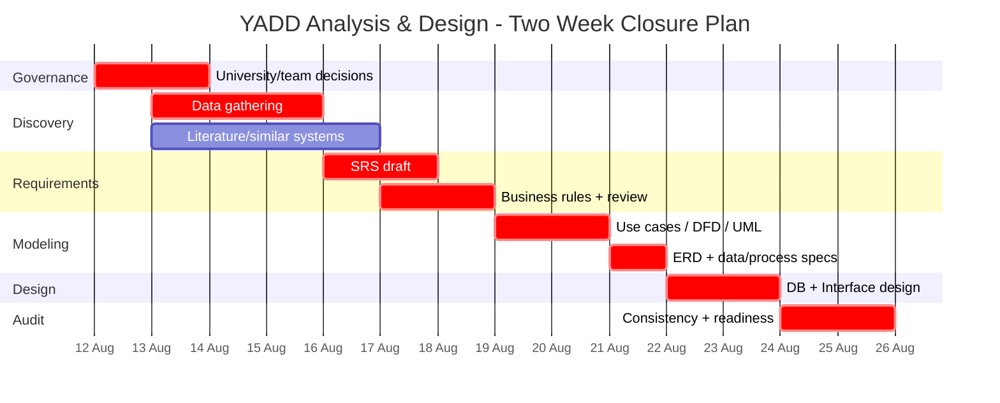

# خطة إغلاق التحليل والمخططات خلال أسبوعين

> **النافذة:** 12–25 أغسطس 2026 تقريبًا. اليوم الأخير مخصص للـReadiness Audit لا لبدء تحليل جديد.

## مبادئ التنفيذ

- أولوية المتطلبات قبل التصميم.
- لا يرسم مخطط نهائي من README مباشرة.
- كل يوم ينتهي بتحديث Decision Register وDocument Register.
- العمل المتوازي مسموح فقط عندما لا توجد Dependency مباشرة.

## الأسبوع الأول — تثبيت الأساس والتحليل

### يوم 1–2: Governance + Discovery
- حسم GOV-Q01/Q02/Q03 مع المشرف.
- حسم BUS-Q01/Q02 مبدئيًا مع الفريق.
- مراجعة Project Baseline وCharter.
- تجهيز أسئلة المقابلات وخطة الملاحظة.
- بدء اختيار الأنظمة المشابهة.

### يوم 3–4: Data Gathering + Research
- تنفيذ مقابلات/ملاحظة فعلية وتوثيق الأدلة.
- تحليل الوضع الحالي والمشكلات والفرص.
- توثيق ثلاثة أنظمة مشابهة على الأقل ومصادرها.
- بناء Comparison Matrix أولية.

### يوم 5: SRS Draft v0.1
- تثبيت Actors/Stakeholders.
- صياغة User Requirements.
- صياغة FR/NFR بحالات `PROPOSED`.
- ربط كل متطلب بمصدر/قرار.

### يوم 6–7: Business Rules + Review
- حسم طلب الخدمة، العرض، التفاوض، السعر، الفاتورة، التقييم، الإلغاء.
- تحديث SRS إلى v0.2.
- جلسة مراجعة فريق واعتماد ما يمكن اعتماده.

## الأسبوع الثاني — النمذجة والتصميم

### يوم 8–9: Use Cases + DFD/UML
- Use Case Diagram + Specifications.
- Activity/Sequence للعمليات الأساسية.
- DFD وفق قرار GOV-Q02.

### يوم 10: ERD + Process/Data Specs
- ERD conceptual.
- Data stores/flows/process descriptions.
- مراجعة Traceability.

### يوم 11–12: Design
- Relational Schema + Data Dictionary.
- Interface Hierarchy + Wireframes الأساسية.
- Query/Report definitions.

### يوم 13: Consistency Audit
- SRS ↔ Use Cases ↔ DFD/UML ↔ ERD ↔ Design.
- إزالة العناصر غير المتتبعة.
- مراجعة AI scope والخصوصية.

### يوم 14: Readiness Gate
- إغلاق قائمة الجاهزية.
- تثبيت نسخ الوثائق (`v1.0-analysis-baseline`).
- عندها فقط يبدأ استخراج الفصول الأربعة.

## Gantt مبدئي

> التواريخ تخطيط داخلي قابل للتعديل عند معرفة موعد التسليم الرسمي باليوم والساعة.
