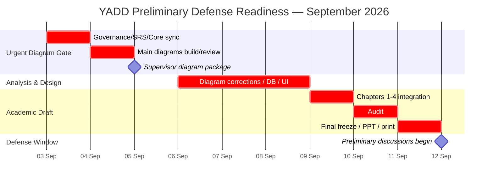

# Project Work Plan — Task Schedule, Gantt, PERT

> **الحالة:** `ACTIVE — PRELIMINARY DEFENSE ROADMAP v3`
>
> **آخر مزامنة للحالة:** 2026-09-11
>
> تبدأ فترة المناقشات الأولية من **12 سبتمبر 2026**، لكن يوم مناقشة فريق YADD داخل هذه الفترة غير مثبت بعد. يعتمد الفريق **11 سبتمبر 2026 كموعد جاهزية داخلي نهائي** للفصول الأربعة الأولى والعرض التقديمي. بوابة **5 سبتمبر 2026** هي مراجعة المخططات الرئيسية للمشرف الرئيسي.
>
> **تنبيه PM:** Task Schedule وGantt موجودان في هذه الخطة. متطلب PERT الأكاديمي ما يزال `OPEN`؛ وجود كلمة PERT في العنوان أو WBS لا يعني أن PERT Diagram أُنجز.

## 0. فريق المشروع والإشراف

### أعضاء الفريق

| الاسم | الصفة |
|---|---|
| عمرو ناجي | مسؤول الفريق |
| محمد عبدالرحمن | عضو فريق |
| محمد حميد | عضو فريق |

### الإشراف

| الاسم | الصفة |
|---|---|
| أ.د.م نبيل طاهر الصهيبي | المشرف الرئيسي |
| الآنسة شذى احمد جلاعم (بكالريوس) | المشرف المساعد |

## 0.1 توزيع المسؤوليات

> **الحالة:** `WORK ALLOCATION — ADOPTED 2026-09-01`

### عمرو ناجي — الإدارة والتوثيق وتجربة المنتج
- إدارة الفريق والاجتماعات ومتابعة التقدم.
- تنظيم GitHub والمستودع والنسخ المعتمدة.
- تنظيم وتجميع التوثيق الأكاديمي.
- إعداد العرض التقديمي للمناقشة.
- مراجعة مخرجات الفريق قبل اعتمادها.
- مراجعة واجهات Figma والمخرجات البصرية.
- تصميم الهوية البصرية والشعار.
- تنسيق القرارات والملاحظات مع المشرفين والفريق.

### محمد حميد — التحليل ومراجعة النمذجة
- مراجعة تحليل النظام والمتطلبات.
- مراجعة SRS وBusiness Rules وLifecycles.
- قيادة ومراجعة Use Cases وUML/DFD.
- التحقق من منطق المخططات واتساقها مع المتطلبات ودورة العمل.
- مراجعة ERD من زاوية اتساقه مع التحليل.

### محمد عبدالرحمن — قاعدة البيانات والتقنيات والتنفيذ
- تصميم قاعدة البيانات: ERD من الجانب التنفيذي، Relation Schema، PK/FK/Constraints، وData Dictionary.
- اختيار وتجهيز التقنيات المستخدمة.
- تهيئة بيئة التطوير.
- مراجعة Architecture التنفيذي بعد استقرار المتطلبات.
- Backend / API / Web/Mobile integration بحسب التقنية المعتمدة.
- تنفيذ النظام برمجيًا بعد استقرار Baseline.
- مراجعة قابلية تنفيذ المتطلبات والمخططات تقنيًا.

> المسؤولية تعني قيادة الإغلاق والمراجعة، ولا تمنع المساعدة المتبادلة بين أعضاء الفريق.

## 1. قاعدة التخطيط

- التخطيط بالمخرجات والتواريخ، لا بعدد ساعات يومي ثابت.
- من ينهي مخرجه ينتقل لدعم أكثر مسار متأخر.
- لا يملأ سؤال مفتوح بتخمين فقط لإظهار أنه مغلق.
- البنود التي لا تمنع المناقشة يمكن أن تبقى `Needs Verification` بشرط ظهورها بوضوح.
- الأولوية الحالية إغلاق المخططات والتصميم الأكاديمي ومراجعة الاتساق، وليس إضافة Features جديدة.
- لا تضاف Feature جديدة قبل Preliminary Defense Freeze إلا إذا كانت Correction أو Decision مدعومًا بدليل/مشرف وتؤثر مباشرة على صحة النموذج.

## 2. بوابات التسليم

### Gate A — 5 September 2026: Main Diagrams Review
المطلوب تسليمه/عرضه على المشرف الرئيسي:
1. Use Case Diagram الرئيسي.
2. DFD Context Diagram.
3. DFD Level 0.
4. ERD تحليلي متسق مع SRS/Business Rules.
5. Activity Diagram لتدفق Core Flow.
6. Sequence Diagram لتدفق Core Flow.
7. Class Diagram إذا سمح الوقت بعد اكتمال الستة السابقة دون تناقضات.

> **الحالة المزامنة حتى 2026-09-11:** توجد Working representations للـUse Case وDFD وActivity/Sequence، وERD متزامن مع Core Model، كما توجد Class Diagram package مشتقة ومزامنة مفاهيميًا حتى DEC-076. يبقى **الرسم/التصدير النهائي بالترميز القياسي، قابلية الطباعة، والمراجعة البشرية عبر الحزمة كاملة** قبل اعتبار Gate A مغلقًا.

### Gate B — 11 September 2026: Preliminary Defense Freeze
يجب أن تكون جاهزة:
- Chapter 1 كامل.
- Chapter 2 كامل.
- Chapter 3 كامل مع DFD + UML + ERD وفق قرار المشرف.
- Chapter 4 بمستوى تصميم كامل: Relation Schema، PK/FK/Constraints، Data Dictionary، Query Statements، Interface Hierarchy، الواجهات، Forms، Queries، Reports.
- PowerPoint للمناقشة.
- Word/PDF قابل للطباعة.
- تجهيز **3 نسخ مطبوعة** من الفصول الأربعة للجنة.
- مراجعة بشرية وتدريب على المناقشة.

### Gate C — From 12 September 2026
تبدأ فترة المناقشات الأولية رسميًا. يوم YADD الدقيق ما يزال `TBD`، لذلك لا يعتمد الفريق على وجود أيام إضافية بعد 11 سبتمبر.

## 3. Closure Tracker

| النقطة | المسؤول الأول | آخر موعد داخلي | الحالة الحالية | ملاحظة الإغلاق |
|---|---|---:|---|---|
| `GOV-Q01` نطاق Chapter Four | عمرو ناجي | 3 سبتمبر | `CLOSED` | تصميم كامل؛ ERD في Ch3 وتصميم DB التفصيلي في Ch4 |
| `GOV-Q02` DFD + UML والمنهج | عمرو ناجي + محمد حميد | 3 سبتمبر | `CLOSED` | قرار المشرف: استخدام DFD وUML معًا |
| `GOV-Q03` لغة التقرير | عمرو ناجي | 3 سبتمبر | `CLOSED` | العربية مع المصطلحات التقنية عند الحاجة |
| `GOV-Q04` Data Gathering | عمرو ناجي | 3 سبتمبر | `CLOSED` | المشرف قبل Survey-only لبيانات المستخدمين؛ لا ادعاء Interviews/Observation غير منفذة |
| `PM-SCHED-Q01` | عمرو ناجي | 3 سبتمبر | `CLOSED FOR PLANNING` | 5 Sep diagram gate + 11 Sep freeze + 12 Sep window; exact YADD day TBD |
| `DEP-Q02` العربون | عمرو ناجي + الفريق | 3 سبتمبر | `CLOSED` | RequiresDeposit نعم/لا فقط؛ كل المال خارج YADD |
| `RAT-CUST-Q01` تقييم المستفيد | عمرو ناجي + الفريق | 3 سبتمبر | `CLOSED` | Provider→Beneficiary اختياري بمؤشرات سلوكية؛ لا عقوبة آلية |
| `PROP-003` Portfolio/Catalog | الفريق | 3 سبتمبر | `CLOSED` | مع علامة مائية تعريفية وإبلاغ عن الانتحال |
| `PROV-ACT-Q01` | الفريق | 11 سبتمبر | `CLOSED` | DEC-074/076: Provider type حصري SERVICE/PRODUCT؛ تصنيف واحد أو أكثر داخل النوع؛ Draft قد يبدأ بصفر |
| Actors الأساسية | محمد حميد | 3 سبتمبر | `CLOSED` | Beneficiary / Provider / YADD Administrator للمخطط الرئيسي |
| Core Flow | محمد حميد + الفريق | 3 سبتمبر | `CLOSED` | Discovery→Transaction→Invoice→Completed→Ratings مع Disputed كمسار غير ناجح |
| Request/Response/Selection Model | محمد حميد | 3 سبتمبر | `CLOSED` | لا Agreement entity مستقل |
| Architecture Direction | محمد عبدالرحمن + الفريق | 3 سبتمبر | `CLOSED AS DIRECTION` | Web/Backend-first؛ Flutter client لاحق؛ framework التفصيلي للBackend ما يزال Feasibility |
| `DISPUTE-AUTH-Q01` | الفريق | 4 سبتمبر | `CLOSED` | DEC-073: Disputed terminal unsuccessful; Admin policy review بلا financial arbitration |
| تحديث الدراسات السابقة | عمرو ناجي | 4 سبتمبر | `IN PROGRESS` | Chapter 2 v1.1 Core Sources Verified؛ يبقى الإغلاق النهائي للمراجع/الفجوة |
| SRS blockers الحرجة | محمد حميد | 4 سبتمبر | `CORE P0 CLOSED — SRS v0.9.6 CURRENT, NOT BASELINED` | SRS متزامن عبر DEC-076؛ الباقي P1/P2 NV وغير مانع للنمذجة الحالية |
| Business Rules + Lifecycles | محمد حميد | 4 سبتمبر | `BR SYNCHRONIZED THROUGH DEC-076 — LIFECYCLES CURRENT THROUGH DEC-073` | Provider model synchronized؛ Lifecycles تحتاج فقط أي أثر صريح من القرارات الأحدث إن وجد |
| Use Cases الأساسية | محمد حميد | 4 سبتمبر | `CURRENT — FINAL VISUAL REVIEW PENDING` | specifications current؛ main use case visual still needs standard redraw/review |
| Use Case Diagram | محمد حميد | 5 سبتمبر | `WORKING MODEL READY — STANDARD UML REDRAW/EXPORT OPEN` | Actors/use cases current؛ لا Guest/Agreement |
| DFD Context + Level 0 | محمد حميد | 5 سبتمبر | `WORKING MODEL READY — STANDARD DFD REDRAW/EXPORT OPEN` | consistency check against DEC-074..076 still required before freeze |
| ERD التحليلي | محمد عبدالرحمن + مراجعة محمد حميد | 5 سبتمبر | `CORE SYNCHRONIZED THROUGH DEC-076 — FINAL VISUAL REVIEW OPEN` | Provider model and conversation cardinality synchronized; physical derivation remains Ch4 |
| Activity Diagram — Core Flow | محمد حميد | 5 سبتمبر | `WORKING MODEL READY — VISUAL REVIEW OPEN` | core transaction/rating flow represented; final visual review open |
| Sequence Diagram — Core Flow | محمد حميد + مراجعة محمد عبدالرحمن | 5 سبتمبر | `WORKING MODEL READY — VISUAL REVIEW OPEN` | sequence package exists; final visual/A4 review remains open |
| Class Diagram | محمد حميد + محمد عبدالرحمن | 5 سبتمبر | `SEMANTIC PACKAGE READY — FINAL VISUAL REVIEW/EXPORT OPEN` | 3 class views exist and are synchronized through DEC-076; standard UML export still pending |
| Main Diagrams Review Package | الثلاثة | 5 سبتمبر | `OPEN` | يحتاج final exports + cross-review + supervisor delivery |
| Relation Schema Draft | محمد عبدالرحمن | 8 سبتمبر | `RE-SYNC REQUIRED AFTER DEC-074..076` | ProviderActivity/Conversation constraints must be re-derived before physical review closure |
| Data Dictionary | محمد عبدالرحمن | 8 سبتمبر | `RE-SYNC REQUIRED AFTER DEC-074..076` | current skeleton needs updated fields/constraints before closure |
| Interface Design / Figma Review | عمرو ناجي | 8 سبتمبر | `CURRENT USE-CASE HIERARCHY DRAFT — CONSISTENCY/FIGMA REVIEW OPEN` | review impact of exclusive provider type and multiple categories |
| Queries & Reports | محمد عبدالرحمن + عمرو ناجي | 8 سبتمبر | `REQUIREMENTS-ALIGNED DRAFT — REPORT DETAILS OPEN` | no invented KPIs; queries traced to current requirements |
| Technical Feasibility | محمد عبدالرحمن | 8 سبتمبر | `OPEN` | Architecture direction is approved; framework/provider/cost/dependency feasibility remains open |
| Operational/UX Feasibility | عمرو ناجي + محمد حميد | 8 سبتمبر | `OPEN` | لا ادعاء نجاح UX قبل الاختبار |
| PERT Diagram | عمرو ناجي + الفريق | 11 سبتمبر | `OPEN — REQUIRED BY UNIVERSITY STRUCTURE` | يحتاج مددًا واعتماديات موثقة؛ لا يُنشأ بتقديرات مخترعة |
| Chapter 1 | عمرو ناجي | 9 سبتمبر | `v1.1 — READY FOR PRELIMINARY DEFENSE REVIEW` | مشتق من Sources of Truth؛ PERT/feasibility/final formatting review still affect closure |
| Chapter 2 | عمرو ناجي | 9 سبتمبر | `v1.1 — CORE SOURCES VERIFIED — REVIEW OPEN` | final research/reference closure pending |
| Chapter 3 | محمد حميد | 9 سبتمبر | `v1.2 — WORKING DRAFT — RE-SYNC REQUIRED AFTER DEC-074..076` | final diagram redraw/export + derived chapter sync + review pending |
| Chapter 4 | محمد عبدالرحمن + عمرو ناجي | 9 سبتمبر | `IN PROGRESS — RE-SYNC REQUIRED AFTER DEC-074..076` | physical DB constraints and interface consistency need refresh before claiming current |
| Traceability/Consistency Audit | الثلاثة | 10 سبتمبر | `IN PROGRESS` | core traceability synchronized through DEC-076; design traceability/final scan pending |
| References + Formatting + Print Check | عمرو ناجي | 11 سبتمبر | `OPEN` | الرسومات واضحة والمراجع والترقيم موحدة |
| PowerPoint + Defense Rehearsal | عمرو ناجي + الفريق | 11 سبتمبر | `OPEN` | العرض من الفصول نفسها والفريق قادر على شرح القرارات والمخططات |
| Preliminary Defense Snapshot | عمرو ناجي | 11 سبتمبر | `OPEN` | نسخة مستقرة محفوظة ولا يبدأ تحليل جديد إلا لتصحيح حرج |

## 4. خطة الضغط حتى تسليم 5 سبتمبر

### 3 September — Freeze the meaning
- مزامنة Decision Register / Open Questions / SRS / BR / Lifecycles / Use Cases.
- منع التوسع غير الضروري في Scope.
- تحديد كيانات/عمليات المخططات من المصادر المتزامنة.

### 4 September — Build and cross-review diagrams
- **محمد حميد:** Use Case + DFD Context/Level 0 + Activity + Sequence.
- **محمد عبدالرحمن:** ERD + مراجعة قابلية التحويل لاحقًا إلى Relation Schema.
- **عمرو:** تدقيق المصطلحات، تنظيم النسخ، قابلية الطباعة والشرح.
- **مراجعة مشتركة:** Decisions ↔ SRS ↔ BR ↔ Lifecycles ↔ Use Cases ↔ Models.

### 5 September — Supervisor package
- تثبيت Correction/Synchronization الضرورية فقط.
- إنهاء final redraw/export للمخططات الرئيسية بالترميز القياسي.
- Cross-review بين المخططات قبل التسليم.
- Export واضح PDF/PNG.
- تحضير شرح شفهي مختصر لكل مخطط.
- تسجيل ملاحظات المشرف كـCorrection / Synchronization / Decision.

## 5. خطة 6–11 سبتمبر

- **6–8 Sep:** استكمال/تصحيح النمذجة بعد ملاحظات المشرف + Database Design + Interfaces + Feasibility.
- **9 Sep:** تجميع Chapters 1–4.
- **10 Sep:** Traceability and Consistency Audit النهائي.
- **11 Sep:** مزامنة وتصحيح حرج فقط؛ PERT إذا توفرت مدد/اعتماديات موثقة، ثم قراءة بشرية، تنسيق، مراجع، PowerPoint، تدريب، PDF/Print، 3 نسخ، Snapshot.

## 6. Gantt المختصر

## 7. نقاط لا نُلزم أنفسنا بإغلاقها قبل المناقشة الأولية إذا لم تمنع التصميم

تبقى `Needs Verification` صريحة:
- `REQ-EXP-Q01` — مدة Expiry والتذكيرات الرقمية.
- `INV-PENDING-Q01` — تصعيد الفاتورة المعلقة.
- `TX-CONC-Q01` — الحد الأقصى للمعاملات المتوازية.
- `LOC-OPS-TIME-Q01` — توقيت توسيع النطاق.
- `SAFE-REQ-Q01` — Thresholds لسوء الاستخدام.
- `UX-VAL-Q01` — Usability/low-connectivity validation.
- `VER-DOC-Q01`, `VER-RET-Q01`, `VER-LIC-Q01`.
- `AI-MOD-Q01/02`, `AI-PROV-Q01`, `AI-RET-Q01`, `AI-APPEAL-Q01`.
- `SUB-PLAN-Q01`, `SUB-PAY-Q01`, `SUB-OPS-Q01`.

## 8. ما بعد المناقشة الأولية

1. تسجيل ملاحظات اللجنة وتصنيفها Correction / Change / Decision.
2. إغلاق البنود التي تمنع التنفيذ ثم Baseline للـSRS/BR/Models.
3. تنفيذ Backend/API والواجهة الأساسية وفق Architecture المعتمدة والتقنيات التي تثبتها Feasibility.
4. تطوير Flutter كعميل Mobile لاحق وفق الخطة المعتمدة آنذاك.
5. اختبارات وظيفية/أمنية/Usability وتتبعها للفصول النهائية.
