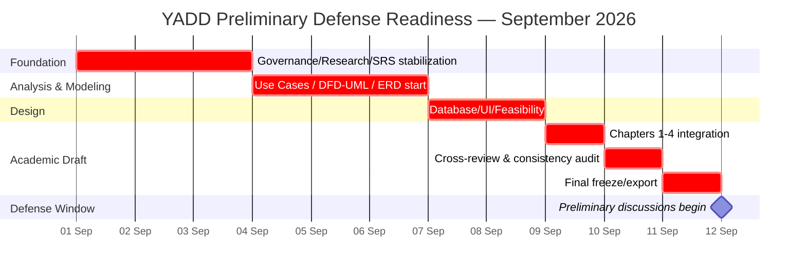
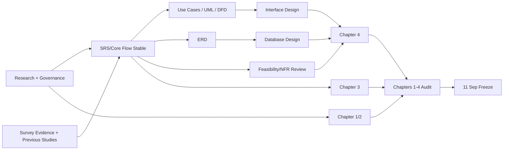

# Project Work Plan — Task Schedule, Gantt, PERT

> **الحالة:** `ACTIVE — PRELIMINARY DEFENSE ROADMAP v1`
>
> **آخر تحديث:** 2026-09-01
>
> **المعلومة التشغيلية الحالية:** تبدأ فترة المناقشات الأولية من **12 سبتمبر 2026**، لكن يوم مناقشة فريق YADD داخل هذه الفترة غير مثبت بعد. لذلك يعتمد الفريق **11 سبتمبر 2026 كموعد جاهزية داخلي نهائي** للفصول الأربعة الأولى (التحليل والتصميم والتوثيق المرتبط بهما). المناقشة النهائية متوقعة في شهر رجب، والتاريخ الميلادي/اليوم الدقيق ما يزال `TBD`.

## 0. فريق المشروع والإشراف

### أعضاء الفريق

| الاسم | الصفة الحالية |
|---|---|
| عمرو ناجي | مسؤول الفريق |
| محمد عبدالرحمن | عضو فريق |
| محمد حميد | عضو فريق |

### الإشراف

| الاسم | الصفة |
|---|---|
| أ.د.م نبيل طاهر الصهيبي | المشرف الرئيسي |
| الآنسة شذى احمد جلاعم (بكالريوس) | المشرف المساعد |

> توزيع المهام التفصيلي بين أعضاء الفريق لا يثبت بناءً على الأسماء فقط. سيحدد حسب نقاط القوة الفعلية لكل عضو وبحسب المرحلة، مع بقاء عمرو ناجي مسؤولًا عن تنسيق الفريق ومتابعة إغلاق المخرجات.

## 1. قاعدة التخطيط

- لا تعتمد الخطة على عدد ساعات يومي ثابت؛ جداول أعضاء الفريق غير مستقرة.
- التخطيط **بالمخرجات اليومية والمرحلية**: كل مخرج له تاريخ إغلاق، ومن ينهي عمله ينتقل إلى دعم المسار المتأخر.
- توزيع المسؤوليات **حسب المراحل** وليس اختصاصًا ثابتًا طوال المشروع.
- لا تعاد GitHub Issues القديمة؛ توزيع العمل في هذه المرحلة يدار من هذه الخطة ومراجعة الفريق اليومية.
- أي قرار غير محسوم لا يختلق فقط لإغلاق الجدول؛ يظل موسومًا `Needs Verification / Supervisor Decision` إذا كان لا يمنع مخرج المناقشة.

## 2. ما يجب أن يكون جاهزًا قبل 12 سبتمبر

الهدف هو نسخة قابلة للعرض والمناقشة من الفصول الأربعة ومصادرها التشغيلية:

1. **Chapter 1 — Introduction / Project Foundation**: المشكلة والأهداف والنطاق والمنهجية والمتطلبات المختصرة وخطة العمل والجدوى والمخاطر والخلفية المطلوبة.
2. **Chapter 2 — Background & Previous Studies**: الدراسات السابقة والأنظمة التشغيلية والمقارنة والفجوة بصياغة قابلة للدفاع.
3. **Chapter 3 — Requirements Analysis & Modeling**: Data Gathering المنفذ فعليًا، Proposed System، SRS، Business Rules، Use Cases، والمخططات المطلوبة وفق المتاح وقرار المنهج.
4. **Chapter 4 — Design**: ERD/Relation Schema/Data Dictionary والواجهات/forms/queries/reports بالقدر المطلوب للمناقشة الأولية.
5. **Consistency/Traceability Review** بين القرارات والمتطلبات والمخططات والتصميم.

## 3. ما يجب حسمه قبل التصميم وما يمكن تأجيله

### Must Close / Resolve Before 11 September

- `GOV-Q01`: نطاق Chapter Four للمناقشة القادمة — الفهم التشغيلي الحالي أن الفصول الأربعة مطلوبة، ويبقى التحقق الرسمي إن أمكن.
- `GOV-Q02`: كيفية عرض DFD + UML دون مخالفة توجيه المنهج.
- `GOV-Q03`: لغة التقرير النهائية، أو على الأقل لغة نسخة المناقشة الأولية.
- `GOV-Q04`: قبول الاكتفاء بالاستبيان بدل المقابلات/الملاحظة.
- `DEP-Q02`: إذا كان سيغير Scope/Architecture؛ وإلا يبقى النظام على baseline الحالي (لا إدارة مالية داخل YADD) مع توضيح أنه قيد مراجعة.
- مزامنة حِرفة وأشغال والدراسات السابقة مع Chapter 2.
- مراجعة SRS بحيث لا توجد ميزة في المخططات أو التصميم خارج المتطلبات الحالية.
- Actors/Stakeholders الأساسية.
- Business Rules/Lifecycles الأساسية لمسارات Request → Response → Selection → Transaction → Invoice → Rating.
- ERD ومخططات التحليل اللازمة للفصول.
- Feasibility أولية قابلة للدفاع بدل نتيجة غير مثبتة.

### Can Remain Open After Preliminary Defense If Explicitly Marked

- القيم الرقمية الدقيقة لـ`REQ-EXP-Q01`, `INV-PENDING-Q01`, `LOC-OPS-TIME-Q01`.
- `TX-CONC-Q01` إذا لم نضع حدًا رقميًا في التصميم الأولي.
- Thresholds الخاصة بـ`SAFE-REQ-Q01` و`AI-MOD-Q02`.
- اختيار مزود AI النهائي وتفاصيل retention الدقيقة إذا عرضت كـArchitecture Candidate لا Implementation Commitment.
- `SUB-PLAN-Q01`, `SUB-PAY-Q01`, `SUB-OPS-Q01` التفصيلية.
- `VER-LIC-Q01` للفئات التي قد تحتاج تراخيص إضافية.

هذه البنود لا تحذف؛ تبقى `Needs Verification` وتدخل خطة ما بعد المناقشة.

## 4. توزيع الطلاب حسب المراحل

الأسماء مثبتة في القسم 0، لكن تعيين كل عضو لمسار `A/B/C` سيحدد بعد تقييم نقاط القوة. إلى ذلك الحين تبقى الرموز التالية **مسارات عمل مؤقتة وليست تكليفًا لشخص بعينه**:

- `مسار A`: التوثيق/التحليل والمراجعة الأكاديمية.
- `مسار B`: البحث/الدراسات السابقة أو تصميم الواجهات حسب المرحلة.
- `مسار C`: المتطلبات/النمذجة/التصميم الهندسي حسب المرحلة.

### المرحلة 1 — تثبيت الأساس والبحث والمتطلبات
**الفترة: 1–3 سبتمبر**

| المسار | المخرجات المطلوبة |
|---|---|
| A | مراجعة Chapter 1 foundation: Baseline/Scope/Objectives/Methodology + Work Plan + Risks + Feasibility gaps. |
| B | Chapter 2 research: حِرفة، أشغال، الأنظمة السابقة، Source Register، Comparison Matrix، Gap Statement. |
| C | Chapter 3 foundation: Stakeholders/Actors + Data Gathering (SUR-01 only) + SRS blockers + Business Rules/Lifecycles الأساسية. |
| الثلاثة | جلسة دمج نهاية 3 سبتمبر: تجميد مؤقت للـCore Flow وعدم إضافة Features جديدة. |

**شرط الانتقال:** Core Flow واضح، الدراسات السابقة الأساسية موثقة، ولا يوجد تعارض كبير معروف بين SRS وBusiness Rules.

### المرحلة 2 — النمذجة والتحليل المرئي
**الفترة: 4–6 سبتمبر**

| المسار | المخرجات المطلوبة |
|---|---|
| A | Use Case Diagram + أهم Use Case Specifications + Activity Diagrams للعمليات الحرجة. |
| B | DFD/Process/Data Flow/Data Store descriptions **وفق نتيجة GOV-Q02**؛ إذا لم يحسم القرار، يعد مسودة منفصلة موسومة بأنها قيد التوافق المنهجي ولا تدمج منطقيًا مع UML على أنها منهج واحد. |
| C | Sequence Diagrams الأساسية + Class/Domain model + بدء ERD من SRS/Business Rules المستقرة. |
| الثلاثة | مراجعة يوم 6 سبتمبر: كل مخطط يجب أن يشير إلى متطلب/Use Case، ولا تضاف وظيفة جديدة من الرسم نفسه. |

**شرط الانتقال:** المخططات الأساسية قابلة للتفسير أمام المناقش ولا تحتوي دورة تعامل متعارضة.

### المرحلة 3 — تصميم Chapter Four والجدوى
**الفترة: 7–8 سبتمبر**

| المسار | المخرجات المطلوبة |
|---|---|
| A | Database Design: ERD review → Relation Schema → Data Dictionary الأساسي. |
| B | Interface Design: hierarchy + wireframes للشاشات الأساسية + Forms/Queries/Reports المطلوبة أكاديميًا. |
| C | Feasibility (Economic/Technical/Operational) + NFR review + Architecture/AI boundaries + التأكد من قابلية التصميم للتنفيذ لفريق ثلاثة طلاب. |
| الثلاثة | مراجعة مساء 8 سبتمبر: Design ↔ SRS ↔ Use Cases ↔ ERD. |

**شرط الانتقال:** Chapter Four لديه تصميم فعلي مرتبط بالتحليل، وليس شاشات تجميلية أو جداول غير مبررة.

### المرحلة 4 — بناء الفصول الأربعة
**الفترة: 9 سبتمبر**

| المسار | المخرج |
|---|---|
| A | تجميع وتنقيح Chapter 1 من مصادر الحقيقة الحالية. |
| B | تجميع وتنقيح Chapter 2، خصوصًا حِرفة/أشغال والفجوة الجديدة. |
| C | تجميع Chapter 3. |
| الثلاثة | Chapter 4 يقسم: قاعدة البيانات، الواجهات، والدمج الهندسي والاتساق وفق توزيع نقاط القوة النهائي. |

لا يعاد اختراع المحتوى داخل الفصول؛ الفصول مشتقة من المستودع.

### المرحلة 5 — Audit أكاديمي وهندسي
**الفترة: 10 سبتمبر**

تقسم المراجعة Cross-Review بحيث لا يراجع الطالب عمله فقط. التوزيع الاسمي يحدد بعد تقييم نقاط القوة، مع الالتزام بأن يراجع كل عضو مخرج عضو آخر.

قائمة الفحص:

- Fact مقابل Inference/Assumption واضح.
- كل ادعاء بحثي له مصدر.
- لا Requirement نهائي بلا Decision/Evidence/Reason.
- لا Feature في Design غير موجودة في SRS.
- لا Entity في ERD بلا حاجة موثقة.
- لا تعارض في lifecycle.
- كل شكل/جدول له عنوان وترقيم ومصدر عند الحاجة.

### المرحلة 6 — Freeze وتسليم نسخة المناقشة
**الفترة: 11 سبتمبر**

لا يبدأ تحليل جديد إلا إذا كان خطأ حرجًا.

المطلوب:

1. إغلاق التعارضات الحرجة فقط.
2. تحديث Document Register.
3. تحديث References/IEEE.
4. توحيد المصطلحات العربية/الإنجليزية.
5. Export Word/PDF للفصول الأربعة.
6. التأكد من جودة الرسومات عند الطباعة.
7. الاحتفاظ بنسخة مستقرة `Preliminary Defense Snapshot` في GitHub/محليًا.

## 5. قاعدة إعادة توزيع العمل اليومية

بسبب عدم ثبات ساعات الأعضاء:

- كل طالب يمتلك **مخرجًا أساسيًا واحدًا** في المرحلة الحالية، لا عدة مسارات متفرقة.
- عند إنهاء المخرج، ينتقل إلى مساعدة صاحب المخرج الأكثر تأخرًا.
- في نهاية كل يوم يستخدم الفريق حالة بسيطة: `NOT STARTED / IN PROGRESS / REVIEW / CLOSED / BLOCKED`.
- أي `BLOCKED` بسبب قرار مشرف لا يوقف بقية المسارات التي لا تعتمد عليه.
- لا يحمل طالب واحد مسؤولية الكتابة + الرسم + التدقيق للمخرج نفسه؛ Cross-review إلزامي.
- مسؤول الفريق يتابع حالة المخرجات والاعتماديات ولا يعني ذلك أن عليه تنفيذ أكبر كمية عمل بنفسه.

## 6. المسار الحرج حتى المناقشة الأولية

```text
Research/Governance/SRS stabilization
        ↓
Core Business Rules & Use Cases
        ↓
Modeling
        ↓
ERD + Database/UI Design + Feasibility
        ↓
Chapters 1–4 integration
        ↓
Consistency Audit
        ↓
11 Sep Preliminary-Defense Freeze
```

أخطر تأخير هو تأخر استقرار SRS/Core Flow لأنه يؤخر Modeling ثم Chapter Four.

## 7. Gantt — Preliminary Defense Window



## 8. PERT / Dependency Network



## 9. ما بعد المناقشة الأولية حتى المناقشة النهائية في رجب

لا توضع تواريخ ميلادية نهائية قبل معرفة يوم المناقشة النهائية. المسار المرحلي المقترح:

1. **Defense Feedback Closure:** تسجيل ملاحظات المناقشة، تصنيفها Correction/Change/Decision، وتحديث الفصول ومصادر الحقيقة.
2. **Analysis Baseline:** إغلاق P0/P1 التي تمنع التنفيذ ثم Baseline للـSRS/Business Rules/Models.
3. **Implementation Sprint 1:** الحسابات/Provider Profile/Verification/Discovery/Request.
4. **Implementation Sprint 2:** Responses/Chat/Selection/Transaction/Invoice/Rating.
5. **Implementation Sprint 3:** Admin/Subscription/Trust & Safety/AI بالمقدار المثبت قابلية تنفيذه.
6. **Integration & Testing:** Functional tests، Security/Privacy checks، UX/performance validation، وإصلاح العيوب.
7. **Final Documentation & Defense:** تحديث الفصول وفق النظام المنفذ، النتائج والاختبارات، وإعداد المناقشة النهائية.

عند معرفة التاريخ الدقيق في رجب، يعاد الجدولة للخلف من ذلك التاريخ مع Buffer للاختبار والتوثيق.

## 10. نقاط زمنية ما تزال تحتاج تحديثًا

- اليوم الفعلي المخصص لمناقشة YADD داخل فترة المناقشات التي تبدأ 12 سبتمبر.
- التاريخ الدقيق للتسليم/المناقشة النهائية في رجب.
- توفر كل عضو في الأسابيع اللاحقة للتنفيذ.
- ربط أسماء أعضاء الفريق بالمسارات المرحلية بعد تقييم نقاط القوة.

هذه النقاط لا تمنع خطة الإغلاق حتى 11 سبتمبر.