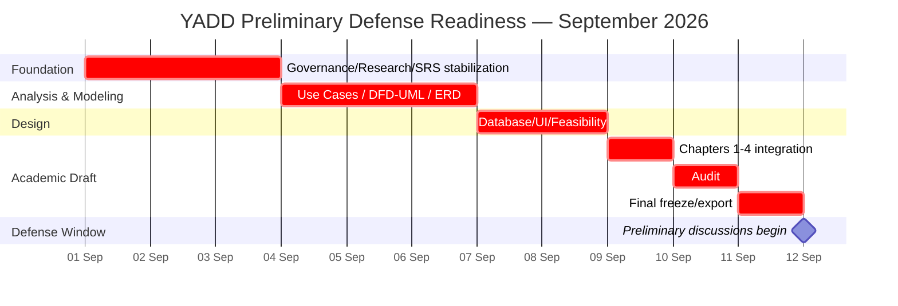

# Project Work Plan — Task Schedule, Gantt, PERT

> **الحالة:** `ACTIVE — PRELIMINARY DEFENSE ROADMAP v2`
>
> **آخر تحديث:** 2026-09-01
>
> تبدأ فترة المناقشات الأولية من **12 سبتمبر 2026**، لكن يوم مناقشة فريق YADD داخل هذه الفترة غير مثبت بعد. لذلك يعتمد الفريق **11 سبتمبر 2026 كموعد جاهزية داخلي نهائي** للفصول الأربعة الأولى وتحليل وتصميم النظام. المناقشة النهائية متوقعة في شهر رجب، والتاريخ الدقيق ما يزال `TBD`.

## 0. فريق المشروع والإشراف

### أعضاء الفريق

| الاسم | الصفة |
|---|---|
| عمرو ناجي | مسؤول الفريق |
| محمد عبدالرحمن | عضو فريق |
| محمد حميد | عضو فريق |

### الإشراف

| الاسم | الصفة |
|---|---|
| أ.د.م نبيل طاهر الصهيبي | المشرف الرئيسي |
| الآنسة شذى احمد جلاعم (بكالريوس) | المشرف المساعد |

## 0.1 توزيع المسؤوليات المعتمد

> **الحالة:** `TEAM DECISION — ADOPTED 2026-09-01`

### عمرو ناجي — الإدارة والتوثيق وتجربة المنتج

- إدارة الفريق والاجتماعات ومتابعة التقدم.
- تنظيم GitHub والمستودع والنسخ المعتمدة.
- تنظيم وتجميع التوثيق الأكاديمي.
- إعداد العرض التقديمي للمناقشة.
- مراجعة مخرجات الفريق قبل اعتمادها.
- مراجعة واجهات Figma المولدة/المساعدة بواسطة ChatGPT المتصل بـFigma.
- تصميم الهوية البصرية والشعار للتطبيق.
- تنسيق القرارات والملاحظات مع المشرفين والفريق.

### محمد حميد — التحليل ومراجعة النمذجة

- مراجعة تحليل النظام والمتطلبات.
- مراجعة SRS وBusiness Rules وLifecycles.
- مراجعة Use Cases ومخرجات UML/DFD.
- التحقق من منطق المخططات واتساقها مع المتطلبات ودورة العمل.
- المشاركة في مراجعة ERD من زاوية اتساقه مع التحليل.

### محمد عبدالرحمن — قاعدة البيانات والتقنيات والتنفيذ

- **تصميم قاعدة البيانات:** ERD من الجانب التنفيذي، Relation Schema، PK/FK/Constraints، وData Dictionary.
- اختيار وتجهيز التقنيات المستخدمة.
- تهيئة بيئة التطوير.
- مراجعة Architecture التنفيذي بعد استقرار المتطلبات.
- Backend / API / Mobile integration بحسب التقنية المعتمدة.
- تنفيذ وتطوير النظام برمجيًا بعد استقرار Baseline.
- مراجعة قابلية تنفيذ المتطلبات والمخططات تقنيًا.

> المسؤولية تعني قيادة الإغلاق والمراجعة، ولا تمنع المساعدة المتبادلة بين أعضاء الفريق.

## 1. قاعدة التخطيط

- لا نعتمد على عدد ساعات يومي ثابت لأن جداول الأعضاء غير مستقرة.
- التخطيط بالمخرجات والتواريخ النهائية لكل مرحلة.
- من ينهي مخرجه ينتقل إلى دعم أكثر مسار متأخر.
- لا تعاد GitHub Issues القديمة.
- أي سؤال غير محسوم لا يملأ بتخمين فقط لإظهار أنه مغلق.
- البنود التي لا تمنع المناقشة يمكن أن تبقى `Needs Verification` إلى ما بعدها بشرط ظهورها بوضوح.

## 2. الهدف قبل 12 سبتمبر

يجب أن تكون نسخة المناقشة من الفصول الأربعة قابلة للطباعة والعرض:

1. **Chapter 1:** المشكلة، الأهداف، النطاق، المنهجية، المتطلبات المختصرة، خطة العمل، الجدوى والمخاطر.
2. **Chapter 2:** الخلفية، الدراسات السابقة، الأنظمة المشابهة، المقارنة والفجوة.
3. **Chapter 3:** Data Gathering المنفذ، Proposed System، SRS، Business Rules، Use Cases، والمخططات المطلوبة.
4. **Chapter 4:** ERD/Relation Schema/Data Dictionary والواجهات والنماذج والاستعلامات والتقارير بالقدر المطلوب.
5. مراجعة اتساق بين Decisions ↔ SRS ↔ Models ↔ Design.

# 3. Closure Tracker — النقاط المطلوب إغلاقها حتى المناقشة

> هذا الجدول هو لوحة المتابعة اليومية. `CLOSED` لا تستخدم إلا بعد تحقق شرط الإغلاق في العمود الأخير.

| النقطة | المسؤول الأول | آخر موعد داخلي | الحالة الحالية | شرط الإغلاق |
|---|---|---:|---|---|
| `GOV-Q01` نطاق Chapter Four | عمرو ناجي | 3 سبتمبر | `OPEN` | جواب واضح من المشرف/القسم أو تثبيت ما سيعرض في المناقشة دون ادعاء أنه قرار رسمي |
| `GOV-Q02` DFD + UML والمنهج | عمرو ناجي + محمد حميد | 3 سبتمبر | `OPEN` | جواب المشرف/القسم وتطبيقه على مخططات الفصل الثالث |
| `GOV-Q03` لغة التقرير | عمرو ناجي | 3 سبتمبر | `OPEN` | تثبيت لغة نسخة المناقشة على الأقل |
| `GOV-Q04` الاكتفاء بالاستبيان | عمرو ناجي | 3 سبتمبر | `OPEN` | تثبيت قبول المشرف/القسم أو إبقاء الانحراف معلنًا Academic Risk |
| `DEP-Q02` العربون | عمرو ناجي + الفريق | 3 سبتمبر | `OPEN` | قرار المشرف؛ وإن لم يحسم يبقى Baseline الحالي بلا إدارة مالية داخل YADD ويظهر Pending Review |
| تحديث حِرفة وأشغال والدراسات السابقة | عمرو ناجي — مراجعة وتنظيم | 3 سبتمبر | `IN PROGRESS` | Source Register + Similar Systems + Evidence Map + Chapter 2 متزامنة بلا Gap قديم متعارض |
| Stakeholders / Actors الأساسية | محمد حميد | 4 سبتمبر | `OPEN` | Actors الأساسية متوافقة مع SRS وUse Cases ولا يوجد دور جوهري مبهم |
| SRS blockers الحرجة للمناقشة | محمد حميد | 4 سبتمبر | `OPEN` | لا يوجد blocker يغير Core Flow أو يمنع النمذجة؛ الباقي موسوم NV صراحة |
| Business Rules + Lifecycles الأساسية | محمد حميد | 4 سبتمبر | `OPEN` | Request → Response → Selection → Transaction → Invoice → Rating متسقة بلا تعارض |
| Use Cases الأساسية | محمد حميد | 5 سبتمبر | `OPEN` | Actors/Preconditions/Main Flow/Exceptions متسقة مع SRS |
| UML/DFD المطلوبة | محمد حميد | 6 سبتمبر | `OPEN` | المخططات قابلة للشرح ومطابقة للمتطلبات وقرار GOV-Q02 |
| ERD الأولي | محمد عبدالرحمن + مراجعة محمد حميد | 6 سبتمبر | `OPEN` | كل Entity وعلاقة لها حاجة موثقة ولا يوجد تعارض مع قواعد العمل |
| Database Design | محمد عبدالرحمن | 8 سبتمبر | `OPEN` | Relation Schema + PK/FK/Constraints + Data Dictionary الأساسي متسقة مع ERD |
| Interface Design / Figma Review | عمرو ناجي | 8 سبتمبر | `OPEN` | التدفقات الأساسية ممثلة والشاشات مرتبطة بالUse Cases وليس بالذوق فقط |
| Technical Feasibility | محمد عبدالرحمن | 8 سبتمبر | `OPEN` | التقنيات والاعتماديات والتكلفة/المخاطر الأساسية موثقة دون ادعاء غير مثبت |
| Operational/UX Feasibility | عمرو ناجي + محمد حميد | 8 سبتمبر | `OPEN` | صياغة واقعية مبنية على الأدلة الحالية وحدود SUR-01؛ لا ادعاء نجاح UX قبل الاختبار |
| Chapter 1 | عمرو ناجي — تنظيم ومراجعة | 9 سبتمبر | `OPEN` | مشتق من Sources of Truth ولا توجد علامات حرجة غير مفسرة |
| Chapter 2 | عمرو ناجي — تنظيم ومراجعة | 9 سبتمبر | `OPEN` | الدراسات والمقارنة والفجوة والمراجع متزامنة ومثبتة |
| Chapter 3 | محمد حميد — مراجعة تحليلية | 9 سبتمبر | `OPEN` | المتطلبات والمخططات متسقة وقابلة للدفاع |
| Chapter 4 | محمد عبدالرحمن + عمرو ناجي | 9 سبتمبر | `OPEN` | قاعدة البيانات + التصميم التقني + الواجهات متوافقة مع التحليل |
| Traceability/Consistency Audit | الثلاثة | 10 سبتمبر | `OPEN` | لا Feature بلا Requirement، لا Entity بلا حاجة، ولا تعارض Lifecycle |
| References + Formatting + Print Check | عمرو ناجي | 11 سبتمبر | `OPEN` | Word/PDF قابلان للطباعة، الرسومات واضحة والمراجع والترقيم موحدة |
| Preliminary Defense Snapshot | عمرو ناجي | 11 سبتمبر | `OPEN` | نسخة مستقرة محفوظة في GitHub ومحليًا ولا يبدأ بعدها تحليل جديد إلا لخطأ حرج |

## 3.1 حالة الجدول الزمني نفسه

| النقطة | الحالة |
|---|---|
| بداية فترة المناقشات الأولية: 12 سبتمبر 2026 | `KNOWN` |
| الموعد الداخلي للجاهزية: 11 سبتمبر 2026 | `TEAM PLANNING DECISION` |
| اليوم الدقيق لمناقشة YADD | `TBD` |
| المناقشة النهائية في رجب | `PARTIALLY KNOWN — EXACT DATE TBD` |

لذلك `PM-SCHED-Q01` يعتبر **مغلقًا جزئيًا للتخطيط الحالي**، لكنه لا يغلق نهائيًا حتى يصل اليوم الدقيق للمناقشة النهائية.

# 4. نقاط لا نُلزم أنفسنا بإغلاقها قبل المناقشة الأولية

تبقى هذه البنود موثقة `Needs Verification` إذا لم تمنع التصميم الأساسي:

- `REQ-EXP-Q01` — مدة Expiry والتذكيرات الرقمية.
- `INV-PENDING-Q01` — التوقيت الدقيق لتصعيد الفاتورة المعلقة.
- `TX-CONC-Q01` — الحد الأقصى للمعاملات المتوازية.
- `LOC-OPS-TIME-Q01` — توقيت توسيع النطاق.
- `SAFE-REQ-Q01` — Thresholds لسوء الاستخدام.
- `AI-MOD-Q02` — AI thresholds الرقمية.
- `AI-PROV-Q01` — اختيار المزود النهائي إذا لم يكن ضروريًا للتصميم الأكاديمي.
- `AI-RET-Q01` والتفاصيل الدقيقة للاحتفاظ إذا بقيت بحاجة تحقق قانوني.
- `VER-LIC-Q01` — التراخيص الخاصة بفئات النشاط.
- `SUB-PLAN-Q01`, `SUB-PAY-Q01`, `SUB-OPS-Q01` — تفاصيل التشغيل التجاري للاشتراك.

لا تحذف هذه البنود من Open Questions؛ تنقل إلى خطة ما بعد المناقشة عند استقرار التحليل.

# 5. توزيع العمل حسب المراحل

## المرحلة 1 — تثبيت الأساس
**1–3 سبتمبر**

- **عمرو:** قرارات المشرف + تنظيم Chapter 1/2 + مزامنة البحث والدراسات السابقة.
- **محمد حميد:** مراجعة SRS/Actors/Business Rules/Lifecycles.
- **محمد عبدالرحمن:** مراجعة قابلية التنفيذ وتجهيز تصور البيانات والتقنيات.
- **الثلاثة:** جلسة نهاية 3 سبتمبر لتجميد Core Flow مؤقتًا وعدم إضافة Features جديدة.

## المرحلة 2 — النمذجة
**4–6 سبتمبر**

- **محمد حميد:** Use Cases + مراجعة UML/DFD وربطها بالمتطلبات.
- **محمد عبدالرحمن:** ERD/Domain data model من زاوية التنفيذ.
- **عمرو:** تنظيم الرسومات والنسخ ومراجعة وضوحها للعرض.

## المرحلة 3 — التصميم والجدوى
**7–8 سبتمبر**

- **محمد عبدالرحمن:** Database Design + Technical Feasibility.
- **عمرو:** Interface/Figma Review + تنظيم Forms/Queries/Reports.
- **محمد حميد:** مراجعة SRS ↔ Models ↔ Design + Operational/NFR review.

## المرحلة 4 — تجميع الفصول
**9 سبتمبر**

- **عمرو:** التنظيم والتجميع والتنسيق العام.
- **محمد حميد:** Chapter 3 والمخططات.
- **محمد عبدالرحمن:** Chapter 4 وقاعدة البيانات والقابلية التقنية.
- الفصول لا تعيد اختراع المحتوى؛ تشتق من مستودع المشروع.

## المرحلة 5 — Audit
**10 سبتمبر**

- **عمرو:** التوثيق، المراجع، المصطلحات، العرض والاتساق العام.
- **محمد حميد:** SRS/Business Rules/Use Cases/Models.
- **محمد عبدالرحمن:** ERD/Database/Architecture/قابلية التنفيذ.

## المرحلة 6 — Freeze
**11 سبتمبر**

1. حل التعارضات الحرجة فقط.
2. تحديث Document Register.
3. توحيد References والترقيم والمصطلحات.
4. Export Word/PDF.
5. فحص جودة الطباعة والرسومات.
6. حفظ `Preliminary Defense Snapshot`.

# 6. Gantt المختصر

# 7. ما بعد المناقشة الأولية حتى المناقشة النهائية

1. تسجيل ملاحظات المناقشة وتصنيفها Correction / Change / Decision.
2. إغلاق P0/P1 التي تمنع التنفيذ ثم Baseline للـSRS/Business Rules/Models.
3. Implementation Sprint 1: Accounts / Provider Profile / Verification / Discovery / Request.
4. Implementation Sprint 2: Responses / Chat / Selection / Transaction / Invoice / Rating.
5. Implementation Sprint 3: Admin / Subscription / Trust & Safety / AI بالمقدار القابل للتنفيذ.
6. Integration & Testing.
7. Final Documentation & Defense.

محمد عبدالرحمن يقود قاعدة البيانات والتجهيز التقني والتنفيذ، محمد حميد يقود مراجعة التحليل والنمذجة، وعمرو ناجي يقود الإدارة والتوثيق والواجهات/الهوية وتجهيز المناقشات.