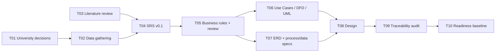

# Project Work Plan — Task Schedule, Gantt, PERT

> **الحالة:** `DRAFT`

خطة الأسبوعين التفصيلية موجودة في `docs/00-governance/05-two-week-plan.md`.

## Task Schedule

| ID | المهمة | المدة | Dependency |
|---|---|---:|---|
| T01 | حسم الأسئلة الجامعية P0 | 2 يوم | — |
| T02 | Data Gathering | 3 أيام | T01 جزئيًا |
| T03 | Similar Systems/Literature | 4 أيام | — |
| T04 | SRS v0.1 | يومان | T02 + مدخلات T03 |
| T05 | Business Rules + SRS Review | يومان | T04 |
| T06 | Use Cases/DFD/UML | يومان | T05 + GOV-Q02 |
| T07 | ERD + Data/Process Specs | يوم | T05 |
| T08 | DB + Interface Design | يومان | T06 + T07 |
| T09 | Consistency/Traceability Audit | يوم | T08 |
| T10 | Readiness Gate/Baseline | يوم | T09 |

## PERT / Dependency Network

## Critical Path

المسار المرشح حاليًا: `T01/T02 → T04 → T05 → T06/T07 → T08 → T09 → T10`.

هذه الخطة داخلية وليست إثباتًا لجدول معتمد حتى يراجع الفريق التواريخ والموارد.
