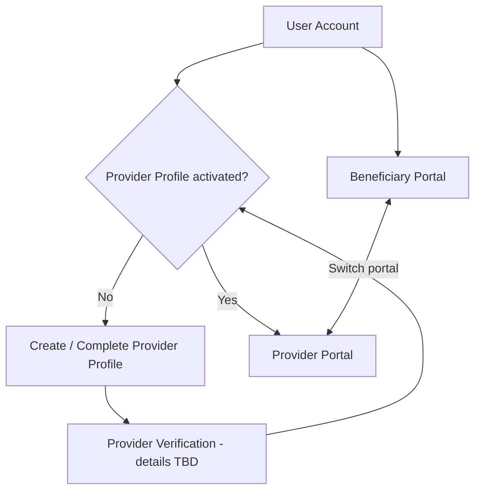

# Stakeholder & Actor Analysis

> **الحالة:** `DRAFT — BUS-Q01 CLOSED, BUS-Q02 OPEN`

## Stakeholders

| ID | الطرف | الاهتمام | الحالة |
|---|---|---|---|
| STK-01 | المستخدم المستفيد | اكتشاف/طلب خدمات أو منتجات والتعامل مع المقدمين | `ANALYZED_APPROVED` من حيث كونه Capability للحساب الواحد |
| STK-02 | مقدم الخدمة المهني | تقديم خدمة وإدارة ما يرتبط بها | `PROPOSED` من حيث تفاصيل الـworkflow |
| STK-03 | مقدم المنتجات/الأسرة المنتجة | عرض منتجات والتعامل مع المستفيدين | `PROPOSED` من حيث تفاصيل الـworkflow |
| STK-04 | إدارة المنصة | إدارة المستخدمين/المحتوى/الحالات الإدارية | `PROPOSED` |
| STK-05 | فريق المشروع | بناء وتشغيل MVP | `APPROVED` كصاحب مصلحة |
| STK-06 | المشرف/القسم | المتطلبات الأكاديمية واعتماد المخرجات | `APPROVED` كصاحب مصلحة |

## Account & Portal Model — معتمد في BUS-Q01

المفهوم الأساسي ليس ثلاثة أنواع حسابات منفصلة. يوجد `User Account` واحد للشخص، ويمكنه استخدام بوابة المستفيد، كما يمكنه إنشاء `Provider Profile` داخل الحساب نفسه واستخدام بوابة المقدم بعد استيفاء شروط التفعيل.

### قاعدة البداية

عند أول استخدام يختار الشخص المسار الذي يريد البدء منه:

- مستفيد من الخدمات/المنتجات.
- مقدم خدمة/منتج.

هذا الاختيار **لا يغير نوع الحساب**؛ بل يحدد الـOnboarding والبوابة الابتدائية.

## ما يزال مفتوحًا

- `BUS-Q02`: العلاقة الدقيقة بين Service Provider وProduct Provider/Home Producer.
- هل يسمح Provider Profile واحد بالنشاطين معًا؟
- `VER-Q01`: تفاصيل التحقق قبل تفعيل Provider Profile.
- هل AI service Actor خارجي أم Implementation Detail؟ يعتمد على AI-Q01.

## أثر القرار على النمذجة

- لا ننشئ `Customer Account` و`Provider Account` كحسابين منفصلين.
- Actor «Beneficiary» يمثل سلوكًا/صلاحيات ضمن User Account.
- Actor «Provider» يعتمد على Provider Profile مفعل.
- الـUse Cases النهائية للخدمات والمنتجات تنتظر BUS-Q02 وبقية قواعد العمل.
