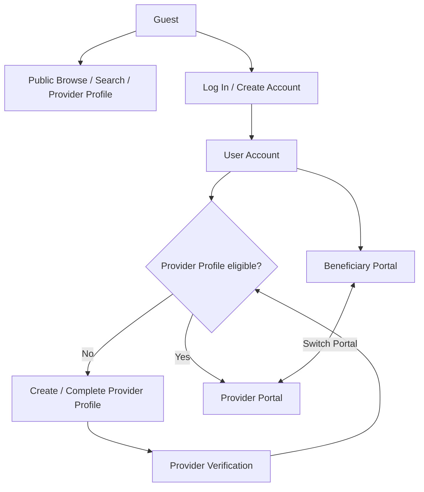

# Stakeholder & Actor Analysis

> **الحالة:** `ANALYZED — SYNCHRONIZED 2026-09-15 THROUGH DEC-077`
>
> هذه الوثيقة مشتقة من Decision Register وSRS الحاليين. تحديد Stakeholder أو Actor هنا لا ينشئ Requirement جديدًا بذاته.

## 1. Stakeholders

| ID | الطرف | الاهتمام داخل YADD | الحالة / المرجع |
|---|---|---|---|
| STK-00 | Guest / الزائر غير المسجل | تصفح المحتوى العام، البحث عن Providers، فتح Public Provider Profile واستعراض Portfolio/Catalog؛ الوظائف المحمية تتطلب Log In أو Create Account | `ANALYZED_APPROVED` — DEC-077 |
| STK-01 | Beneficiary / المستخدم المستفيد | اكتشاف مقدمي الخدمات/المنتجات، إنشاء الطلبات، المقارنة والاختيار، التواصل، المعاملات، اعتماد الفاتورة، تقييم المقدم، الحظر/الإبلاغ | `ANALYZED_APPROVED` — DEC-008..014/046..053/066..077 |
| STK-02 | Service Provider / مقدم الخدمة | إدارة Provider Profile والنشاط ومناطق الخدمة، الاستجابة للطلبات، التواصل، بدء/تنفيذ المعاملات، الفاتورة، Portfolio، تقييم المستفيد | `ANALYZED_APPROVED` — DEC-030/034/043/046/063/064/066..077 |
| STK-03 | Product Provider / مقدم المنتج/المشروع المنزلي | إدارة Provider Profile والنشاط وCatalog، الاستجابة لطلبات المنتجات، التواصل، تجهيز المنتج، الفاتورة، تقييم المستفيد | `ANALYZED_APPROVED` — DEC-003/019/030/063/064/066..077 |
| STK-04 | YADD Administration / إدارة المنصة | Provider Verification، Trust & Safety، البلاغات، الاشتراكات، الإجراءات الإدارية والسجل المرتبط بها | `ANALYZED_APPROVED` في الوظائف الأساسية — DEC-035/036/039/042/053/067 |
| STK-05 | Project Team / فريق المشروع | تحليل وتصميم وتنفيذ وتوثيق MVP ضمن نطاق ووقت مشروع التخرج | `APPROVED` كصاحب مصلحة تشغيلي/أكاديمي |
| STK-06 | Supervisor / Department / المشرف والقسم | مراجعة الالتزام الأكاديمي والمنهجي ومخرجات المشروع | `APPROVED` كصاحب مصلحة أكاديمي |

## 2. Account & Portal Model

المفهوم الأساسي هو **User Account واحد للشخص**. لا يوجد Customer Account وProvider Account منفصلان.

قبل Authentication يمكن للشخص استخدام النظام بصفة `Guest` ضمن حدود التصفح العام فقط. عند محاولة وظيفة محمية، ينتقل إلى `Log In` أو `Create Account` قبل متابعة الإجراء — DEC-077.

بعد Authentication:
- يستطيع الحساب استخدام Beneficiary Portal.
- يستطيع الشخص إنشاء Provider Profile داخل الحساب نفسه.
- لا تتاح وظائف التقديم قبل استكمال شروط Provider Verification والتفعيل.
- يمكن للحساب الانتقال بين Beneficiary Portal وProvider Portal عند استيفاء الشروط.
- اختيار البوابة عند البداية يحدد Onboarding فقط ولا يحول الحساب إلى نوع دائم.

**المرجع:** DEC-008..011/077.

## 3. Provider Activity Model

`Provider` هو Actor العام في المخطط الرئيسي. عند الحاجة إلى التفصيل يتخصص إلى:

- `Service Provider`
- `Product Provider`

في MVP يمتلك User صفرًا أو Provider Profile واحدًا، ويكون Provider Profile من **نوع واحد فقط**:

- `SERVICE`، أو
- `PRODUCT`.

لا يمكن تفعيل النوعين معًا على Provider Profile نفسه — DEC-074. داخل النوع المختار يمكن ربط تصنيف واحد أو أكثر عبر ProviderActivity/Category وفق DEC-076.

الهوية والتحقق مشتركان على مستوى Provider Profile، بينما بيانات النشاط والتصنيفات ذات الصلة قد تختلف.

**الحالة:** `ANALYZED_APPROVED` — DEC-030/067/074/076.

## 4. Main UML Actor Model

وفق DEC-067 كما عدله DEC-077، Actors العامة في Main Use Case Diagram هي:

1. `Guest`
2. `Beneficiary`
3. `Provider`
4. `YADD Administrator`

وعند الحاجة إلى مخططات تفصيلية:

- `Provider` يمكن تخصصه إلى `Service Provider` و`Product Provider`.
- الصلاحيات الإدارية يمكن تفصيلها إلى `Verification Reviewer`, `Content Moderator`, `Subscription Administrator`.

`Guest` Actor خارجي غير authenticated؛ لا يمثل حسابًا ولا ينشئ Class/Entity باسم Guest. صلاحياته تقتصر على Public Browse/Search/View. الوظائف التفاعلية والمعاملاتية المحمية تتطلب Authentication وفق DEC-077.

لا تعد Web Interface أو Backend/API أو Database أو Flutter Actors؛ هي أجزاء من الحل التقني وليست جهات خارجية تتفاعل مع النظام في Main Use Case Diagram.

## 5. AI / External Service Boundary

وظائف AI المساعدة في Verification وTrust & Safety معتمدة، لكن مزود AI النهائي ما يزال `AI-PROV-Q01 — Needs Verification`.

لذلك:

- لا يظهر AI كActor في **Main Use Case Diagram**.
- إذا اعتمد لاحقًا مزود API خارجي، يمكن تمثيله كـExternal System في مخطط تكامل/معمارية تفصيلي عند الحاجة.
- القرار البشري النهائي يبقى مطلوبًا في Verification والعقوبات عالية الأثر وفق DEC-035/039.

## 6. Stakeholder-to-Capability Summary

| Actor / Stakeholder | Core Capabilities |
|---|---|
| Guest | Browse public content, Search Providers, View Public Provider Profile, View Portfolio/Catalog; protected actions redirect to Log In/Create Account |
| Beneficiary | Search, View Provider Profile, Create Request, Compare Responses, Chat, Select Provider, Start Transaction, Review Invoice, Rate Provider, Block/Report |
| Provider | Manage Provider Profile, Manage Portfolio/Catalog, View Matching Requests, Respond/Edit/Withdraw Response, Chat, Start Transaction, Manage Transaction, Create/Revise Invoice, Rate Beneficiary, Block/Report |
| YADD Administrator | Review Verification, Review Reports/Flags, Manage Subscription Records, Authorized Administrative Actions |

## 7. Public / Protected Boundary

### Public for Guest
- Home/public discovery content.
- Search/filter Providers by approved public criteria.
- Public Provider Profile.
- Provider type/category and public service-area information.
- Portfolio/Catalog display content and public provider indicators approved for profile display.

### Requires Authentication
- Create/close Request.
- Private Chat/Inquiry.
- Provider Responses and selection interactions.
- Transaction actions.
- Invoice actions.
- Ratings.
- Block/Report.
- Provider Profile management, Verification and Subscription functions.

Public Provider Profile does not expose direct private contact details such as phone number. Basic communication occurs through YADD after Authentication — DEC-046/077.

## 8. ما يزال مفتوحًا ولا يغيّر Actor Model الأساسي

- تفاصيل أنواع وثائق الهوية: `VER-DOC-Q01`.
- مدة الاحتفاظ ببيانات التحقق: `VER-RET-Q01`.
- بعض الفئات التي قد تحتاج ترخيصًا إضافيًا: `VER-LIC-Q01`.
- مزود AI وسياساته التفصيلية: `AI-PROV-Q01` وما يرتبط به.
- تفاصيل الباقات/الدفع الخارجي للاشتراك: `SUB-PLAN-Q01` و`SUB-PAY-Q01`.

هذه النقاط لا تمنع اعتماد Actors الرئيسية للمخططات الحالية.