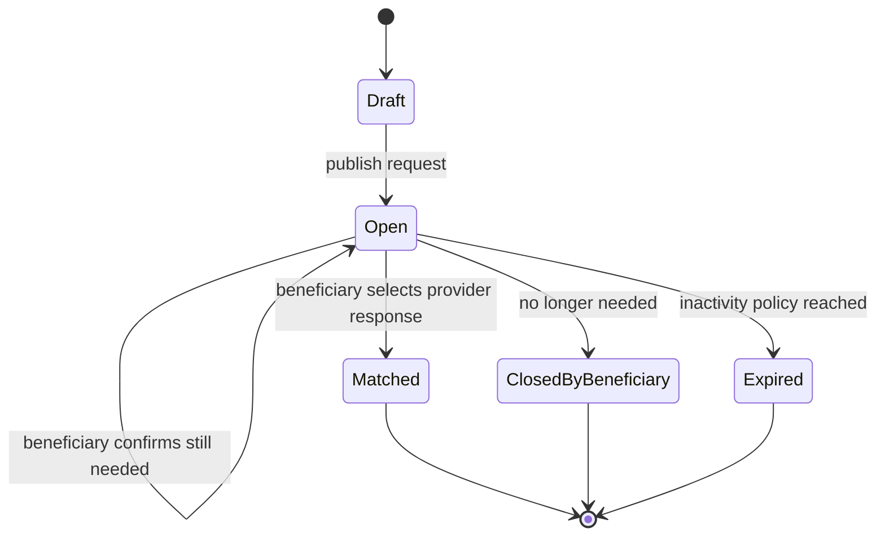
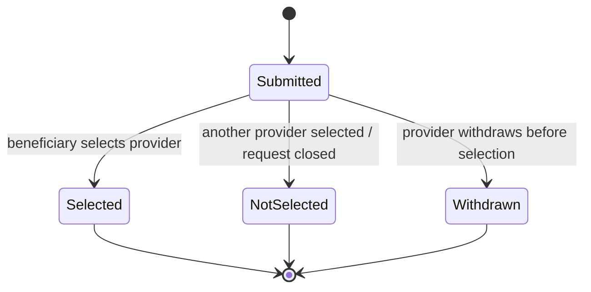
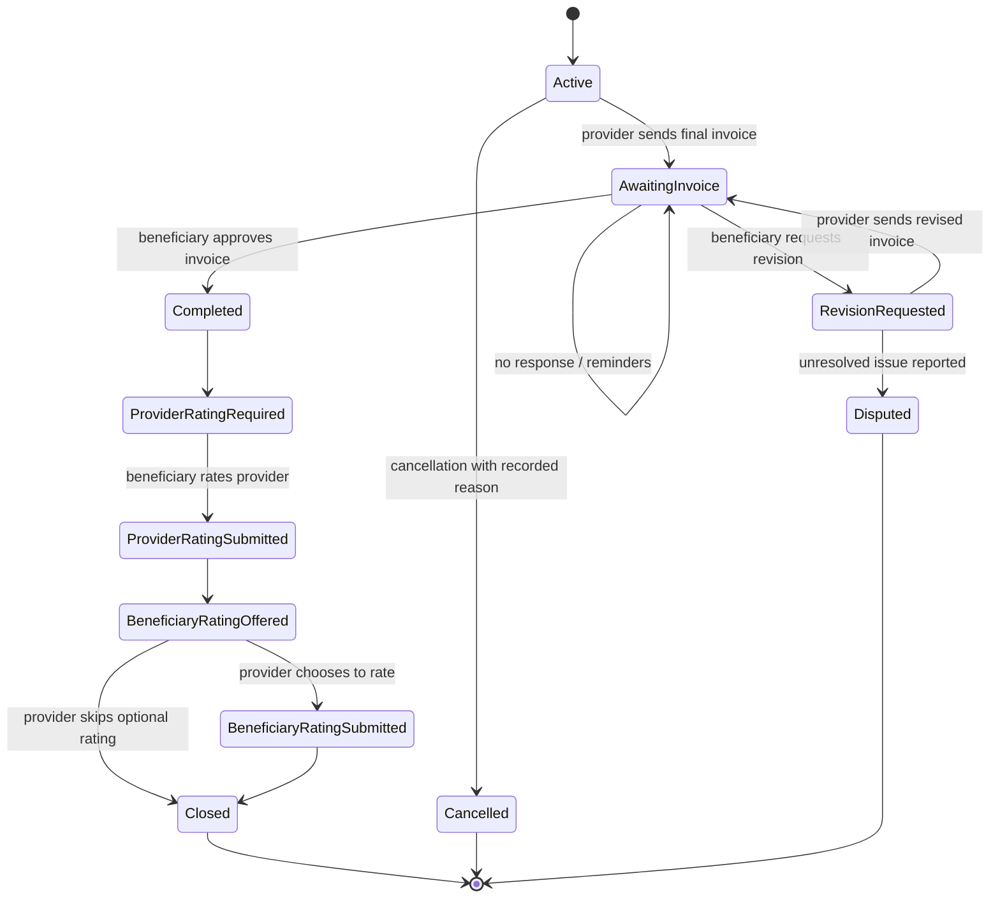
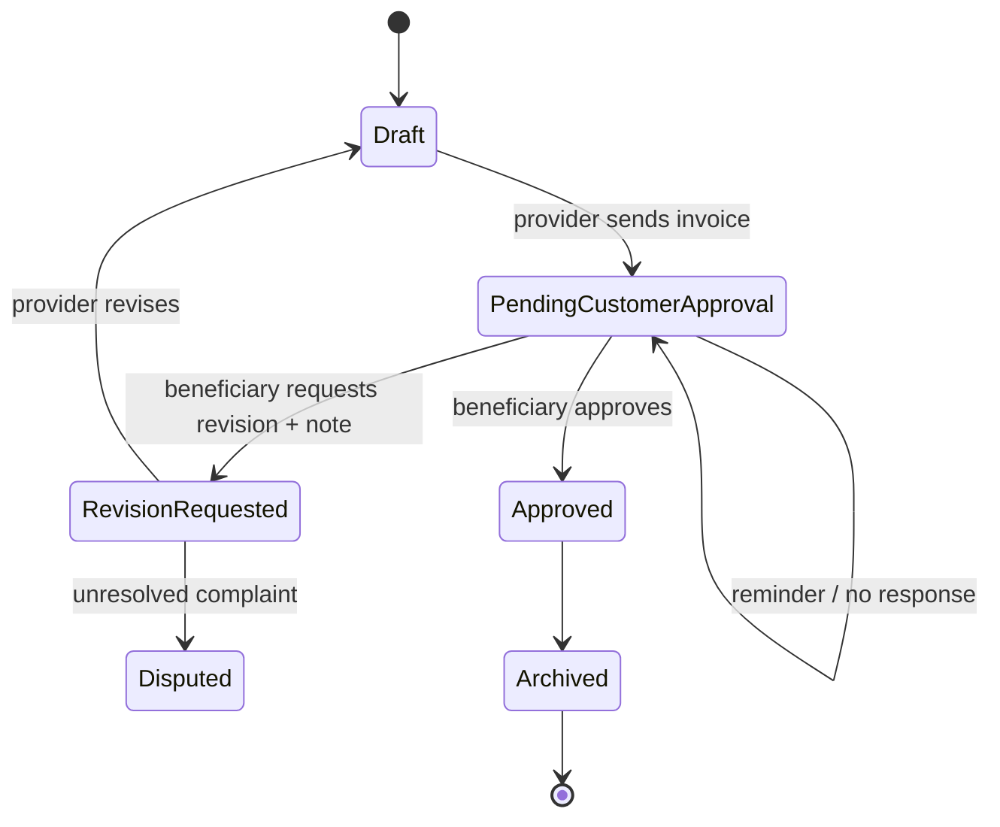
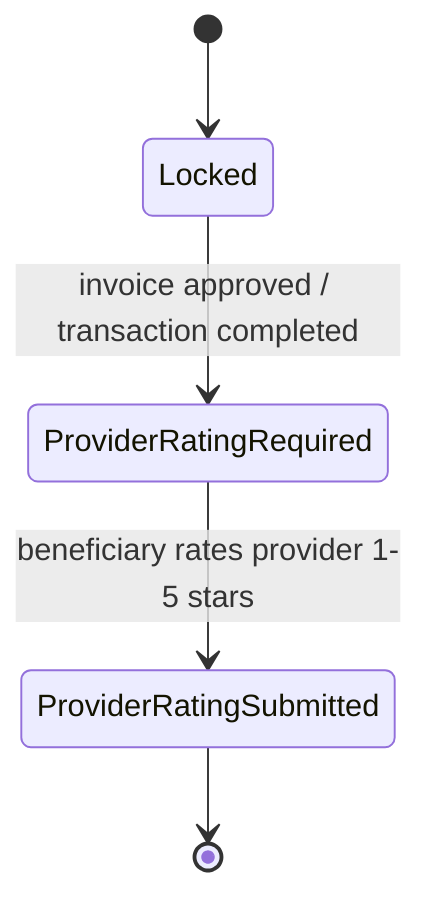
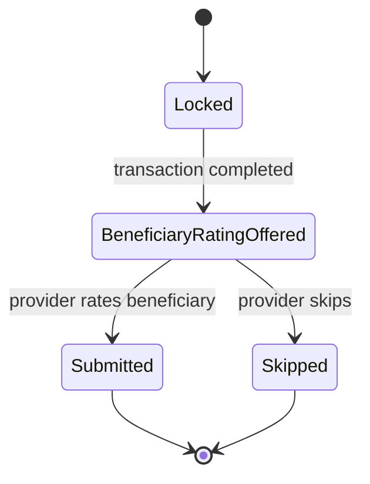
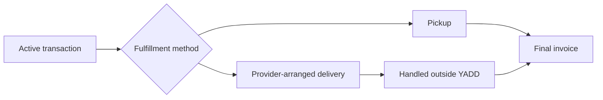

# Lifecycles & State Machines

> **الحالة:** `PARTIALLY ANALYZED`
>
> يعكس هذا الملف القرارات الحالية مع إبقاء القيم الزمنية والـthresholds والسياسات المفتوحة دون افتراض.

## 1. Published Request Lifecycle



- `Matched` يعني أن الطلب توقف عن استقبال استجابات جديدة وأن المعاملة الرسمية بدأت مع المقدم المختار.
- إغلاق الطلب قبل اختيار مقدم ليس Transaction Cancellation.
- مدة عدم النشاط وتوقيت/عدد التذكيرات: `REQ-EXP-Q01`.

## 2. Provider Response Lifecycle



- Provider Response قد تتضمن سعرًا مقترحًا وملاحظة و`RequiresDeposit` نعم/لا.
- لا توجد حالة Payment/Deposit مالية مرتبطة بالاستجابة.

## 3. Communication and Transaction Start

### Request route

```text
Open Request → Provider Responses → Inquiry/Chat → Beneficiary Selects Provider → Active Transaction
```

اختيار المقدم يغلق الطلب أمام استجابات جديدة ويجعل الاستجابات الأخرى `NotSelected`.
لا يوجد Agreement entity مستقل في هذا المسار.

### Direct-search route

```text
Search → Provider Profile/Portfolio → Inquiry/Chat → Both Agree to Start → Active Transaction
```

المحادثة وحدها ليست Transaction.

## 4. Transaction Lifecycle



- لا يوجد Auto-Approval للفاتورة.
- بعد بدء المعاملة، الإلغاء يحتاج سببًا مسجلًا.
- عدة Transactions قد تكون Active للمستخدم بالتوازي؛ الحد الرقمي غير معتمد.
- تقييم المستفيد للمقدم إلزامي؛ تقييم المقدم للمستفيد اختياري.
- لا Payment/Refund lifecycle داخل Transaction.

## 5. Invoice Lifecycle



`Approved` يغلق العمل المالي التوثيقي للمعاملة داخل YADD، لكنه لا يثبت دفعًا إلكترونيًا. سياسة التصعيد عند عدم الاستجابة الطويلة: `INV-PENDING-Q01`.

## 6. Rating Lifecycle

### Beneficiary rates Provider — mandatory



- النجوم 1–5 إلزامية والتعليق اختياري.
- لا يفتح التقييم لمعاملة ملغاة أو غير مكتملة.

### Provider rates Beneficiary — optional



- التقييم اختياري ويظهر Prompt بارزًا.
- المؤشرات: وضوح الطلب والتواصل، الالتزام بالاتفاق، حسن التعامل والتعاون؛ كل مؤشر 1–5.
- التعليق اختياري.
- النتائج تدخل سجل تعامل المستفيد الذي يظهر فقط لمقدمي الخدمات/المنتجات في سياق تعامل مشروع.
- لا ينتج عنه منع أو عقوبة آلية في MVP.

## 7. Product-specific Fulfillment Note



YADD لا يدير مندوب توصيل أو تتبع شحنة. إذا كان Provider Response يتطلب عربونًا، يعرض النظام الدلالة فقط؛ مبلغ العربون والدفع والاسترداد خارج YADD ولا يملكان lifecycle داخل النظام.
