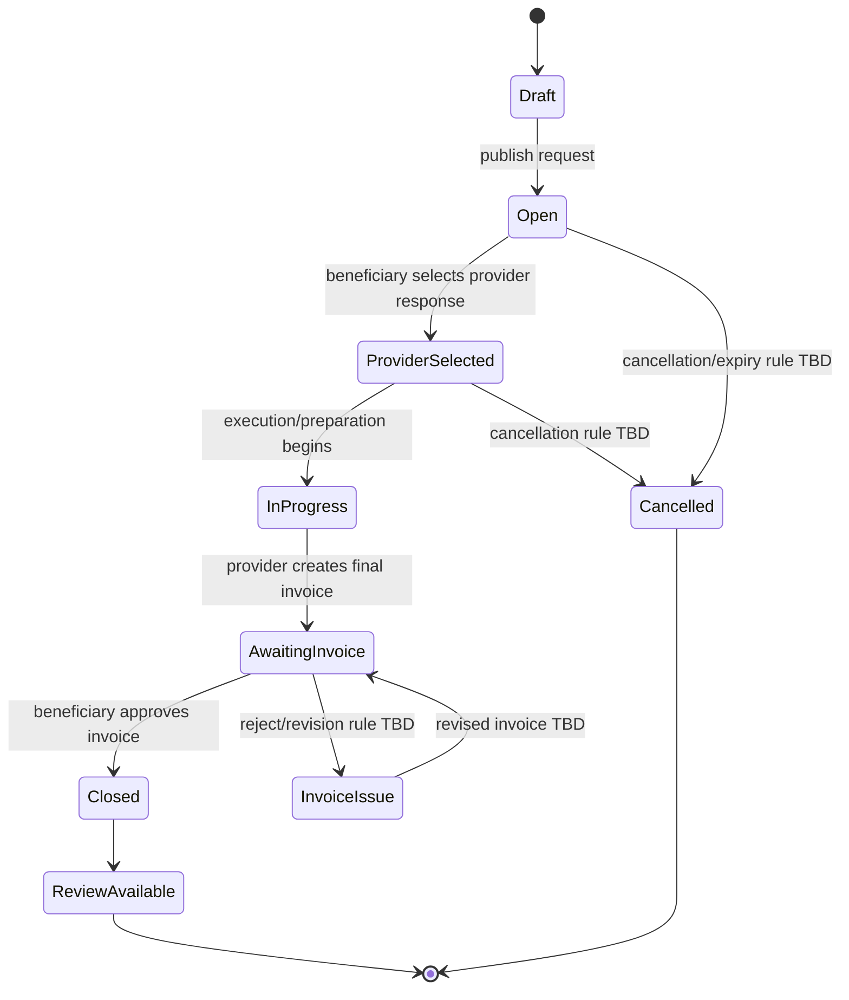
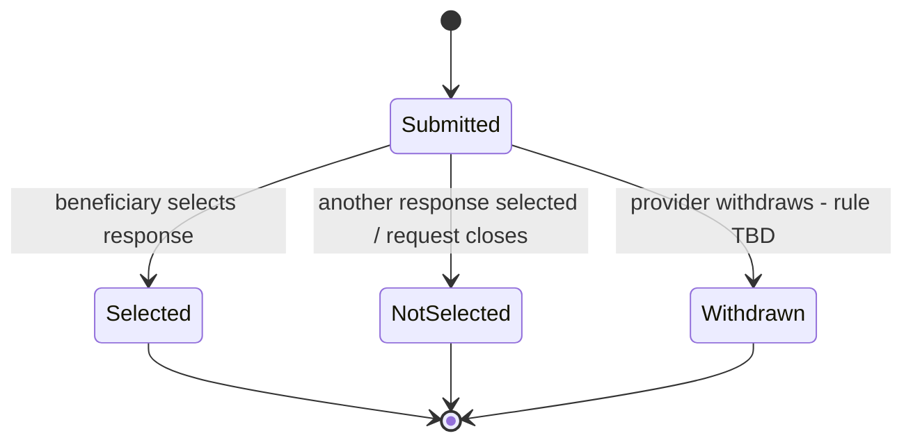
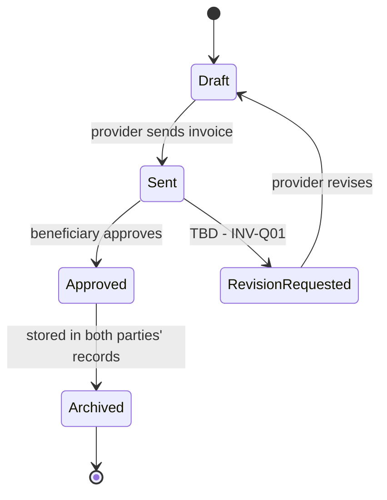
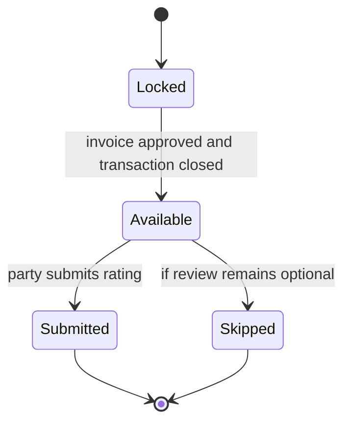
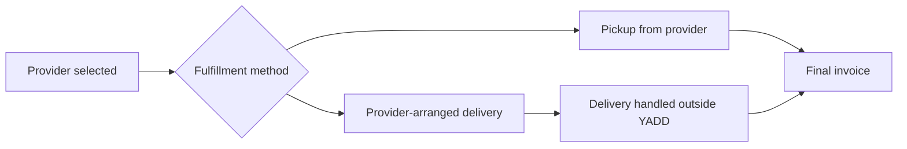

# Lifecycles & State Machines

> **الحالة:** `PARTIALLY ANALYZED`
>
> تم تثبيت نقاط البداية والإغلاق المشتركة، لكن بعض الانتقالات ما تزال محجوبة بأسئلة مفتوحة مثل BUS-Q03 وINV-Q01.

## 1. Core Request / Transaction Lifecycle

### نقاط معتمدة

- `Draft → Open`: المستخدم ينشر الطلب.
- `Open → ProviderSelected`: المستخدم يختار مقدمًا واحدًا من الاستجابات.
- `InProgress → AwaitingInvoice`: المقدم ينشئ فاتورة بعد التنفيذ/التجهيز.
- `AwaitingInvoice → Closed`: الفاتورة تعتمد من الطرف المستفيد؛ أصل الإغلاق يعتمد موافقة الطرفين.
- `Closed → ReviewAvailable`: لا يفتح التقييم قبل الإغلاق.

### نقاط غير محسومة

- متى يتحول `ProviderSelected` إلى `InProgress` رسميًا؟
- قواعد الإلغاء والانتهاء.
- ماذا يحدث عند اعتراض المستفيد على الفاتورة.

## 2. Provider Response Lifecycle

الاستجابة قد تحتوي سعرًا مقترحًا، وفي طلب المنتج قد تحمل `DepositRequired = true`.

## 3. Invoice Lifecycle

`Approved/Archived` يمثلان الإغلاق الرسمي للمعاملة داخل YADD. لا يعني ذلك إثبات الدفع المالي لأن المدفوعات خارج نطاق النظام.

## 4. Review Lifecycle

مهلة التقييم وإمكانية التعديل/الاعتراض تنتظر `RAT-Q01`.

## 5. Product-specific Fulfillment Note

YADD لا يدير مندوب توصيل ولا يتتبع الشحنة. إن وجدت تكلفة توصيل متفق عليها، يمكن إدراجها كبند في الفاتورة.
