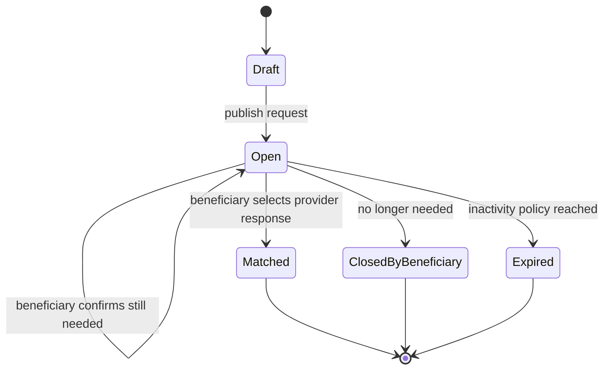
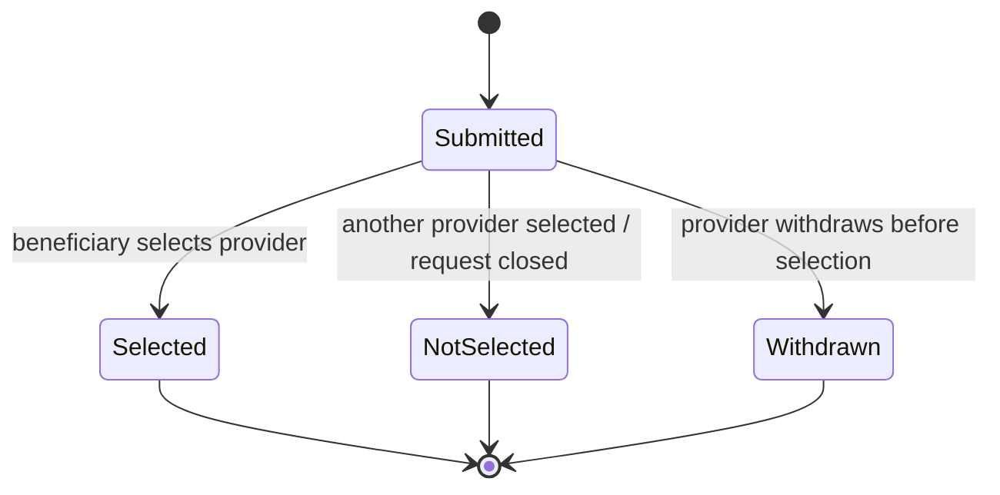
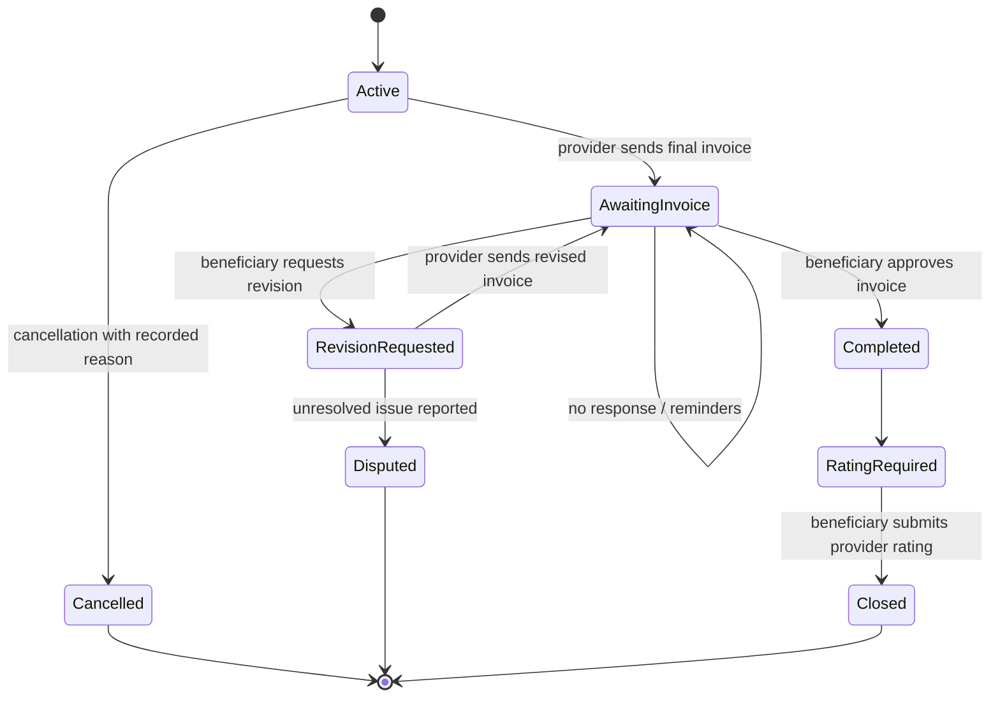
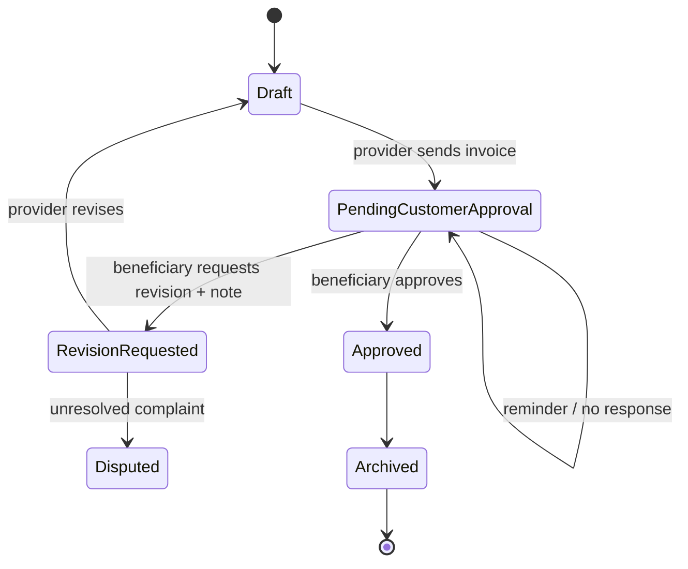
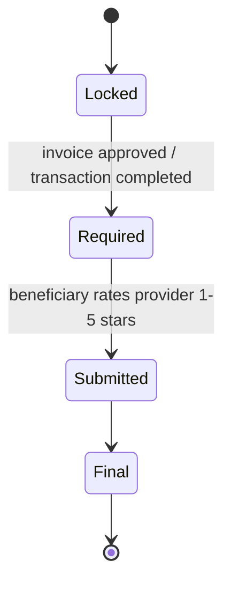
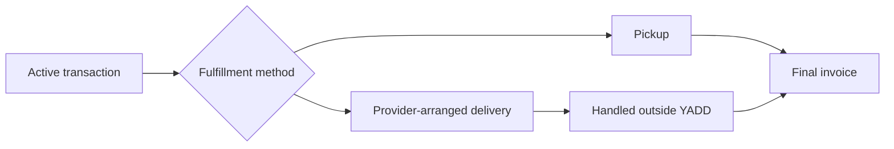

# Lifecycles & State Machines

> **الحالة:** `PARTIALLY ANALYZED`
>
> يعكس هذا الملف القرارات حتى 2026-08-26. القيم الزمنية والـthresholds المفتوحة لا تفترض.

## 1. Published Request Lifecycle



- `Matched` يعني أن الطلب توقف عن استقبال استجابات جديدة وأن المعاملة الرسمية بدأت مع المقدم المختار.
- إغلاق الطلب قبل اختيار مقدم ليس Transaction Cancellation.
- مدة عدم النشاط وتوقيت/عدد التذكيرات: `REQ-EXP-Q01`.

## 2. Provider Response Lifecycle



## 3. Communication and Transaction Start

### Request route

```text
Open Request → Responses → Inquiry/Chat → Beneficiary Selects Provider → Active Transaction
```

اختيار المقدم يغلق الطلب أمام عروض جديدة ويجعل الاستجابات الأخرى `NotSelected`.

### Direct-search route

```text
Search → Provider Profile → Inquiry/Chat → Both Agree to Start → Active Transaction
```

المحادثة وحدها ليست Transaction.

## 4. Transaction Lifecycle



- لا يوجد Auto-Approval للفاتورة.
- بعد بدء المعاملة، الإلغاء يحتاج سببًا مسجلًا.
- عدة Transactions قد تكون Active للمستخدم بالتوازي؛ الحد الرقمي غير معتمد.

## 5. Invoice Lifecycle



`Approved` يغلق العمل المالي التوثيقي للمعاملة داخل YADD، لكنه لا يثبت دفعًا إلكترونيًا. سياسة التصعيد عند عدم الاستجابة الطويلة: `INV-PENDING-Q01`.

## 6. Rating Lifecycle



- النجوم إلزامية؛ التعليق النصي اختياري.
- لا تقييم للمستفيد من المقدم في النموذج الحالي.
- لا Double-Blind ولا مهلة 14 يومًا في القرار الحالي.
- لا يفتح التقييم لمعاملة ملغاة أو غير مكتملة.

## 7. Product-specific Fulfillment Note



YADD لا يدير مندوب توصيل أو تتبع شحنة. موضوع العربون يبقى مفتوحًا في `DEP-Q02` ولا يضاف له lifecycle مالي حتى قرار المشرف.
