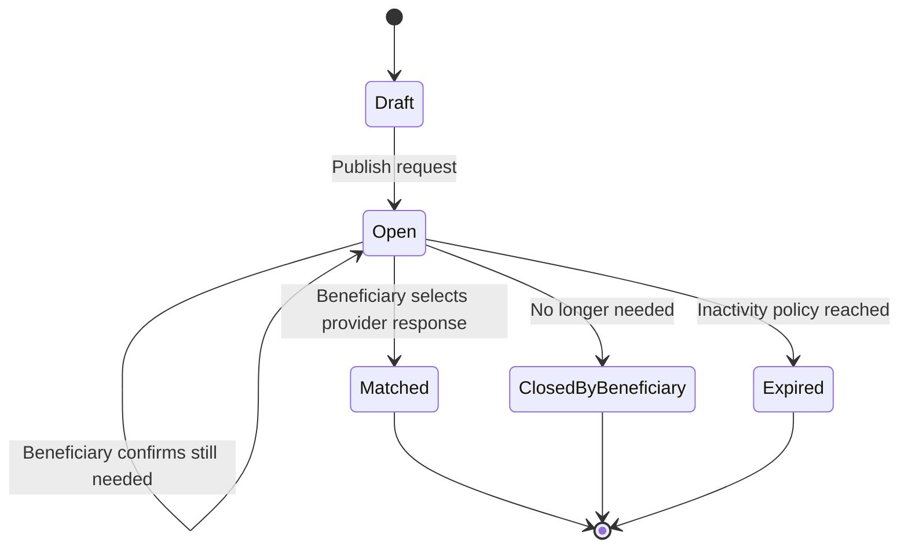
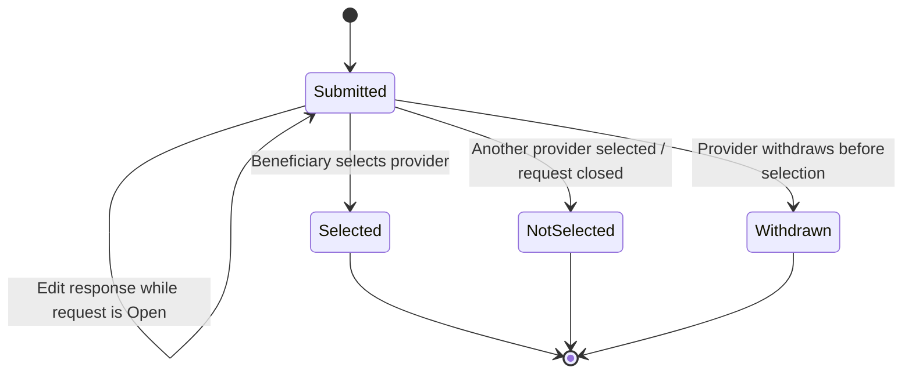
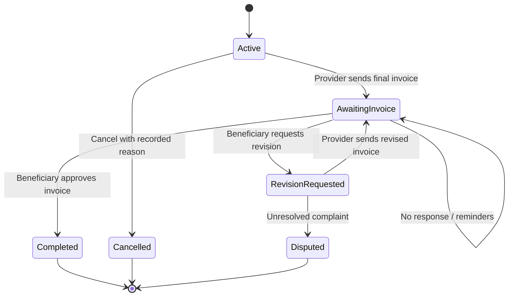
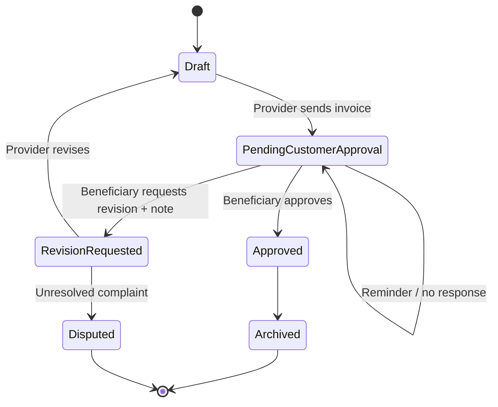
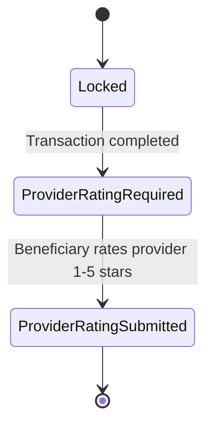
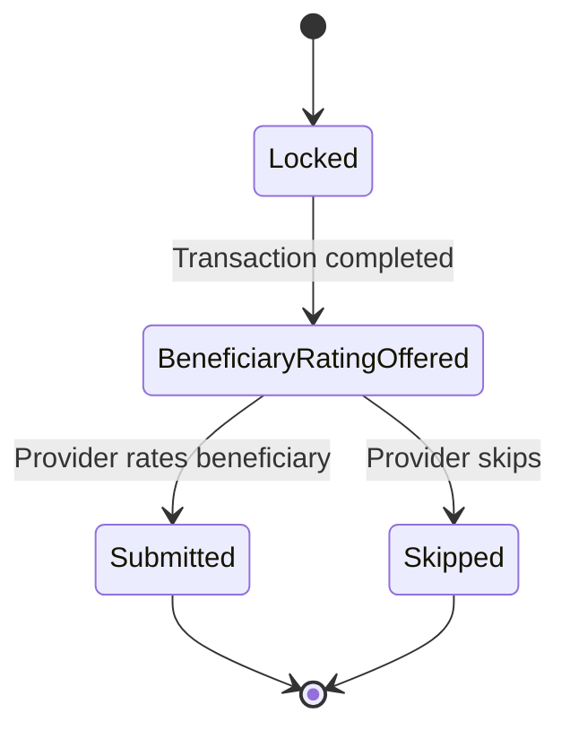
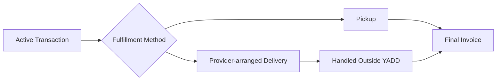

# Lifecycles & State Machines

> **الحالة:** `PARTIALLY ANALYZED — SYNCHRONIZED 2026-09-04`
>
> يعكس هذا الملف القرارات الحالية مع إبقاء القيم الزمنية والـthresholds والسياسات المفتوحة دون افتراض.
>
> **Modeling convention:** جميع أسماء الحالات والأفعال داخل المخططات باللغة الإنجليزية وفق DEC-072.

## 1. Published Request Lifecycle



- `Matched` يعني أن الطلب توقف عن استقبال استجابات جديدة وأن المعاملة الرسمية بدأت مع المقدم المختار.
- إغلاق الطلب قبل اختيار مقدم ليس Transaction Cancellation.
- مدة عدم النشاط وتوقيت/عدد التذكيرات: `REQ-EXP-Q01`.

## 2. Provider Response Lifecycle



- لكل Provider **استجابة فعالة واحدة فقط لكل Request** وفق DEC-070.
- يمكن تعديل الاستجابة أو سحبها ما دام Request في حالة `Open` ولم يتم اختيار المقدم.
- Provider Response قد تتضمن سعرًا مقترحًا وملاحظة و`RequiresDeposit` نعم/لا.
- لا توجد حالة Payment/Deposit مالية مرتبطة بالاستجابة.

## 3. Communication and Transaction Start

### Request route

```text
Open Request → Provider Responses → Inquiry/Chat → Beneficiary Selects Provider → Active Transaction
```

اختيار المقدم يغلق الطلب أمام استجابات جديدة ويجعل الاستجابات الأخرى `NotSelected`.
لا يوجد Agreement entity مستقل في هذا المسار.

### Direct-search route

```text
Search → Provider Profile/Portfolio → Inquiry/Chat → Request Transaction Start → Other Party Confirms → Active Transaction
```

- يمكن لأي طرف إرسال `Request Transaction Start` من المحادثة.
- لا تصبح Transaction `Active` إلا بعد تأكيد الطرف الآخر.
- عدم التأكيد أو الرفض يبقي المحادثة دون Transaction.
- المحادثة وحدها ليست Transaction.

## 4. Transaction Lifecycle



- `Completed` هي **النهاية الناجحة للـTransaction** وفق DEC-071.
- `Disputed` هي **نهاية غير ناجحة للـTransaction** عندما يستمر الخلاف قبل اعتماد الفاتورة ولا يتوصل الطرفان إلى اتفاق، وفق DEC-073.
- عند `Disputed` تراجع إدارة YADD الشكوى لتطبيق سياسات المنصة واتخاذ إجراء إداري عند وجود مخالفة؛ لا تحكم الإدارة في الحقوق المالية/التجارية ولا تفرض Payment/Refund/Compensation.
- لا تفتح Ratings لمعاملة `Disputed` لأنها لم تصل إلى `Completed`.
- لا توجد حالة Transaction باسم `Closed` بعد التقييمات.
- لا يوجد Auto-Approval للفاتورة.
- بعد بدء المعاملة، الإلغاء يحتاج سببًا مسجلًا.
- عدة Transactions قد تكون Active للمستخدم بالتوازي؛ الحد الرقمي غير معتمد.
- Ratings تحدث بعد `Completed` كعمليات Post-Transaction مستقلة ولا تغير Transaction Status.
- لا Payment/Refund lifecycle داخل Transaction.

## 5. Invoice Lifecycle



- `Approved` يغلق العمل التوثيقي للفاتورة داخل YADD ويؤدي إلى `Transaction = Completed`، لكنه لا يثبت دفعًا إلكترونيًا.
- `Disputed` يعني أن الفاتورة لم تعتمد وأن Transaction لا تصبح Completed.
- الشكوى الإدارية لا تمنح YADD صلاحية الفصل في المبالغ أو إصدار Refund/Compensation؛ دور الإدارة هو تطبيق سياسة المنصة على السلوك والسجلات الداخلية.
- سياسة التصعيد عند عدم الاستجابة الطويلة: `INV-PENDING-Q01`.

## 6. Rating Lifecycles — Post-Transaction

### Beneficiary rates Provider — mandatory



- النجوم 1–5 إلزامية والتعليق اختياري.
- لا يفتح التقييم لمعاملة ملغاة أو `Disputed` أو غير مكتملة.
- اكتمال هذا التقييم لا يغير Transaction من `Completed` إلى حالة أخرى.

### Provider rates Beneficiary — optional



- التقييم اختياري ويظهر Prompt بارزًا.
- المؤشرات: وضوح الطلب والتواصل، الالتزام بالاتفاق، حسن التعامل والتعاون؛ كل مؤشر 1–5.
- التعليق اختياري.
- النتائج تدخل سجل تعامل المستفيد الذي يظهر فقط لمقدمي الخدمات/المنتجات في سياق تعامل مشروع.
- لا ينتج عنه منع أو عقوبة آلية في MVP.
- `Submitted` أو `Skipped` لا يغيران Transaction Status؛ تبقى `Completed`.

## 7. Product-specific Fulfillment Note



YADD لا يدير مندوب توصيل أو تتبع شحنة. إذا كان Provider Response يتطلب عربونًا، يعرض النظام الدلالة فقط؛ مبلغ العربون والدفع والاسترداد خارج YADD ولا يملكان lifecycle داخل النظام.