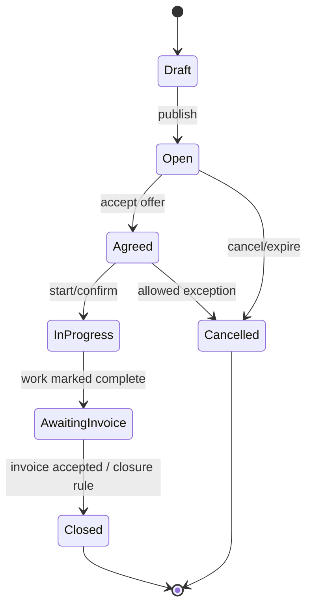
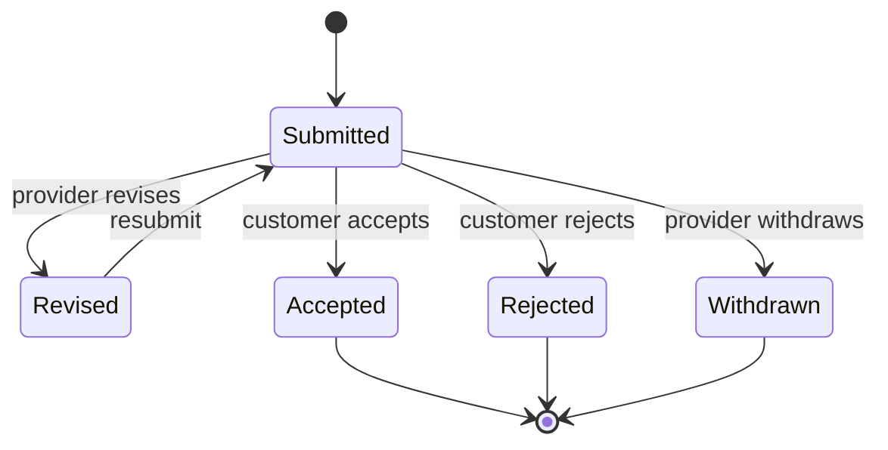
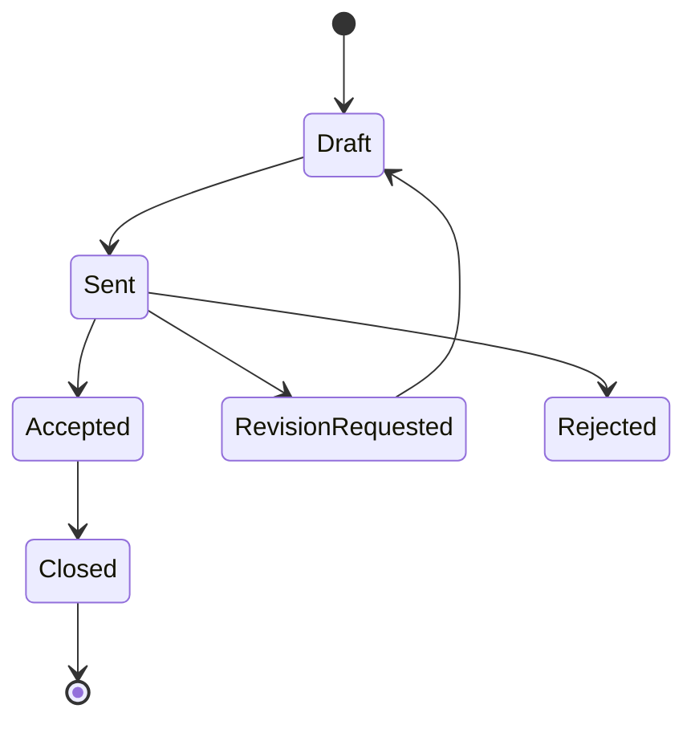

# Lifecycles & State Machines

> **الحالة:** `PROPOSED — NOT APPROVED`

الرسومات التالية أدوات نقاش فقط حتى اعتماد Business Rules.

## Service Request — Candidate Lifecycle

`TBD`: هل InProgress/AwaitingInvoice لازمان؟ وما event الإغلاق؟

## Offer — Candidate Lifecycle

## Invoice — Candidate Lifecycle

كل انتقال يحتاج Business Rule ومعرف FR قبل اعتماده.
