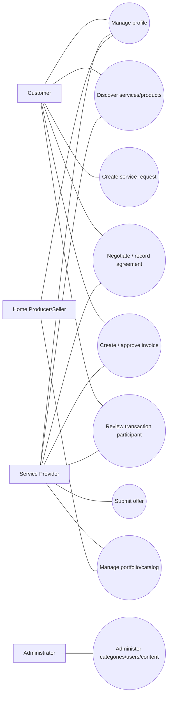

# Use Cases & Specifications

> **الحالة:** `DRAFT`

## Use Case Map — Proposed

Actor model ينتظر BUS-Q01/BUS-Q02.

## UC-03 — Create Service Request

- **Status:** `PROPOSED`.
- **Primary actor:** Customer.
- **Preconditions:** حساب صالح؛ بيانات الموقع/المنطقة المطلوبة متوفرة حسب LOC-Q01.
- **Trigger:** المستخدم يقرر نشر طلب خدمة.
- **Main flow:**
  1. يحدد التصنيف.
  2. يدخل وصف الطلب.
  3. يحدد المنطقة/الموقع المطلوب.
  4. يضيف وسائط إن كانت ضمن المتطلبات المعتمدة.
  5. يراجع البيانات.
  6. ينشر الطلب.
  7. يغير النظام الحالة إلى Open ويربطه بآلية الاكتشاف.
- **Alternatives:** بيانات ناقصة؛ تصنيف غير متاح؛ إلغاء قبل النشر.
- **Related:** FR-005, FR-006.

## UC-04 — Submit Offer

- **Status:** `PROPOSED`.
- **Actor:** Service Provider.
- **Preconditions:** الطلب Open والمقدم Eligible.
- **Main flow:** عرض → مراجعة → إرسال → تسجيل Submitted.
- **Open points:** بنية السعر، المدة، التعديل.
- **Related:** FR-007, BR-001.

## UC-05 — Accept Offer / Record Agreement

- **Status:** `PROPOSED`.
- **Main goal:** توثيق الاختيار والاتفاق النهائي.
- **Open points:** التفاوض، التعديل بعد القبول، الإلغاء.
- **Related:** FR-008, FR-009, BR-002, BR-003.

## UC-06 — Invoice Approval

- **Status:** `PROPOSED`.
- **Open points:** creator, revision, rejection, closure event.
- **Related:** FR-010..012, BUS-Q05.

## UC-07 — Review

- **Status:** `PROPOSED`.
- **Precondition:** معاملة مؤهلة مغلقة.
- **Related:** FR-013, FR-014, BR-005/006.
