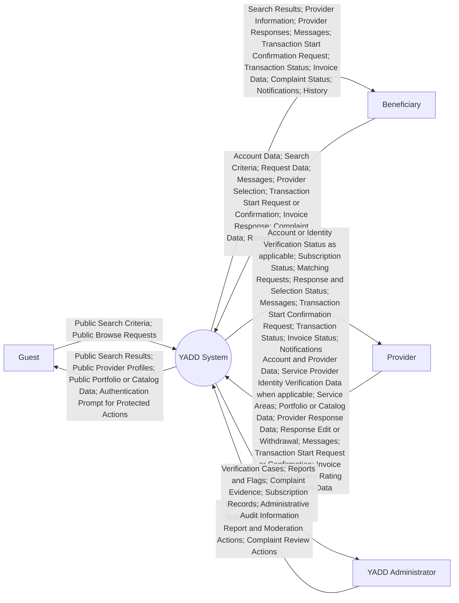
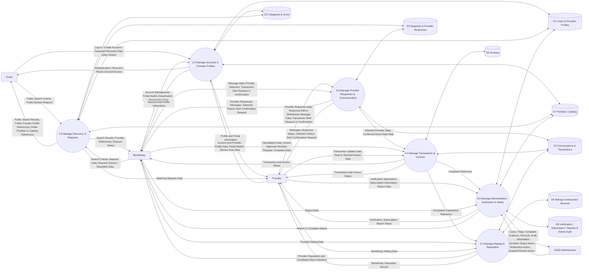

# Data Flow Diagrams — YADD Preliminary Defense

> **الحالة:** `DRAFT FOR PRELIMINARY DEFENSE — CORE SYNCHRONIZED 2026-09-18 THROUGH DEC-090`
>
> **المراجع الحاكمة:** DEC-012/041/046/047/048/050/051/053/063/064/066/067/068/069/070/071/072/073/074/075/076/077/078..090 + `05-SRS.md` + `06-business-rules.md` + `07-lifecycles.md` + `08-use-cases.md`.
>
> يستخدم المشروع DFD وUML معًا وفق DEC-060. يمثل DFD أدناه **تدفقات البيانات**، ولا يستخدم لوصف حالات الكائنات أو تسلسل الرسائل التفصيلي. جميع التسميات داخل الرسم النهائي باللغة الإنجليزية وفق DEC-072.

---

## 1. Context DFD

### Purpose

يمثل النظام كعملية واحدة `YADD System` ويعرض تبادل البيانات مع الجهات الخارجية الرئيسية فقط.

### Context Boundaries

- `Guest` هو Actor خارجي غير authenticated وله Public Browse/Search/View فقط وفق DEC-077؛ لا ينشئ Request/Chat/Transaction/Rating/Block/Report قبل Authentication.
- ظهور CTA محمي للGuest لا يعني تنفيذ العملية؛ يعيد النظام Authentication Prompt، ويجب أن يفرض Backend/API الصلاحية فعليًا.
- `Beneficiary` and `Provider` are behavioral actors; the same person may use both roles through one User account.
- `Service Provider` and `Product Provider` are specializations of Provider and need not appear as separate Context entities; a single Provider Profile is one type only in MVP — DEC-074.
- `YADD Administrator` is the main external administrative actor; detailed roles may be decomposed later.
- Public Provider data excludes private direct-contact data such as phone number and excludes verification/sensitive/private records — DEC-036/046/077.
- No Payment Gateway, Escrow service or Delivery service appears because these are outside YADD's current Beneficiary↔Provider transaction scope.
- Backend/API and Database are internal to YADD and must not appear as Context external entities.
- Administration review of a Transaction complaint is limited to platform evidence/policy; YADD is not modeled as a financial/commercial arbitrator.

---

## 2. Level 0 DFD

### Processes

1. `1.0 Manage Accounts & Provider Profiles`
2. `2.0 Manage Discovery & Requests`
3. `3.0 Manage Provider Responses & Communication`
4. `4.0 Manage Transactions & Invoices`
5. `5.0 Manage Ratings & Reputation`
6. `6.0 Manage Administration, Verification & Safety`

### Logical Data Stores

- `D1 Users & Provider Profiles`
- `D2 Categories & Areas`
- `D3 Requests & Provider Responses`
- `D4 Conversations & Transactions`
- `D5 Invoices`
- `D6 Ratings & Interaction Records`
- `D7 Portfolio / Catalog`
- `D8 Verification / Subscription / Reports & Admin Audit`

---

## 3. Process Semantics

### 1.0 Manage Accounts & Provider Profiles

Manages:
- Guest transition to `Log In / Create Account` when Authentication is required;
- returning-user Log In using verified phone or verified email + password, plus Forgot Password recovery through verified channels;
- Manage Account, Deactivate/Reactivate and last-Portal persistence/switching for the same User account;
- one User account per person;
- one optional Provider Profile per User;
- exactly one Provider Type (`SERVICE` or `PRODUCT`) per Provider Profile in MVP — DEC-074;
- multiple Provider Activities/Categories inside that type, with at least one required before provider-function eligibility — DEC-076;
- service areas; user-facing location selection uses Neighborhood while District is derived internally from Neighborhood;
- Portfolio/Catalog metadata and watermarked display copy.

Guest itself is not stored as a domain account/entity merely because anonymous browsing exists.

### 2.0 Manage Discovery & Requests

Manages:
- public Direct Search/browse for Guest and authenticated Beneficiary;
- public Provider Profile/Portfolio-Catalog discovery using only approved public fields;
- creation/publication of Request for authenticated Beneficiary only;
- discovery of eligible Providers using provider type/category/area constraints;
- Request closure before Provider selection;
- Request expiry and Republish as a new Request.

Public responses to Guest must not expose direct private-contact data such as provider phone number or sensitive/private records. If Guest attempts a protected action, UI/API routes to Authentication rather than creating the protected domain action — DEC-077.

Request inactivity policy: Reminder after 24h and 48h, then Expired after 72h of Beneficiary inactivity; meaningful Beneficiary activity resets the inactivity clock, Provider Response arrival alone does not; Republish creates a new Request and never reopens the expired one — DEC-081.

Discovery/Request UI uses Neighborhood as the user-facing location selector. District remains internal/derived from Neighborhood and continues to participate in the underlying data rules.

### 3.0 Manage Provider Responses & Communication

Manages:
- canonical `Provider Response` terminology;
- one active Provider Response per Provider per Request;
- edit/withdraw response while Request is Open and before selection;
- optional proposed price/note;
- `RequiresDeposit = Yes/No` only;
- private communication before Transaction for authenticated Users only;
- one persistent Conversation per Beneficiary–Provider pair — DEC-075;
- system separators/events that mark Transaction boundaries inside the persistent Conversation;
- Provider selection in Request route;
- `Transaction Start Request` and `Start Confirmation` in Direct Search route; pending start request expires after 12h and only one may be pending per pair — DEC-082.

Chat alone does not create Transaction. A persistent Conversation may contain zero or multiple Transactions over time. Guest cannot create/join the private Conversation before Authentication.

### 4.0 Manage Transactions & Invoices

Transaction becomes Active through either:
1. Beneficiary selects one Provider in Request route; or
2. one party sends a Transaction Start Request and the other confirms within 12h in Direct Search route.

Each Transaction belongs to the persistent Conversation between the same Beneficiary and Provider. Physical linking of individual messages/system events to a specific Transaction remains Chapter Four work.

This process also manages:
- Transaction cancellation with recorded actor/reason/time;
- final/revised invoice;
- Pending Customer Approval;
- Approve / Request Revision / Complaint;
- `Transaction = Completed` after invoice approval;
- `Transaction = Disputed` when a pre-approval dispute remains unresolved and the parties do not reach agreement.

`Completed` is the successful terminal Transaction state. `Disputed` is a terminal unsuccessful state. There is no Transaction state named `Closed` after ratings. Only `Completed` produces a Completed Transaction Reference for Process 5 ratings.

Complaint data may be passed to Process 6 for administrative review. Administration reviews YADD evidence and applies platform policy, but does not decide financial/commercial entitlement or order Payment/Refund/Compensation.

### 5.0 Manage Ratings & Reputation

Manages Post-Transaction operations **only after `Completed`**:
- mandatory Beneficiary→Provider rating;
- optional Provider→Beneficiary rating;
- completed-work count and provider reputation indicators;
- limited beneficiary interaction record.

Ratings do not change Transaction status. No ratings are created for `Cancelled` or `Disputed` Transactions. Guest cannot create Ratings.

### 6.0 Manage Administration, Verification & Safety

Manages:
- Service Provider Identity Verification;
- Provider Subscription state;
- Reports / Moderation / Flags;
- reported Portfolio/Catalog content;
- Transaction complaint review according to `DEC-073`;
- administrative audit records.

AI is an internal assistance mechanism, not an external actor in the main DFD. Safety Flags must preserve enough reason/category information for an authorized reviewer to understand the suspicion; exact categories/thresholds remain open. Transaction complaint review is limited to YADD policy/administrative action and does not create Payment, Refund, Compensation or Settlement processes.

---

## 4. Balancing Check

| External Entity | Context data represented in Level 0? |
|---|---|
| Guest | Yes — public search/browse input, public provider/profile/portfolio output, optional authentication transition |
| Beneficiary | Yes — account, discovery, requests, messages, selection/start confirmation, invoice response, complaints, ratings and reports |
| Provider | Yes — profile, verification, service areas, portfolio/catalog, responses, messages, start confirmation, invoices, ratings and reports |
| YADD Administrator | Yes — verification, subscription, moderation/reports, complaint review and administrative records |

---

## 5. Deliberately Excluded

- Payment / Escrow / Refund / Settlement lifecycle between Beneficiary and Provider.
- Deposit amount, percentage, payment status or refund data.
- Delivery-driver or shipment-management process.
- Shopping Cart.
- `Agreement` process/store/entity.
- Guest-created protected domain actions before Authentication.
- Public exposure of phone/direct private-contact data or sensitive/private records.
- numeric/policy values that remain open, such as AI/moderation thresholds and location-data timing where applicable.
- Provider Type switching behavior not yet approved.

---

## 6. Diagram Readiness Checklist

- [x] Context and Level 0 use the same four main external entities: Guest, Beneficiary, Provider, YADD Administrator.
- [x] Guest public browse and Authentication boundary are aligned with DEC-077.
- [x] Processes and stores are aligned with current SRS/Business Rules through DEC-090 in their applicable scope.
- [x] `Provider Response` is the canonical term; no Offer store/process.
- [x] edit/withdraw response rule is represented.
- [x] Direct Search start request + confirmation is represented.
- [x] persistent Conversation semantics are aligned with DEC-075.
- [x] no Agreement Data Store or Record Agreement process.
- [x] `RequiresDeposit` is data within Provider Response only.
- [x] `Completed` is terminal successful Transaction state.
- [x] `Disputed` is terminal unsuccessful for unresolved pre-approval dispute.
- [x] administration complaint review does not create financial/commercial settlement authority.
- [x] ratings are Post-Transaction and only after Completed.
- [x] all final diagram labels must be English.
- [ ] visual redraw/export with standard DFD notation remains to be produced.

> Level 0 stores are **logical data stores**, not final database tables. Relation Schema and Data Dictionary are Chapter Four design outputs.