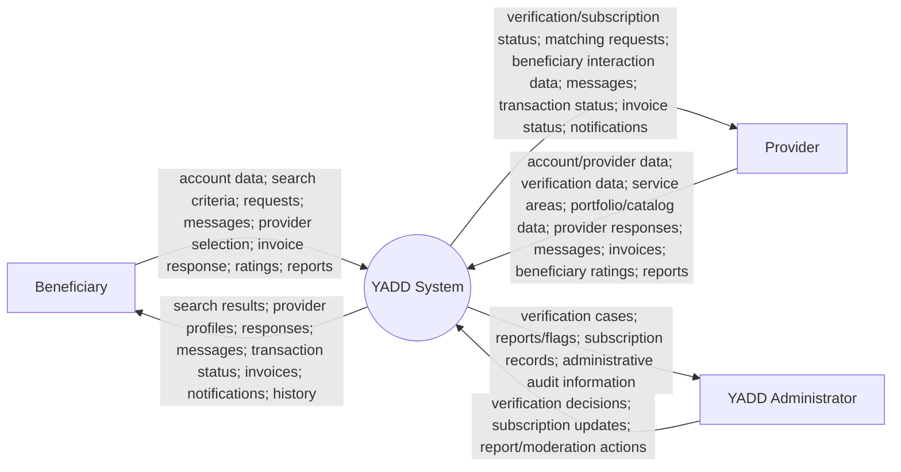
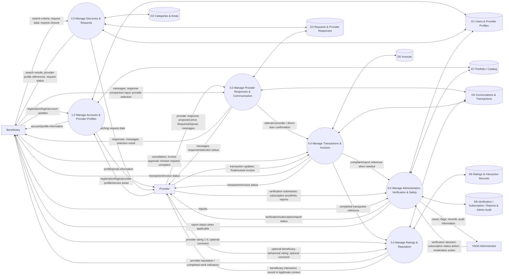

# Data Flow Diagrams — YADD Preliminary Defense

> **الحالة:** `DRAFT FOR PRELIMINARY DEFENSE — SYNCHRONIZED 2026-09-03`
>
> **المراجع الحاكمة:** DEC-012/029/041/046/047/048/050/051/053/063/064/066/067/068 + `05-SRS.md` + `06-business-rules.md` + `07-lifecycles.md` + `08-use-cases.md`.
>
> يستخدم المشروع DFD وUML معًا وفق DEC-060. يمثل DFD أدناه **تدفقات البيانات** ولا يستخدم لوصف حالات الكائنات أو تسلسل الرسائل التفصيلي.

---

## 1. Context DFD

### الهدف

يعرض النظام كعملية واحدة `YADD System` ويبين تبادل البيانات مع الجهات الخارجية الأساسية فقط.

### حدود الـContext

- `Beneficiary` و`Provider` Actors وظيفيان؛ قد يستخدم الشخص الحساب نفسه في الدورين وفق DEC-008..011.
- `Service Provider` و`Product Provider` تخصصان من `Provider` ولا يظهران ككيانين خارجيين منفصلين في Context الرئيسي.
- `YADD Administrator` تمثيل عام لأدوار Verification/Moderation/Subscription في الرسم الرئيسي.
- لا يوجد `Guest` حاليًا كActor مستقل.
- لا يظهر Payment Gateway أو Escrow أو Delivery Service لأن الدفع بين المستفيد والمقدم والتوصيل يقعان خارج نطاق YADD الحالي.
- الـBackend/API وقاعدة البيانات أجزاء داخل حدود YADD وليست External Entities.

---

## 2. Level 0 DFD

### العمليات الرئيسية

1. `1.0 Manage Accounts & Provider Profiles`
2. `2.0 Manage Discovery & Requests`
3. `3.0 Manage Provider Responses & Communication`
4. `4.0 Manage Transactions & Invoices`
5. `5.0 Manage Ratings & Reputation`
6. `6.0 Manage Administration, Verification & Safety`

### مخازن البيانات الرئيسية

- `D1 Users & Provider Profiles`
- `D2 Categories & Areas`
- `D3 Requests & Provider Responses`
- `D4 Conversations & Transactions`
- `D5 Invoices`
- `D6 Ratings & Interaction Records`
- `D7 Portfolio / Catalog`
- `D8 Verification / Subscription / Reports & Admin Audit`

---

## 3. Process Notes

### 1.0 Manage Accounts & Provider Profiles

يدير:

- حساب User الواحد.
- الانتقال بين بوابة المستفيد والمقدم.
- Provider Profile.
- Service/Product Activity.
- مناطق الخدمة.
- Portfolio/Catalog metadata ونسخة العرض ذات العلامة المائية.

لا يعتمد صلاحية التقديم على الواجهة؛ الصلاحية النهائية تطبق داخل النظام وفق التحقق والاشتراك.

### 2.0 Manage Discovery & Requests

يدير:

- البحث المباشر حسب التصنيف والمديرية/الحي.
- إنشاء ونشر Request.
- توزيع الطلب على المقدمين المؤهلين.
- إغلاق الطلب قبل الاختيار.
- Expiry في المبدأ، مع بقاء التوقيت `REQ-EXP-Q01` مفتوحًا.

### 3.0 Manage Provider Responses & Communication

يدير:

- `Provider Response` وليس Offer كمصطلح قياسي.
- السعر المقترح عند الحاجة.
- `RequiresDeposit = Yes/No` فقط.
- المحادثة الخاصة قبل Transaction.
- اختيار Provider Response في مسار الطلب.

لا يسجل مبلغ العربون أو نسبته أو حالته المالية.

### 4.0 Manage Transactions & Invoices

يدير:

- إنشاء Active Transaction من Selection أو اتفاق الطرفين في البحث المباشر.
- Transaction Cancellation مع السبب.
- الفاتورة النهائية ونسخ التعديل.
- Pending Customer Approval.
- Approve / Request Revision / Dispute.
- تحويل Transaction إلى Completed بعد اعتماد الفاتورة.

لا يوجد Data Store باسم Agreement ولا عملية `Record Agreement` مستقلة.

### 5.0 Manage Ratings & Reputation

يدير:

- تقييم المستفيد للمقدم بعد Completed: 1–5 إلزامي + تعليق اختياري.
- تقييم المقدم للمستفيد: اختياري بثلاثة مؤشرات سلوكية 1–5 + تعليق اختياري.
- سجل تعامل المستفيد المرئي للمقدمين فقط في سياق تعامل مشروع.
- عدد المعاملات المكتملة للمقدم كمؤشر خبرة داخل YADD.

لا ينتج عن تقييم المستفيد عقوبة أو منع آلي في MVP.

### 6.0 Manage Administration, Verification & Safety

يدير:

- Provider Verification.
- حالة اشتراك المقدم.
- Reports / Moderation / Flags.
- مراجعة Portfolio/Catalog المبلغ عنه.
- Audit records للأعمال الإدارية الحساسة.

AI إن استخدم يولد مساعدات/Flags ولا يصدر وحده قرار تحقق نهائي أو عقوبة عالية الأثر.

---

## 4. Balancing Check — Context vs Level 0

| External Entity | أهم التدفقات في Context | ممثلة في Level 0؟ |
|---|---|---|
| Beneficiary | الحساب، البحث، الطلب، الرسائل، الاختيار، الفاتورة، التقييم، البلاغ | نعم |
| Provider | الملف، التحقق، المناطق، Portfolio/Catalog، الاستجابة، الرسائل، الفاتورة، تقييم المستفيد، البلاغ | نعم |
| YADD Administrator | التحقق، الاشتراك، البلاغات/المراقبة، السجل الإداري | نعم |

---

## 5. عناصر غير ممثلة عمدًا

- Payment/Escrow/Refund lifecycle بين المستفيد والمقدم.
- إدارة توصيل أو سائقين.
- Shopping Cart مستقل.
- `Agreement` ككيان أو مخزن بيانات مستقل.
- Guest/Web browsing كActor مستقل.
- القيم الرقمية غير المحسومة مثل Expiry timing وAI thresholds.

---

## 6. Review Checklist Before Supervisor Delivery

- [x] Context DFD متوازن مع Level 0 من حيث الجهات الخارجية الرئيسية.
- [x] الخدمة والمنتج يستخدمان Provider/Core Flow واحدًا مع الاختلافات التشغيلية عند الحاجة.
- [x] لا يوجد Agreement Data Store.
- [x] المصطلح القياسي `Provider Response`.
- [x] العربون Yes/No فقط دون Payment data.
- [x] Invoice وRating متوافقان مع Core Flow الحالي.
- [x] Admin/Verification/Safety ممثلة دون اختراع أدوار خارج القرار.
- [ ] إخراج الرسم النهائي برموز DFD القياسية وبأسماء عربية موحدة قبل التسليم.
- [ ] مراجعة ERD لضمان أن Data Stores الأساسية قابلة للاشتقاق من النموذج المفاهيمي الجديد.

> مخازن Level 0 هنا **Logical Data Stores** وليست جداول قاعدة بيانات نهائية. Relation Schema وData Dictionary تشتق لاحقًا من ERD في مسار التصميم.