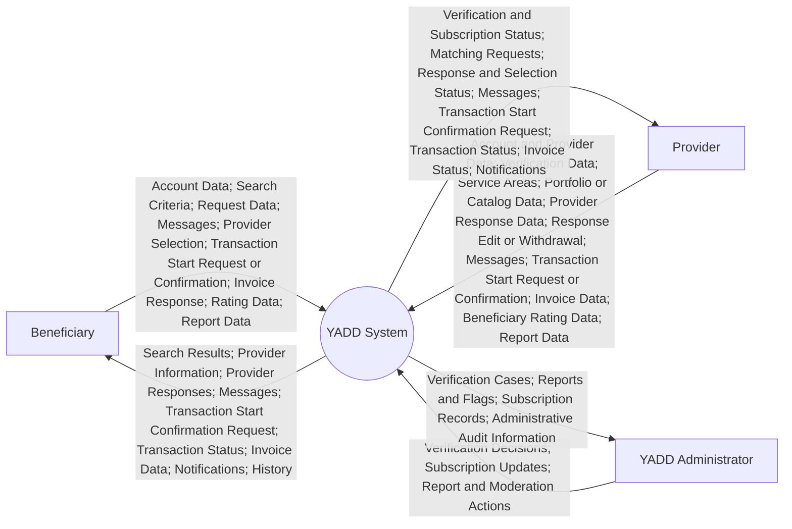
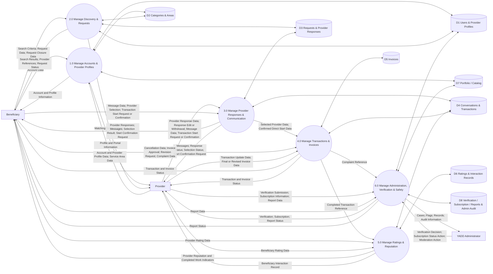

# Data Flow Diagrams — YADD Preliminary Defense

> **الحالة:** `DRAFT FOR PRELIMINARY DEFENSE — CORE SYNCHRONIZED 2026-09-04`
>
> **المراجع الحاكمة:** DEC-012/029/041/046/047/048/050/051/053/063/064/066/067/068/069/070/071/072 + `05-SRS.md` + `06-business-rules.md` + `07-lifecycles.md` + `08-use-cases.md`.
>
> يستخدم المشروع DFD وUML معًا وفق DEC-060. يمثل DFD أدناه **تدفقات البيانات**، ولا يستخدم لوصف حالات الكائنات أو تسلسل الرسائل التفصيلي. جميع التسميات داخل الرسم النهائي باللغة الإنجليزية وفق DEC-072.

---

## 1. Context DFD

### Purpose

يمثل النظام كعملية واحدة `YADD System` ويعرض تبادل البيانات مع الجهات الخارجية الرئيسية فقط.

### Context Boundaries

- `Beneficiary` and `Provider` are behavioral actors; the same person may use both roles through one User account.
- `Service Provider` and `Product Provider` are specializations of Provider and need not appear as separate Context entities.
- `YADD Administrator` is the main external administrative actor; detailed roles may be decomposed later.
- No `Guest` actor is currently approved.
- No Payment Gateway, Escrow service or Delivery service appears because these are outside YADD's current Beneficiary↔Provider transaction scope.
- Backend/API and Database are internal to YADD and must not appear as Context external entities.

---

## 2. Level 0 DFD

### Processes

1. `1.0 Manage Accounts & Provider Profiles`
2. `2.0 Manage Discovery & Requests`
3. `3.0 Manage Provider Responses & Communication`
4. `4.0 Manage Transactions & Invoices`
5. `5.0 Manage Ratings & Reputation`
6. `6.0 Manage Administration, Verification & Safety`

### Logical Data Stores

- `D1 Users & Provider Profiles`
- `D2 Categories & Areas`
- `D3 Requests & Provider Responses`
- `D4 Conversations & Transactions`
- `D5 Invoices`
- `D6 Ratings & Interaction Records`
- `D7 Portfolio / Catalog`
- `D8 Verification / Subscription / Reports & Admin Audit`

---

## 3. Process Semantics

### 1.0 Manage Accounts & Provider Profiles

Manages:
- one User account per person;
- Provider Profile;
- Service/Product Activity;
- service areas;
- Portfolio/Catalog metadata and watermarked display copy.

### 2.0 Manage Discovery & Requests

Manages:
- Direct Search by category/area;
- creation/publication of Request;
- discovery of eligible Providers;
- Request closure before Provider selection;
- Request expiry in principle.

Exact expiry/reminder timing is `REQ-EXP-Q01` and must not be shown as a numeric value in the diagram.

### 3.0 Manage Provider Responses & Communication

Manages:
- canonical `Provider Response` terminology;
- one active Provider Response per Provider per Request;
- edit/withdraw response while Request is Open and before selection;
- optional proposed price/note;
- `RequiresDeposit = Yes/No` only;
- private communication before Transaction;
- Provider selection in Request route;
- `Transaction Start Request` and `Start Confirmation` in Direct Search route.

Chat alone does not create Transaction.

### 4.0 Manage Transactions & Invoices

Transaction becomes Active through either:
1. Beneficiary selects one Provider in Request route; or
2. one party sends a Transaction Start Request and the other confirms in Direct Search route.

This process also manages:
- Transaction cancellation with recorded reason;
- final/revised invoice;
- Pending Customer Approval;
- Approve / Request Revision / Dispute;
- `Transaction = Completed` after invoice approval.

`Completed` is the successful terminal Transaction state. There is no Transaction state named `Closed` after ratings.

### 5.0 Manage Ratings & Reputation

Manages Post-Transaction operations:
- mandatory Beneficiary→Provider rating after Completed;
- optional Provider→Beneficiary rating after Completed;
- completed-work count and provider reputation indicators;
- limited beneficiary interaction record.

Ratings do not change Transaction status.

### 6.0 Manage Administration, Verification & Safety

Manages:
- Provider Verification;
- Provider Subscription state;
- Reports / Moderation / Flags;
- reported Portfolio/Catalog content;
- administrative audit records.

AI is an internal assistance mechanism, not an external actor in the main DFD.

---

## 4. Balancing Check

| External Entity | Context data represented in Level 0? |
|---|---|
| Beneficiary | Yes — account, discovery, requests, messages, selection/start confirmation, invoice response, ratings and reports |
| Provider | Yes — profile, verification, service areas, portfolio/catalog, responses, messages, start confirmation, invoices, ratings and reports |
| YADD Administrator | Yes — verification, subscription, moderation/reports and administrative records |

---

## 5. Deliberately Excluded

- Payment / Escrow / Refund lifecycle between Beneficiary and Provider.
- Deposit amount, percentage, payment status or refund data.
- Delivery-driver or shipment-management process.
- Shopping Cart.
- `Agreement` process/store/entity.
- Guest actor.
- numeric values that remain open such as expiry timing and AI thresholds.

---

## 6. Diagram Readiness Checklist

- [x] Context and Level 0 use the same three main external entities.
- [x] Processes and stores are aligned with current SRS/Business Rules.
- [x] `Provider Response` is the canonical term; no Offer store/process.
- [x] edit/withdraw response rule is represented.
- [x] Direct Search start request + confirmation is represented.
- [x] no Agreement Data Store or Record Agreement process.
- [x] `RequiresDeposit` is data within Provider Response only.
- [x] `Completed` is terminal successful Transaction state.
- [x] ratings are Post-Transaction.
- [x] all final diagram labels must be English.
- [ ] visual redraw/export with standard DFD notation remains to be produced.

> Level 0 stores are **logical data stores**, not final database tables. Relation Schema and Data Dictionary are Chapter Four design outputs.