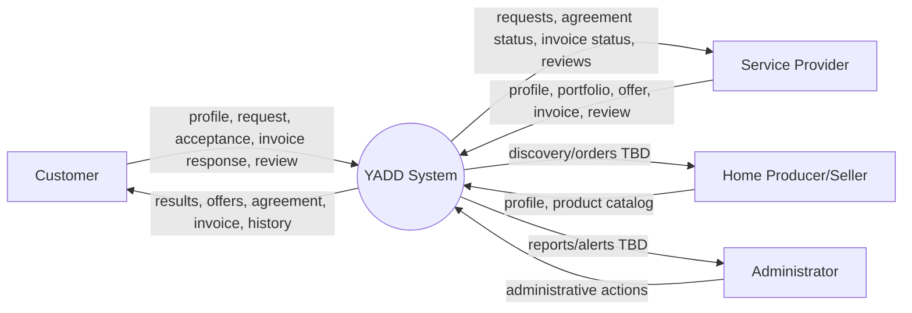
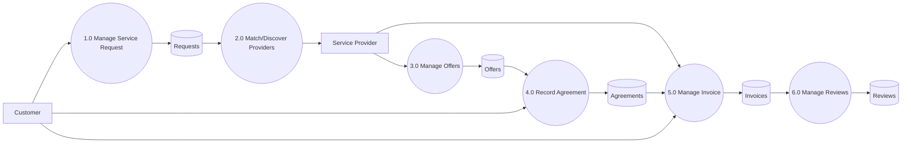

# Data Flow Diagrams

> **الحالة:** `DRAFT / SUBJECT TO GOV-Q02`
>
> هيكل 1447 يطلب DFD، بينما دليل المشاريع يتضمن تنبيهًا حول عدم خلط منهجيات التحليل. يعتمد الاستخدام النهائي على قرار المشرف.

## Context DFD — Working View

> تدفق "products/orders" غير مكتمل؛ وثائق المشروع لم تحسم دورة شراء المنتجات كما حسمت فكرة طلب الخدمة. يجب عدم افتراض Shopping Cart/Order/Delivery.

## Level 1 — Service Transaction Candidate

كل Process/Data Store يوثق لاحقًا في `12-process-data-specifications.md`.
