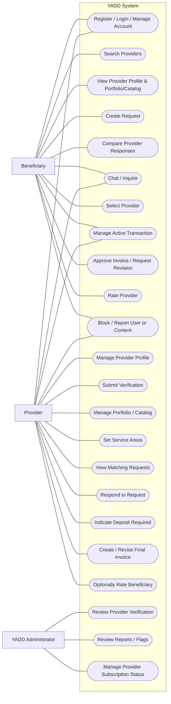
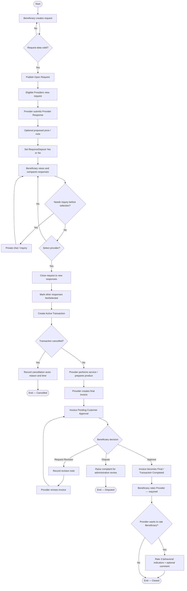
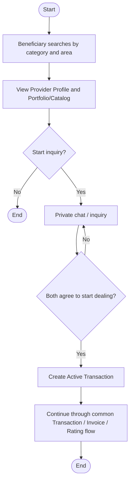
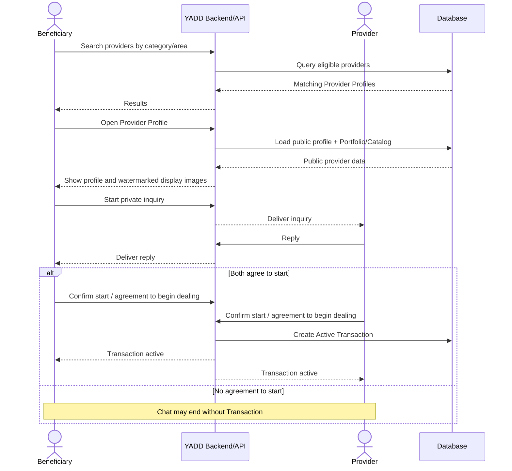

# UML Models — YADD Preliminary Defense

> **الحالة:** `DRAFT FOR PRELIMINARY DEFENSE — SYNCHRONIZED 2026-09-03`
>
> **المراجع الحاكمة:** DEC-046/047/048/050/051/063/064/066/067/068 + `05-SRS.md` + `06-business-rules.md` + `07-lifecycles.md` + `08-use-cases.md`.
>
> يستخدم المشروع DFD وUML معًا وفق DEC-060. هذه النماذج تمثل الحالة الحالية للمراجعة مع المشرف وليست Baseline نهائيًا.

## 1. Actor Model

### Actors العامة في المخطط الرئيسي

- `Beneficiary` — المستفيد.
- `Provider` — المقدم.
  - `Service Provider` — تخصص من Provider عند الحاجة.
  - `Product Provider` — تخصص من Provider عند الحاجة.
- `YADD Administrator` — تمثيل عام للأعمال الإدارية في المخطط الرئيسي.

### أدوار إدارية تفصيلية

- `Verification Reviewer`.
- `Content Moderator`.
- `Subscription Administrator`.

استخدام `YADD Administrator` في الرسم الرئيسي هو تبسيط نمذجي فقط ولا يعني أن موظفًا واحدًا يجب أن يمتلك جميع الصلاحيات.

---

## 2. Main Use Case Diagram — Working Representation

> ملاحظة: Mermaid لا يوفر ترميز UML Use Case البيضاوي الأصلي؛ لذلك يمثل الرسم التالي **العلاقات ومحتوى System Boundary** بصورة عمل، ويجب عند إخراج النسخة الأكاديمية النهائية رسم الحالات بأشكال Use Case القياسية دون تغيير العلاقات الموضحة هنا.



### ملاحظات على الرسم

1. `Service Provider` و`Product Provider` يرثان الوظائف العامة من `Provider`، ويمكن إظهارهما كتخصصين في نسخة UML الرسومية النهائية إذا احتاج المشرف ذلك.
2. `Guest` غير موجود في النموذج الحالي؛ لم يعتمد Actor مستقل للتصفح العام.
3. `Agreement` ليس Use Case أو Entity مستقلًا في MVP الحالي؛ المسار المعتمد هو `Request → Provider Response → Selection → Transaction`.
4. `Indicate Deposit Required` يعني فقط `RequiresDeposit = Yes/No` ولا يتضمن مبلغًا أو دفعًا أو Refund داخل YADD.
5. تقييم المستفيد للمقدم إلزامي بعد اكتمال المعاملة، وتقييم المقدم للمستفيد اختياري.

---

## 3. Activity Diagram — Published Request to Transaction Closure



### حدود النشاط

- أي دفع أو عربون أو استرداد يتم خارج YADD.
- عدم الرد على الفاتورة لا يعد موافقة ولا يوجد Auto-Approval.
- لا يوجد `Agreement` مستقل ولا Change Order مستقل في MVP.
- تقييم المقدم للمستفيد لا ينتج عقوبة آلية.

---

## 4. Activity Diagram — Direct Search Route to Active Transaction



المحادثة وحدها لا تنشئ Transaction؛ يلزم اتفاق الطرفين على بدء التعامل في مسار البحث المباشر.

---

## 5. Sequence Diagram — Published Request Route

```mermaid
sequenceDiagram
    actor B as Beneficiary
    participant Y as YADD Backend/API
    actor P as Provider
    participant DB as Database

    B->>Y: Create and publish request
    Y->>DB: Save Request = Open
    Y-->>P: Expose matching request

    P->>Y: Submit Provider Response
    Note over P,Y: Proposed price/note optional
RequiresDeposit = Yes/No only
    Y->>DB: Save response
    Y-->>B: Show response for comparison

    opt Inquiry before selection
        B->>Y: Send message
        Y-->>P: Deliver private message
        P->>Y: Reply
        Y-->>B: Deliver reply
    end

    B->>Y: Select provider
    Y->>DB: Request = Matched
Other responses = NotSelected
Create Active Transaction
    Y-->>P: Provider selected / transaction active
    Y-->>B: Transaction active

    alt Transaction cancelled before final invoice
        B->>Y: Cancel + reason
        Y->>DB: Save Cancelled + actor + reason + time
        Y-->>P: Cancellation recorded
    else Work completed / product prepared
        P->>Y: Submit final invoice
        Y->>DB: Save invoice = PendingCustomerApproval
        Y-->>B: Request invoice review

        alt Request revision
            B->>Y: Request revision + note
            Y-->>P: Revision requested
            P->>Y: Submit revised invoice
            Y-->>B: Show revised invoice
        else Approve
            B->>Y: Approve final invoice
            Y->>DB: Invoice = Final
Transaction = Completed
            Y-->>B: Require Provider rating
            B->>Y: Submit provider rating 1-5 + optional comment
            Y->>DB: Save provider rating
            Y-->>P: Show optional beneficiary rating prompt
            opt Provider chooses to rate beneficiary
                P->>Y: Submit 3 behavioral scores + optional comment
                Y->>DB: Save beneficiary interaction rating
            end
        end
    end
```

---

## 6. Sequence Diagram — Direct Search Route



---

## 7. Class Diagram — Deferred Until ERD Synchronization

الـClass Diagram القديم كان يعتمد `Offer → Agreement → Invoice/Review` ولذلك لم يعد صالحًا بعد DEC-066.

**الحالة:** `BLOCKED BY ERD SYNCHRONIZATION`.

سيشتق Class Diagram الجديد بعد مراجعة `11-ERD.md` حتى نتجنب إنشاء Classes وعلاقات لا تتفق مع نموذج البيانات المعتمد. الحد الأدنى المتوقع للمراجعة يشمل:

- User / roles or permissions.
- ProviderProfile and provider activities.
- Request.
- ProviderResponse.
- Transaction.
- Invoice and invoice revisions/items.
- Provider rating and beneficiary interaction rating.
- Portfolio/Catalog items and media.
- Category / Area.
- Verification / Subscription / Report entities بالقدر المثبت في SRS.

لا تعتبر هذه القائمة Cardinalities نهائية قبل ERD.

---

## 8. Review Checklist Before Supervisor Delivery

- [x] لا يستخدم `Customer` بدل `Beneficiary`.
- [x] لا يستخدم `Offer` كالمصطلح الرئيسي؛ المصطلح القياسي `Provider Response`.
- [x] لا يوجد `Agreement` مستقل.
- [x] اختيار Provider Response يبدأ Transaction في مسار الطلب.
- [x] البحث المباشر يحتاج اتفاق الطرفين قبل Transaction.
- [x] العربون معلومة Yes/No فقط والدفع خارجي.
- [x] Invoice approval يؤدي إلى Transaction Completed.
- [x] Beneficiary → Provider rating إلزامي.
- [x] Provider → Beneficiary rating اختياري بثلاثة مؤشرات.
- [x] Portfolio/Catalog ظاهر ضمن وظائف Provider.
- [x] Actors متوافقة مع DEC-067.
- [ ] Class Diagram ينتظر ERD الجديد.
- [ ] مراجعة بصرية نهائية وإخراج UML قياسي للطباعة قبل تسليم 5 سبتمبر.
