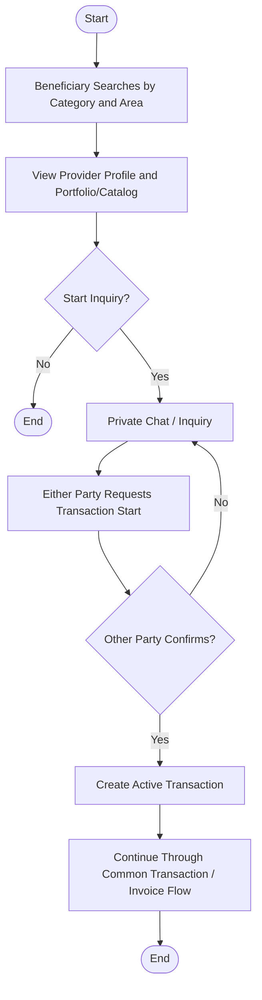
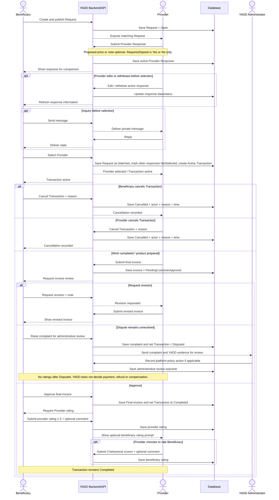
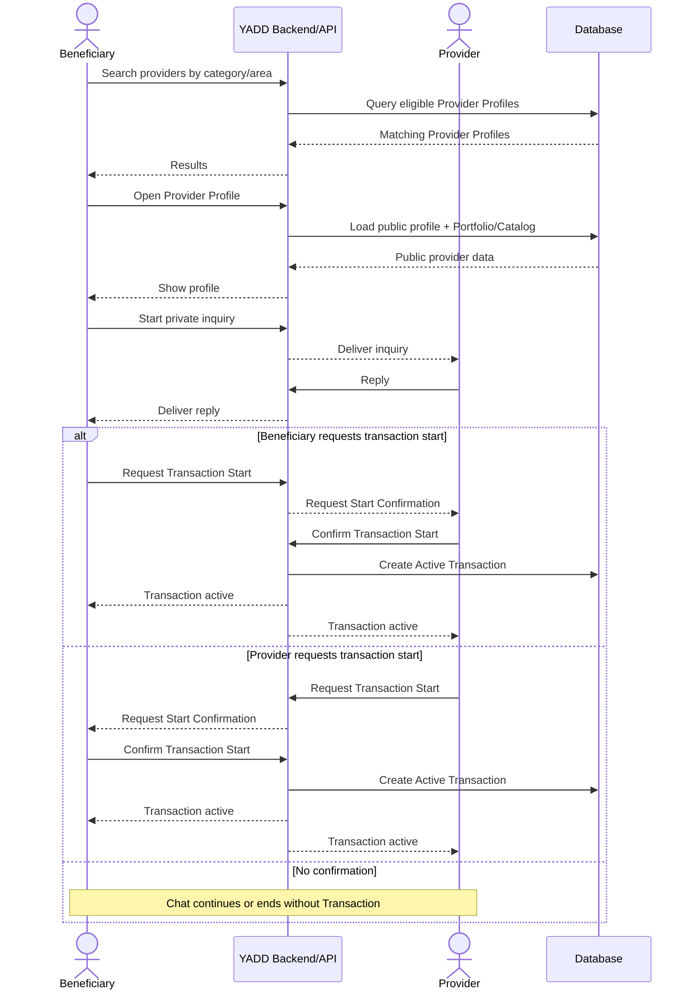

# نماذج UML — YADD Preliminary Defense

> **الحالة:** `DRAFT FOR PRELIMINARY DEFENSE — CORE SYNCHRONIZED 2026-09-04`
>
> **المراجع الحاكمة:** DEC-046/047/048/050/051/063/064/066/067/068/069/070/071/072/073 + `05-SRS.md` + `06-business-rules.md` + `07-lifecycles.md` + `08-use-cases.md`.
>
> يستخدم YADD كلًا من DFD وUML وفق `DEC-060`. يجب أن تكون جميع التسميات داخل المخططات الأكاديمية النهائية باللغة الإنجليزية وفق `DEC-072`.

## 1. نموذج الـActors

### الـActors الرئيسيون
- `Beneficiary`
- `Provider`
  - تخصص `Service Provider` عند الحاجة
  - تخصص `Product Provider` عند الحاجة
- `YADD Administrator`

### الأدوار الإدارية المتخصصة
- `Verification Reviewer`
- `Content Moderator`
- `Subscription Administrator`

استخدام `YADD Administrator` في المخطط الرئيسي هو تبسيط نمذجي، ولا يعني أن موظفًا واحدًا يمتلك جميع الصلاحيات الإدارية.

---

## 2. Main Use Case Diagram — Working UML Decomposition

> هذا الرسم يعيد تفكيك السيناريوهات المركبة إلى Actor goals أصغر حتى تكون علاقات `<<include>>` و`<<extend>>` ذات معنى UML واضح. لا تستخدم العلاقات لتمثيل مجرد التسلسل الزمني؛ التبعيات الزمنية/الحالية تمثل كـPreconditions/Postconditions في المواصفات. اللون والأسلوب البصري يحاكيان القالب المرجعي الذي وفره الفريق، بينما Actors القياسية النهائية تحتاج إعادة رسم/تصدير بصري لاحق.

### دلالات Main Use Case

1. `Service Provider` و`Product Provider` تخصصان من `Provider` وفق `DEC-067`، ولا يلزم تكرارهما داخل الرسم الرئيسي.
2. لا يوجد Actor مستقل باسم `Guest` حاليًا.
3. لا توجد Use Case/Entity باسم `Agreement`; المسار القياسي في الطلب هو `Request → Provider Response → Selection → Transaction`.
4. `View Provider Profile <<extend>> Search Providers` لأن البحث قد ينتهي دون فتح ملف بعينه.
5. `Communicate / Inquire <<extend>> View Provider Profile` في Direct Search، ويمتد أيضًا من `Compare Provider Responses` في Request Route لأن الاستفسار قبل الاختيار اختياري.
6. `Select Provider <<extend>> Compare Provider Responses`: المقارنة يمكن أن تتم دون اختيار، بينما الاختيار يحدث عند قرار المستفيد. عند حدوث الاختيار فهو **يتضمن** `Create Active Transaction` لأن `DEC-047/066` يفرضان بدء Transaction في Request Route.
7. `Submit Provider Response <<extend>> View Matching Requests`: مشاهدة الطلب لا تلزم Provider بالاستجابة. وعند الإرسال يجب دائمًا تنفيذ `Validate Response Eligibility` الذي يمثل شرط Verified Provider + Active Subscription + Open Request.
8. `Request Transaction Start <<extend>> Communicate / Inquire` في Direct Search فقط؛ المحادثة قد تستمر أو تنتهي دون Transaction. أما عند `Confirm Transaction Start` الإيجابي فيتم تضمين `Create Active Transaction` وفق `DEC-069`.
9. `Review Final Invoice` هو الأساس؛ `Approve Final Invoice` و`Request Invoice Revision` و`Raise Transaction Complaint` امتدادات شرطية لقرار المراجعة. عند الاعتماد فقط يتم `<<include>> Complete Transaction` لأن الاعتماد يجعل Transaction = `Completed` دائمًا.
10. `Rate Provider` و`Rate Beneficiary` Use Cases مستقلة من ناحية Actor goal، لكنهما **غير متاحتين بحرية**: كلتاهما تتطلبان `Transaction = Completed`. الأولى إلزامية على Beneficiary بعد Completed، والثانية اختيارية على Provider. لذلك لا تمثل تبعية Completed بأسهم `include/extend`.
11. `Cancel Transaction` تتطلب Transaction قائمة وفي حالة تسمح بالإلغاء. `Close Open Request` مختلفة عنها وتتطلب Request Open قبل الاختيار.
12. `Edit Provider Response` و`Withdraw Provider Response` تتطلبان استجابة فعالة مع Request Open وقبل selection وفق `DEC-070`; لا تربطان بعلاقة `include/extend` مصطنعة مع `Submit Provider Response`.
13. `Revise Final Invoice` تتطلب `Revision Requested` سابقة؛ و`Review Provider Verification`/`Review Transaction Complaint` أهداف إدارية لاحقة مستقلة تعتمد على وجود submission/complaint، وليست أجزاء included داخل فعل المرسل.
14. تم فصل `Block User` عن `Report User / Content`: يستطيع المستخدم تنفيذ أحدهما دون الآخر، وReport يخضع لاحقًا لمراجعة إدارية.
15. `Create Active Transaction`, `Complete Transaction`, و`Validate Response Eligibility` تمثل سلوكًا نظاميًا مشتركًا/إلزاميًا، وليس Actor goals مستقلة؛ لذلك لا ترتبط مباشرة بـActor.
16. اللون المستخدم لحالات الاستخدام هو `LightBlue (#ADD8E6)` مع خلفية بيضاء وحدود رمادية رفيعة لمحاكاة القالب المرجعي؛ هذا قرار عرض لا Business Rule.

### Preconditions / Postconditions التي يجب ألا تُفهم كـ`include`/`extend`

- `Rate Provider`: Precondition = `Transaction Completed`; Post-Transaction required step.
- `Rate Beneficiary`: Precondition = `Transaction Completed`; optional Provider action.
- `Cancel Transaction`: Precondition = active/cancellable Transaction.
- `Close Open Request`: Precondition = Request Open + no Provider selected.
- `Edit/Withdraw Provider Response`: Precondition = active response + Request Open + before selection.
- `Review Final Invoice`: Precondition = invoice `Pending Customer Approval`.
- `Revise Final Invoice`: Precondition = revision previously requested.
- `Review Provider Verification`: Precondition = verification submission exists.
- `Review Transaction Complaint`: Precondition = complaint exists.

---

## 3. Activity Diagram — Published Request Route

`Completed` هي الحالة النهائية الناجحة للـ`Transaction`؛ أما التقييمات الظاهرة بعدها فهي Post-Transaction workflow فقط. `Disputed` حالة نهائية غير ناجحة عندما يبقى نزاع الفاتورة قبل الاعتماد دون حل. تراجع الإدارة أدلة YADD وتطبق سياسة المنصة، لكنها لا تقرر الدفع أو الاسترداد أو التعويض أو أي استحقاق مالي/تجاري آخر بين الطرفين.

---

## 4. Activity Diagram — Direct Search Route

المحادثة وحدها لا تنشئ `Transaction`.

---

## 5. Sequence Diagram — Published Request Route

---

## 6. Sequence Diagram — Direct Search Route

---

## 7. Class Diagram — النموذج المصدر

يجب إعادة بناء `Class Diagram` من الـConceptual ERD المتزامن في `11-ERD.md`، وعدم إعادة استخدام نموذج الكلاسات القديم `Offer → Agreement → Review`.

الحد الأدنى من Domain classes/concepts الحالية:
- User
- ProviderProfile
- ProviderActivity
- Category
- Area / ProviderServiceArea
- ShowcaseItem
- Request
- ProviderResponse
- Conversation / Message
- Transaction
- Invoice / InvoiceVersion / InvoiceItem according to chosen class abstraction
- ProviderRating
- BeneficiaryRating
- VerificationCase / VerificationArtifact
- Subscription
- Report

خيارات قاعدة البيانات الفيزيائية مثل بنية جدول Media أو `InvoiceVersion` مقابل `Invoice + Revision` هي قرارات تصميم في Chapter Four، ولا يجوز اختلاقها كحقائق تحليلية.

---

## 8. قائمة جاهزية المخططات — Diagram Readiness Checklist

- [x] الـActors متوافقة مع `DEC-067`.
- [x] التسميات الإنجليزية فقط متوافقة مع `DEC-072`.
- [x] لا يوجد `Guest` actor.
- [x] لا توجد `Agreement` مستقلة.
- [x] المصطلح القياسي هو `Provider Response`.
- [x] تعديل/سحب `Provider Response` ممثلان كتبعيات مشروطة لا كعلاقات UML مصطنعة.
- [x] `RequiresDeposit` بيانات داخل الاستجابة وليست Use Case/Payment flow مستقلة.
- [x] Request Route وDirect Search يفصلان آليتي بدء Transaction بصورة صحيحة.
- [x] `<<include>>` يستخدم فقط للسلوك الإلزامي داخل الـBase Use Case.
- [x] `<<extend>>` يستخدم فقط للسلوك الشرطي/الاختياري.
- [x] التبعيات الزمنية/الحالية مثل Ratings بعد Completed ممثلة كـPreconditions/Postconditions.
- [x] اعتماد الفاتورة يؤدي إلى `Completed`.
- [x] لا توجد حالة `Transaction` باسم `Closed`.
- [x] النزاع غير المحلول قبل الاعتماد يؤدي إلى الحالة النهائية `Disputed`.
- [x] الإدارة لا تقرر استحقاق payment/refund/compensation.
- [x] تحدث `Ratings` فقط بعد `Completed`، وليس بعد `Cancelled` أو `Disputed`.
- [x] تقييم `Beneficiary→Provider` إلزامي؛ وتقييم `Provider→Beneficiary` اختياري.
- [x] `Block User` و`Report User / Content` منفصلتان في الرسم الرئيسي.
- [x] مفاهيم مصدر `Class Diagram` محددة من ERD المتزامن.
- [ ] ما يزال مطلوبًا اعتماد/تصدير الرسم البصري النهائي وفق ترميز UML القياسي بعد مراجعة الفريق.
