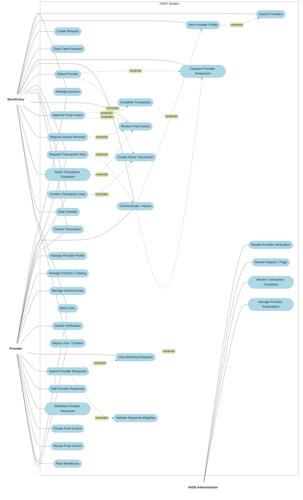
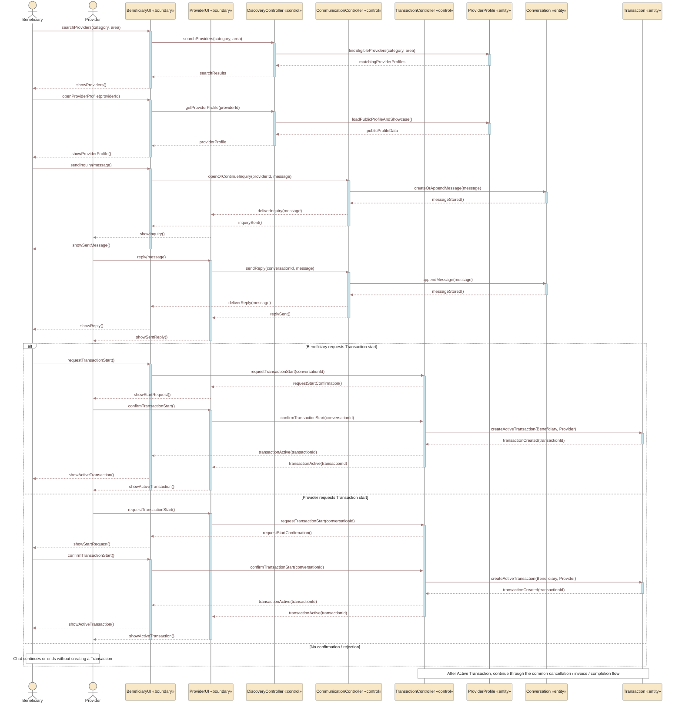

# نماذج UML — YADD Preliminary Defense

> **الحالة:** `DRAFT FOR PRELIMINARY DEFENSE — CORE SYNCHRONIZED 2026-09-04`
>
> **المراجع الحاكمة:** DEC-046/047/048/050/051/063/064/066/067/068/069/070/071/072/073 + `05-SRS.md` + `06-business-rules.md` + `07-lifecycles.md` + `08-use-cases.md`.
>
> يستخدم YADD كلًا من DFD وUML وفق `DEC-060`. يجب أن تكون جميع التسميات داخل المخططات الأكاديمية النهائية باللغة الإنجليزية وفق `DEC-072`.

## 1. نموذج الـActors

### الـActors الرئيسيون
- `Beneficiary`
- `Provider`
  - تخصص `Service Provider` عند الحاجة
  - تخصص `Product Provider` عند الحاجة
- `YADD Administrator`

### الأدوار الإدارية المتخصصة
- `Verification Reviewer`
- `Content Moderator`
- `Subscription Administrator`

استخدام `YADD Administrator` في المخطط الرئيسي هو تبسيط نمذجي، ولا يعني أن موظفًا واحدًا يمتلك جميع الصلاحيات الإدارية.

---

## 2. Main Use Case Diagram — Working UML Decomposition

> هذا الرسم يعيد تفكيك السيناريوهات المركبة إلى Actor goals أصغر حتى تكون علاقات `<<include>>` و`<<extend>>` ذات معنى UML واضح. لا تستخدم العلاقات لتمثيل مجرد التسلسل الزمني؛ التبعيات الزمنية/الحالية تمثل كـPreconditions/Postconditions في المواصفات. اللون والأسلوب البصري يحاكيان القالب المرجعي الذي وفره الفريق، بينما Actors القياسية النهائية تحتاج إعادة رسم/تصدير بصري لاحق.



### دلالات Main Use Case

1. `Service Provider` و`Product Provider` تخصصان من `Provider` وفق `DEC-067`، ولا يلزم تكرارهما داخل الرسم الرئيسي.
2. لا يوجد Actor مستقل باسم `Guest` حاليًا.
3. لا توجد Use Case/Entity باسم `Agreement`; المسار القياسي في الطلب هو `Request → Provider Response → Selection → Transaction`.
4. `View Provider Profile <<extend>> Search Providers` لأن البحث قد ينتهي دون فتح ملف بعينه.
5. `Communicate / Inquire <<extend>> View Provider Profile` في Direct Search، ويمتد أيضًا من `Compare Provider Responses` في Request Route لأن الاستفسار قبل الاختيار اختياري.
6. `Select Provider <<extend>> Compare Provider Responses`: المقارنة يمكن أن تتم دون اختيار، بينما الاختيار يحدث عند قرار المستفيد. عند حدوث الاختيار فهو **يتضمن** `Create Active Transaction` لأن `DEC-047/066` يفرضان بدء Transaction في Request Route.
7. `Submit Provider Response <<extend>> View Matching Requests`: مشاهدة الطلب لا تلزم Provider بالاستجابة. وعند الإرسال يجب دائمًا تنفيذ `Validate Response Eligibility` الذي يمثل شرط Verified Provider + Active Subscription + Open Request.
8. `Request Transaction Start <<extend>> Communicate / Inquire` في Direct Search فقط؛ المحادثة قد تستمر أو تنتهي دون Transaction. أما عند `Confirm Transaction Start` الإيجابي فيتم تضمين `Create Active Transaction` وفق `DEC-069`.
9. `Review Final Invoice` هو الأساس؛ `Approve Final Invoice` و`Request Invoice Revision` و`Raise Transaction Complaint` امتدادات شرطية لقرار المراجعة. عند الاعتماد فقط يتم `<<include>> Complete Transaction` لأن الاعتماد يجعل Transaction = `Completed` دائمًا.
10. `Rate Provider` و`Rate Beneficiary` Use Cases مستقلة من ناحية Actor goal، لكنهما **غير متاحتين بحرية**: كلتاهما تتطلبان `Transaction = Completed`. الأولى إلزامية على Beneficiary بعد Completed، والثانية اختيارية على Provider. لذلك لا تمثل تبعية Completed بأسهم `include/extend`.
11. `Cancel Transaction` تتطلب Transaction قائمة وفي حالة تسمح بالإلغاء. `Close Open Request` مختلفة عنها وتتطلب Request Open قبل الاختيار.
12. `Edit Provider Response` و`Withdraw Provider Response` تتطلبان استجابة فعالة مع Request Open وقبل selection وفق `DEC-070`; لا تربطان بعلاقة `include/extend` مصطنعة مع `Submit Provider Response`.
13. `Revise Final Invoice` تتطلب `Revision Requested` سابقة؛ و`Review Provider Verification`/`Review Transaction Complaint` أهداف إدارية لاحقة مستقلة تعتمد على وجود submission/complaint، وليست أجزاء included داخل فعل المرسل.
14. تم فصل `Block User` عن `Report User / Content`: يستطيع المستخدم تنفيذ أحدهما دون الآخر، وReport يخضع لاحقًا لمراجعة إدارية.
15. `Create Active Transaction`, `Complete Transaction`, و`Validate Response Eligibility` تمثل سلوكًا نظاميًا مشتركًا/إلزاميًا، وليس Actor goals مستقلة؛ لذلك لا ترتبط مباشرة بـActor.
16. اللون المستخدم لحالات الاستخدام هو `LightBlue (#ADD8E6)` مع خلفية بيضاء وحدود رمادية رفيعة لمحاكاة القالب المرجعي؛ هذا قرار عرض لا Business Rule.

### Preconditions / Postconditions التي يجب ألا تُفهم كـ`include`/`extend`

- `Rate Provider`: Precondition = `Transaction Completed`; Post-Transaction required step.
- `Rate Beneficiary`: Precondition = `Transaction Completed`; optional Provider action.
- `Cancel Transaction`: Precondition = active/cancellable Transaction.
- `Close Open Request`: Precondition = Request Open + no Provider selected.
- `Edit/Withdraw Provider Response`: Precondition = active response + Request Open + before selection.
- `Review Final Invoice`: Precondition = invoice `Pending Customer Approval`.
- `Revise Final Invoice`: Precondition = revision previously requested.
- `Review Provider Verification`: Precondition = verification submission exists.
- `Review Transaction Complaint`: Precondition = complaint exists.

---

## 3. Activity Diagram — Published Request Route


`Completed` هي الحالة النهائية الناجحة للـ`Transaction`؛ أما التقييمات الظاهرة بعدها فهي Post-Transaction workflow فقط. `Disputed` حالة نهائية غير ناجحة عندما يبقى نزاع الفاتورة قبل الاعتماد دون حل. تراجع الإدارة أدلة YADD وتطبق سياسة المنصة، لكنها لا تقرر الدفع أو الاسترداد أو التعويض أو أي استحقاق مالي/تجاري آخر بين الطرفين.

---

## 4. Activity Diagram — Direct Search Route


المحادثة وحدها لا تنشئ `Transaction`.

---

## 5. Sequence Diagram — Published Request Route

> أعيد بناء مخطط التسلسل بأسلوب قريب من القالب الأكاديمي المرجعي: Actor → Boundary/UI → Control → Entity، مع Activation Bars و`alt`/`opt` للحالات البديلة. أسماء `*UI` و`*Controller` هنا **Derived Interaction Roles** لأغراض النمذجة، وليست التزامًا بأسماء Classes فعلية في التنفيذ. الـEntities المسماة مثل `Request`, `ProviderResponse`, `Transaction`, `Invoice`, `Rating`, و`Report` مستمدة من النموذج التحليلي الحالي.

```mermaid
%%{init: {"theme":"base","themeVariables":{"background":"#FFFFFF","fontFamily":"Arial","actorBkg":"#F8E8C8","actorBorder":"#7E7E7E","actorTextColor":"#222222","actorLineColor":"#8A8A8A","signalColor":"#A07878","signalTextColor":"#5C3F3F","labelBoxBkgColor":"#FFFFFF","labelBoxBorderColor":"#7E7E7E","labelTextColor":"#222222","loopTextColor":"#222222","noteBkgColor":"#FFFFFF","noteBorderColor":"#7E7E7E","noteTextColor":"#222222","activationBkgColor":"#C8E0E8","activationBorderColor":"#7B969C","sequenceNumberColor":"#222222"}}}%%
sequenceDiagram
    actor B as Beneficiary
    actor P as Provider
    actor A as YADD Administrator
    participant BUI as BeneficiaryUI «boundary»
    participant PUI as ProviderUI «boundary»
    participant AUI as AdminUI «boundary»
    participant RQC as RequestController «control»
    participant CMC as CommunicationController «control»
    participant TXC as TransactionController «control»
    participant IVC as InvoiceController «control»
    participant RTC as RatingController «control»
    participant ADC as AdminController «control»
    participant REQ as Request «entity»
    participant RES as ProviderResponse «entity»
    participant CONV as Conversation «entity»
    participant TX as Transaction «entity»
    participant INV as Invoice «entity»
    participant RAT as Rating «entity»
    participant REP as Report «entity»

    B->>BUI: createRequest(requestData)
    activate BUI
    BUI->>RQC: createRequest(requestData)
    activate RQC
    RQC->>REQ: createOpenRequest(requestData)
    activate REQ
    REQ-->>RQC: requestCreated(requestId)
    deactivate REQ
    RQC-->>BUI: requestPublished(requestId)
    deactivate RQC
    BUI-->>B: publicationConfirmed()
    deactivate BUI

    P->>PUI: viewMatchingRequests()
    activate PUI
    PUI->>RQC: getMatchingRequests(providerId)
    activate RQC
    RQC->>REQ: findOpenEligibleRequests(providerId)
    activate REQ
    REQ-->>RQC: matchingRequests
    deactivate REQ
    RQC-->>PUI: matchingRequests
    deactivate RQC
    PUI-->>P: showMatchingRequests()
    deactivate PUI

    P->>PUI: submitProviderResponse(requestId, responseData)
    activate PUI
    PUI->>RQC: submitProviderResponse(requestId, responseData)
    activate RQC
    Note over RQC,RES: Preconditions: Provider Verified + Active Subscription + Request Open
    RQC->>RES: createActiveResponse(responseData, RequiresDeposit)
    activate RES
    RES-->>RQC: responseCreated(responseId)
    deactivate RES
    RQC-->>BUI: responseAvailable(responseId)
    RQC-->>PUI: responseSubmitted()
    deactivate RQC
    PUI-->>P: submissionConfirmed()
    deactivate PUI

    alt Edit active response before selection
        P->>PUI: editProviderResponse(responseId, changes)
        activate PUI
        PUI->>RQC: editProviderResponse(responseId, changes)
        activate RQC
        RQC->>RES: updateActiveResponse(changes)
        activate RES
        RES-->>RQC: responseUpdated()
        deactivate RES
        RQC-->>BUI: responseChanged(responseId)
        RQC-->>PUI: editConfirmed()
        deactivate RQC
        PUI-->>P: showUpdatedResponse()
        deactivate PUI
    else Withdraw active response before selection
        P->>PUI: withdrawProviderResponse(responseId)
        activate PUI
        PUI->>RQC: withdrawProviderResponse(responseId)
        activate RQC
        RQC->>RES: markWithdrawn()
        activate RES
        RES-->>RQC: withdrawn()
        deactivate RES
        RQC-->>BUI: responseWithdrawn(responseId)
        RQC-->>PUI: withdrawalConfirmed()
        deactivate RQC
        PUI-->>P: showWithdrawnStatus()
        deactivate PUI
    end

    B->>BUI: compareProviderResponses(requestId)
    activate BUI
    BUI->>RQC: getActiveResponses(requestId)
    activate RQC
    RQC->>RES: listActiveResponses(requestId)
    activate RES
    RES-->>RQC: activeResponses
    deactivate RES
    RQC-->>BUI: comparisonData
    deactivate RQC
    BUI-->>B: showResponseComparison()
    deactivate BUI

    opt Inquiry before selection
        B->>BUI: sendMessage(providerId, message)
        activate BUI
        BUI->>CMC: sendInquiry(requestId, providerId, message)
        activate CMC
        CMC->>CONV: appendMessage(message)
        activate CONV
        CONV-->>CMC: messageStored()
        deactivate CONV
        CMC-->>PUI: deliverMessage(message)
        CMC-->>BUI: messageSent()
        deactivate CMC
        PUI-->>P: showNewMessage()
        BUI-->>B: showSentMessage()
        deactivate BUI

        P->>PUI: reply(message)
        activate PUI
        PUI->>CMC: sendReply(requestId, message)
        activate CMC
        CMC->>CONV: appendMessage(message)
        activate CONV
        CONV-->>CMC: messageStored()
        deactivate CONV
        CMC-->>BUI: deliverReply(message)
        CMC-->>PUI: replySent()
        deactivate CMC
        BUI-->>B: showReply()
        PUI-->>P: showSentReply()
        deactivate PUI
    end

    B->>BUI: selectProvider(responseId)
    activate BUI
    BUI->>RQC: selectProvider(requestId, responseId)
    activate RQC
    RQC->>REQ: closeToNewResponses()
    activate REQ
    REQ-->>RQC: requestMatched()
    deactivate REQ
    RQC->>RES: markSelectedAndOthersNotSelected(responseId)
    activate RES
    RES-->>RQC: selectionSaved()
    deactivate RES
    RQC->>TXC: createTransactionFromSelection(requestId, responseId)
    activate TXC
    TXC->>TX: createActiveTransaction()
    activate TX
    TX-->>TXC: transactionCreated(transactionId)
    deactivate TX
    TXC-->>RQC: transactionActive(transactionId)
    deactivate TXC
    RQC-->>PUI: providerSelected(transactionId)
    RQC-->>BUI: transactionActive(transactionId)
    deactivate RQC
    PUI-->>P: showActiveTransaction()
    BUI-->>B: showActiveTransaction()
    deactivate BUI

    alt Beneficiary cancels active Transaction
        B->>BUI: cancelTransaction(reason)
        activate BUI
        BUI->>TXC: cancelTransaction(transactionId, Beneficiary, reason)
        activate TXC
        TXC->>TX: setStatus(CANCELLED, actor, reason, time)
        activate TX
        TX-->>TXC: cancellationRecorded()
        deactivate TX
        TXC-->>PUI: transactionCancelled(reason)
        TXC-->>BUI: cancellationConfirmed()
        deactivate TXC
        PUI-->>P: showCancellation(reason)
        BUI-->>B: showCancelledStatus()
        deactivate BUI
    else Provider cancels active Transaction
        P->>PUI: cancelTransaction(reason)
        activate PUI
        PUI->>TXC: cancelTransaction(transactionId, Provider, reason)
        activate TXC
        TXC->>TX: setStatus(CANCELLED, actor, reason, time)
        activate TX
        TX-->>TXC: cancellationRecorded()
        deactivate TX
        TXC-->>BUI: transactionCancelled(reason)
        TXC-->>PUI: cancellationConfirmed()
        deactivate TXC
        BUI-->>B: showCancellation(reason)
        PUI-->>P: showCancelledStatus()
        deactivate PUI
    else Fulfillment / preparation completed
        P->>PUI: createFinalInvoice(invoiceData)
        activate PUI
        PUI->>IVC: createFinalInvoice(transactionId, invoiceData)
        activate IVC
        IVC->>INV: createPendingApprovalVersion(invoiceData)
        activate INV
        INV-->>IVC: invoiceCreated(invoiceId)
        deactivate INV
        IVC-->>BUI: finalInvoiceReady(invoiceId)
        IVC-->>PUI: invoiceSubmitted()
        deactivate IVC
        BUI-->>B: requestInvoiceReview()
        PUI-->>P: submissionConfirmed()
        deactivate PUI

        B->>BUI: reviewFinalInvoice(invoiceId)
        activate BUI
        BUI->>IVC: getCurrentInvoice(invoiceId)
        activate IVC
        IVC->>INV: loadCurrentVersion()
        activate INV
        INV-->>IVC: invoiceDetails
        deactivate INV
        IVC-->>BUI: invoiceDetails
        deactivate IVC
        BUI-->>B: showInvoice()
        deactivate BUI

        alt Request invoice revision
            B->>BUI: requestInvoiceRevision(note)
            activate BUI
            BUI->>IVC: requestRevision(invoiceId, note)
            activate IVC
            IVC->>INV: markRevisionRequested(note)
            activate INV
            INV-->>IVC: revisionRequested()
            deactivate INV
            IVC-->>PUI: revisionRequest(note)
            IVC-->>BUI: revisionRequestRecorded()
            deactivate IVC
            PUI-->>P: showRevisionRequest(note)
            BUI-->>B: showPendingRevision()
            deactivate BUI

            P->>PUI: reviseFinalInvoice(changes)
            activate PUI
            PUI->>IVC: reviseFinalInvoice(invoiceId, changes)
            activate IVC
            IVC->>INV: createNewVersion(changes)
            activate INV
            INV-->>IVC: revisedVersionCreated()
            deactivate INV
            IVC-->>BUI: revisedInvoiceReady()
            IVC-->>PUI: revisionSubmitted()
            deactivate IVC
            BUI-->>B: showRevisedInvoice()
            PUI-->>P: showRevisionConfirmed()
            deactivate PUI
        else Unresolved dispute before approval
            B->>BUI: raiseTransactionComplaint(details)
            activate BUI
            BUI->>ADC: createComplaint(transactionId, details)
            activate ADC
            ADC->>REP: saveComplaintAndEvidenceRefs(details)
            activate REP
            REP-->>ADC: complaintCreated(complaintId)
            deactivate REP
            ADC->>TX: setStatus(DISPUTED)
            activate TX
            TX-->>ADC: disputedStatusSaved()
            deactivate TX
            ADC-->>AUI: complaintReadyForReview(complaintId)
            ADC-->>BUI: complaintRecorded()
            deactivate ADC
            AUI-->>A: showComplaintForReview()
            BUI-->>B: showDisputedStatus()
            deactivate BUI

            A->>AUI: reviewComplaintAndYADDEvidence()
            activate AUI
            AUI->>ADC: recordPlatformPolicyActionIfApplicable()
            activate ADC
            ADC->>REP: saveAdministrativeReviewOutcome()
            activate REP
            REP-->>ADC: outcomeSaved()
            deactivate REP
            ADC-->>AUI: reviewRecorded()
            deactivate ADC
            AUI-->>A: showReviewResult()
            deactivate AUI
            Note over B,A: YADD applies platform policy only; no payment, refund or compensation ruling
        else Approve final invoice
            B->>BUI: approveFinalInvoice(invoiceId)
            activate BUI
            BUI->>IVC: approveFinalInvoice(invoiceId)
            activate IVC
            IVC->>INV: approveCurrentVersion()
            activate INV
            INV-->>IVC: invoiceApproved()
            deactivate INV
            IVC->>TXC: completeTransaction(transactionId)
            activate TXC
            TXC->>TX: setStatus(COMPLETED)
            activate TX
            TX-->>TXC: completed()
            deactivate TX
            TXC-->>IVC: transactionCompleted()
            deactivate TXC
            IVC-->>BUI: completionConfirmed()
            IVC-->>PUI: transactionCompleted()
            deactivate IVC
            BUI-->>B: requireProviderRating()
            PUI-->>P: showCompletedStatus()
            deactivate BUI

            B->>BUI: rateProvider(stars, optionalComment)
            activate BUI
            BUI->>RTC: submitProviderRating(transactionId, stars, comment)
            activate RTC
            RTC->>RAT: createProviderRating()
            activate RAT
            RAT-->>RTC: ratingSaved()
            deactivate RAT
            RTC-->>BUI: providerRatingSaved()
            RTC-->>PUI: optionalBeneficiaryRatingPrompt()
            deactivate RTC
            BUI-->>B: ratingConfirmed()
            deactivate BUI

            opt Provider chooses to rate Beneficiary
                P->>PUI: rateBeneficiary(threeScores, optionalComment)
                activate PUI
                PUI->>RTC: submitBeneficiaryRating(transactionId, scores, comment)
                activate RTC
                RTC->>RAT: createBeneficiaryRating()
                activate RAT
                RAT-->>RTC: ratingSaved()
                deactivate RAT
                RTC-->>PUI: beneficiaryRatingSaved()
                deactivate RTC
                PUI-->>P: ratingConfirmed()
                deactivate PUI
            end
            Note over TX,RAT: Transaction remains COMPLETED; Ratings are Post-Transaction operations
        end
    end
```

### Sequence modeling note

- `Beneficiary`, `Provider`, و`YADD Administrator` هم الـActors المعتمدون في النموذج الرئيسي.
- `BeneficiaryUI`, `ProviderUI`, `AdminUI` تمثل `«boundary»` interaction roles.
- `RequestController`, `CommunicationController`, `TransactionController`, `InvoiceController`, `RatingController`, و`AdminController` تمثل `«control»` roles مشتقة لأغراض Sequence modeling وليست Classes تنفيذ معتمدة.
- `Request`, `ProviderResponse`, `Conversation`, `Transaction`, `Invoice`, `Rating`, و`Report` تمثل `«entity»` lifelines مرتبطة بمفاهيم التحليل الحالية.
- استخدمت لوحة الألوان المرجعية بصريًا: خلفية بيضاء، Actor/Boundary أصفر باهت (`#F8E8C8`)، اللون الأخضر المرجعي للمقدم (`#D8E8D0`) واللون الأزرق الفاتح للـControl/Entity (`#C8E0E8`) كمرجع للتصدير النهائي، وأسهم/Signals أحمر باهت (`#A07878`) مع Lifelines وحدود رمادية. Mermaid لا يدعم تلوين كل Lifeline أو رموز `boundary/control/entity` القياسية بصورة مستقلة بنفس دقة أداة UML؛ لذلك النسخة النهائية للتقرير تحتاج إعادة تصدير بنفس الـpalette من أداة UML قياسية إذا كان التطابق البصري الحرفي مطلوبًا.

---

## 6. Sequence Diagram — Direct Search Route



هذا المخطط يحافظ على قاعدة `DEC-069`: أي من الطرفين قد يطلب بدء Transaction، لكن لا ينشئ YADD `Active Transaction` قبل تأكيد الطرف الآخر. عدم التأكيد/الرفض يبقي المحادثة دون Transaction.

---

## 7. Class Diagram — النموذج المصدر

يجب إعادة بناء `Class Diagram` من الـConceptual ERD المتزامن في `11-ERD.md`، وعدم إعادة استخدام نموذج الكلاسات القديم `Offer → Agreement → Review`.

الحد الأدنى من Domain classes/concepts الحالية:
- User
- ProviderProfile
- ProviderActivity
- Category
- Area / ProviderServiceArea
- ShowcaseItem
- Request
- ProviderResponse
- Conversation / Message
- Transaction
- Invoice / InvoiceVersion / InvoiceItem according to chosen class abstraction
- ProviderRating
- BeneficiaryRating
- VerificationCase / VerificationArtifact
- Subscription
- Report

خيارات قاعدة البيانات الفيزيائية مثل بنية جدول Media أو `InvoiceVersion` مقابل `Invoice + Revision` هي قرارات تصميم في Chapter Four، ولا يجوز اختلاقها كحقائق تحليلية.

---

## 8. قائمة جاهزية المخططات — Diagram Readiness Checklist

- [x] الـActors متوافقة مع `DEC-067`.
- [x] التسميات الإنجليزية فقط متوافقة مع `DEC-072`.
- [x] لا يوجد `Guest` actor.
- [x] لا توجد `Agreement` مستقلة.
- [x] المصطلح القياسي هو `Provider Response`.
- [x] تعديل/سحب `Provider Response` ممثلان كتبعيات مشروطة لا كعلاقات UML مصطنعة.
- [x] `RequiresDeposit` بيانات داخل الاستجابة وليست Use Case/Payment flow مستقلة.
- [x] Request Route وDirect Search يفصلان آليتي بدء Transaction بصورة صحيحة.
- [x] `<<include>>` يستخدم فقط للسلوك الإلزامي داخل الـBase Use Case.
- [x] `<<extend>>` يستخدم فقط للسلوك الشرطي/الاختياري.
- [x] التبعيات الزمنية/الحالية مثل Ratings بعد Completed ممثلة كـPreconditions/Postconditions.
- [x] Sequence Diagrams تستخدم Actor / Boundary / Control / Entity interaction roles مع Activation Bars و`alt`/`opt` وفق القالب المرجعي.
- [x] أسماء UI/Controller في Sequence Diagrams موسومة كـDerived modeling roles وليست Implementation Classes معتمدة.
- [x] اعتماد الفاتورة يؤدي إلى `Completed`.
- [x] لا توجد حالة `Transaction` باسم `Closed`.
- [x] النزاع غير المحلول قبل الاعتماد يؤدي إلى الحالة النهائية `Disputed`.
- [x] الإدارة لا تقرر استحقاق payment/refund/compensation.
- [x] تحدث `Ratings` فقط بعد `Completed`، وليس بعد `Cancelled` أو `Disputed`.
- [x] تقييم `Beneficiary→Provider` إلزامي؛ وتقييم `Provider→Beneficiary` اختياري.
- [x] `Block User` و`Report User / Content` منفصلتان في الرسم الرئيسي.
- [x] مفاهيم مصدر `Class Diagram` محددة من ERD المتزامن.
- [ ] ما يزال مطلوبًا اعتماد/تصدير الرسم البصري النهائي وفق ترميز UML القياسي بعد مراجعة الفريق.
