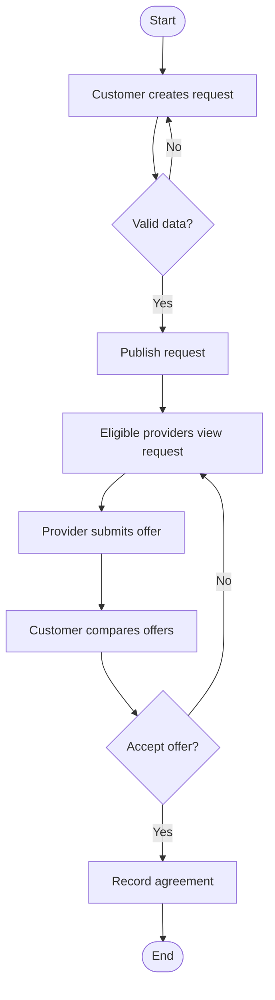
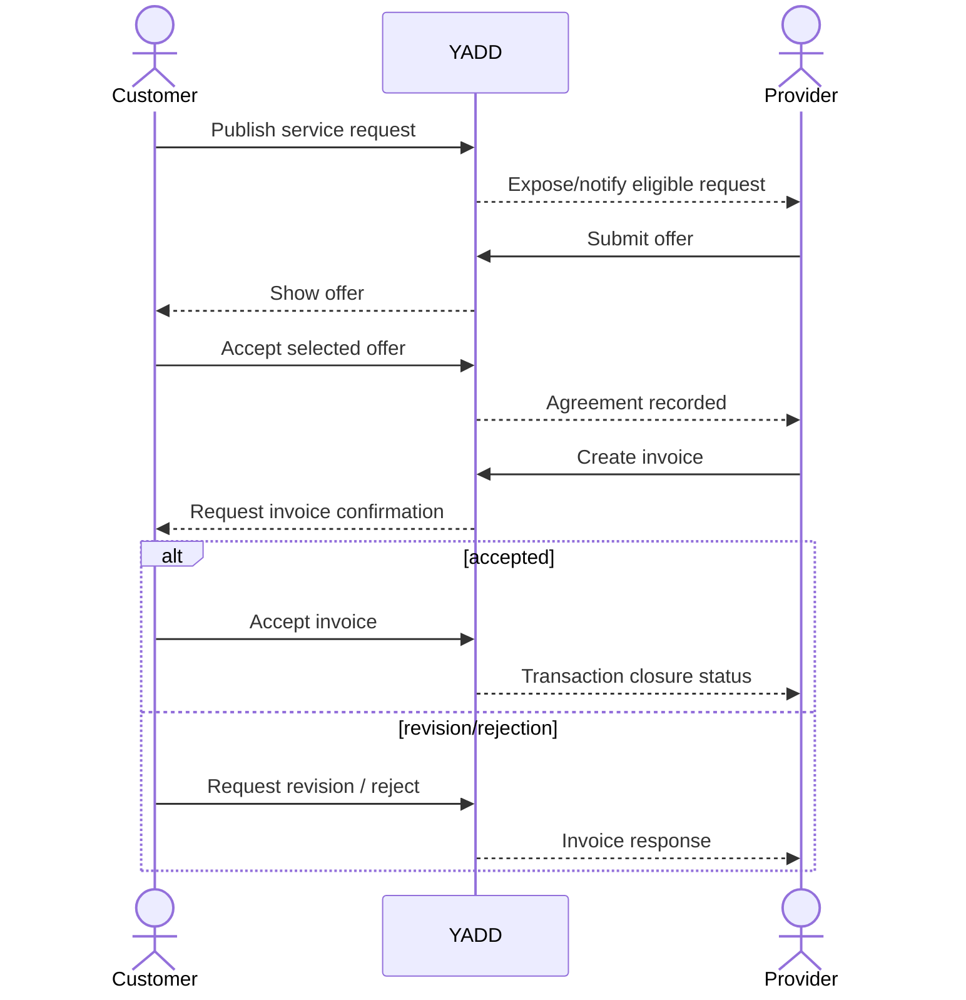
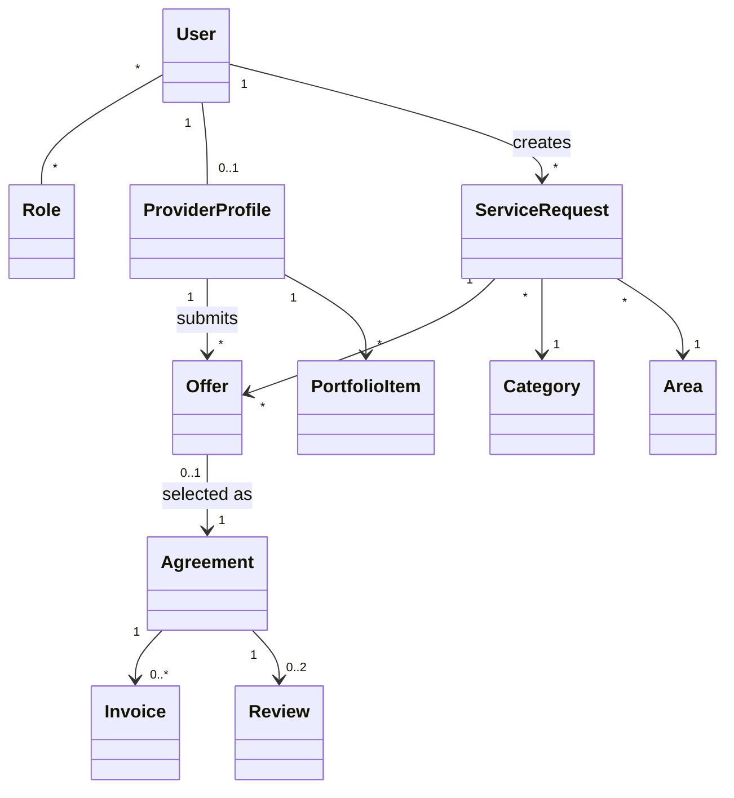

# UML Working Models

> **الحالة:** `DRAFT / SUBJECT TO GOV-Q02`

## Activity — Service Request to Agreement

## Sequence — Offer Acceptance and Invoice Candidate

## Class Model — Conceptual Candidate

Role model وInvoice cardinality وReviews تعتمد على القرارات المفتوحة.
