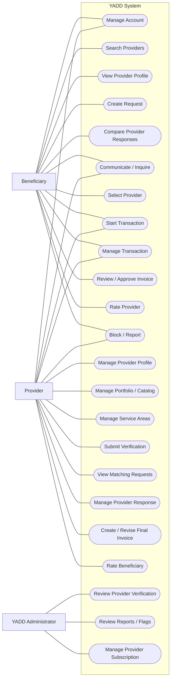
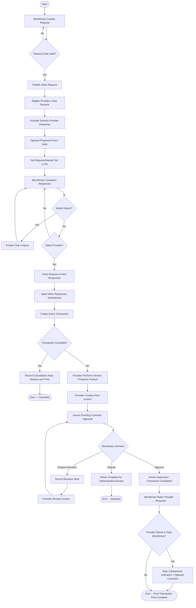
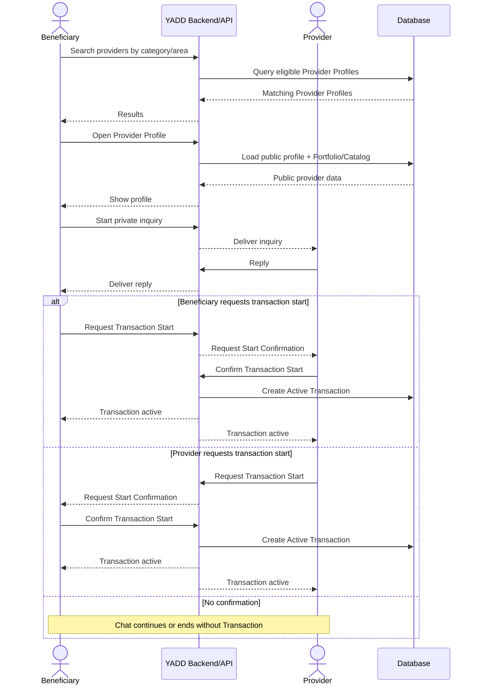

# UML Models — YADD Preliminary Defense

> **Status:** `DRAFT FOR PRELIMINARY DEFENSE — CORE SYNCHRONIZED 2026-09-04`
>
> **Governing basis:** DEC-046/047/048/050/051/063/064/066/067/068/069/070/071/072 + `05-SRS.md` + `06-business-rules.md` + `07-lifecycles.md` + `08-use-cases.md`.
>
> YADD uses DFD and UML together according to DEC-060. All labels inside final academic diagrams must be English according to DEC-072.

## 1. Actor Model

### Main actors
- `Beneficiary`
- `Provider`
  - `Service Provider` specialization when useful
  - `Product Provider` specialization when useful
- `YADD Administrator`

### Specialized administrative roles
- `Verification Reviewer`
- `Content Moderator`
- `Subscription Administrator`

`YADD Administrator` is a modeling simplification for the main diagram and does not imply one employee owns all administrative permissions.

---

## 2. Main Use Case Diagram — Working Representation

> Mermaid is used only as a working semantic representation. The final academic Use Case Diagram must use standard UML actors, system boundary and oval use cases.



### Main Use Case semantics

1. `Service Provider` and `Product Provider` inherit general Provider behavior; do not duplicate all inherited use cases unless needed for clarity.
2. No `Guest` actor is currently approved.
3. No standalone `Agreement` use case/entity exists. Request route is `Request → Provider Response → Selection → Transaction`.
4. `Manage Provider Response` covers submit/edit/withdraw under DEC-070. `RequiresDeposit = Yes/No` is data inside Provider Response, **not a standalone Use Case**.
5. `Start Transaction` has both Beneficiary and Provider associations because either may request start in Direct Search. The other party must confirm before Active Transaction is created.
6. In Request route, Beneficiary selection starts the Transaction with the selected Provider. Do not force an `<<include>>` relation in the main overview if it obscures the different Direct Search semantics; details belong in specifications/Activity/Sequence.
7. Beneficiary→Provider rating is mandatory after Completed; Provider→Beneficiary rating is optional.

---

## 3. Activity Diagram — Published Request Route



`Completed` is the successful terminal Transaction state; ratings shown afterward are Post-Transaction workflow only.

---

## 4. Activity Diagram — Direct Search Route


Chat alone does not create Transaction.

---

## 5. Sequence Diagram — Published Request Route

```mermaid
sequenceDiagram
    actor B as Beneficiary
    participant Y as YADD Backend/API
    actor P as Provider
    participant DB as Database

    B->>Y: Create and publish Request
    Y->>DB: Save Request = Open
    Y-->>P: Expose matching Request

    P->>Y: Submit Provider Response
    Note over P,Y: Proposed price/note optional; RequiresDeposit = Yes/No only
    Y->>DB: Save active Provider Response
    Y-->>B: Show response for comparison

    opt Provider edits or withdraws before selection
        P->>Y: Edit / withdraw active response
        Y->>DB: Update response data/status
        Y-->>B: Refresh response information
    end

    opt Inquiry before selection
        B->>Y: Send message
        Y-->>P: Deliver private message
        P->>Y: Reply
        Y-->>B: Deliver reply
    end

    B->>Y: Select Provider
    Y->>DB: Request = Matched; other responses = NotSelected; create Active Transaction
    Y-->>P: Provider selected / Transaction active
    Y-->>B: Transaction active

    alt Transaction cancelled
        B->>Y: Cancel + reason
        Y->>DB: Save Cancelled + actor + reason + time
        Y-->>P: Cancellation recorded
    else Work completed / product prepared
        P->>Y: Submit final invoice
        Y->>DB: Save invoice = PendingCustomerApproval
        Y-->>B: Request invoice review

        alt Request revision
            B->>Y: Request revision + note
            Y-->>P: Revision requested
            P->>Y: Submit revised invoice
            Y-->>B: Show revised invoice
        else Approve
            B->>Y: Approve final invoice
            Y->>DB: Invoice = Final; Transaction = Completed
            Y-->>B: Require Provider rating
            B->>Y: Submit provider rating 1-5 + optional comment
            Y->>DB: Save provider rating
            Y-->>P: Show optional beneficiary rating prompt
            opt Provider chooses to rate Beneficiary
                P->>Y: Submit 3 behavioral scores + optional comment
                Y->>DB: Save beneficiary rating
            end
            Note over B,P: Transaction remains Completed
        end
    end
```

---

## 6. Sequence Diagram — Direct Search Route



---

## 7. Class Diagram — Source Model

The Class Diagram must be rebuilt from the synchronized conceptual ERD in `11-ERD.md`; do not reuse the old `Offer → Agreement → Review` class model.

Minimum current domain classes/concepts:
- User
- ProviderProfile
- ProviderActivity
- Category
- Area / ProviderServiceArea
- ShowcaseItem
- Request
- ProviderResponse
- Conversation / Message
- Transaction
- Invoice / InvoiceVersion / InvoiceItem according to chosen class abstraction
- ProviderRating
- BeneficiaryRating
- VerificationCase / VerificationArtifact
- Subscription
- Report

Physical database choices such as Media table structure or `InvoiceVersion` vs `Invoice + Revision` are Chapter Four design decisions and must not be invented as analysis facts.

---

## 8. Diagram Readiness Checklist

- [x] Actors aligned with DEC-067.
- [x] English-only labels aligned with DEC-072.
- [x] No Guest actor.
- [x] No standalone Agreement.
- [x] Canonical term is Provider Response.
- [x] Provider Response edit/withdraw represented.
- [x] RequiresDeposit is response data, not a standalone use case/payment flow.
- [x] Direct Search start request + other-party confirmation represented.
- [x] Request selection creates one Transaction.
- [x] Invoice approval leads to Completed.
- [x] No Transaction state Closed.
- [x] Ratings are Post-Transaction.
- [x] Beneficiary→Provider rating mandatory; Provider→Beneficiary optional.
- [x] Class Diagram source concepts defined from synchronized ERD.
- [ ] Final visual redraw/export in standard UML notation remains to be produced.
