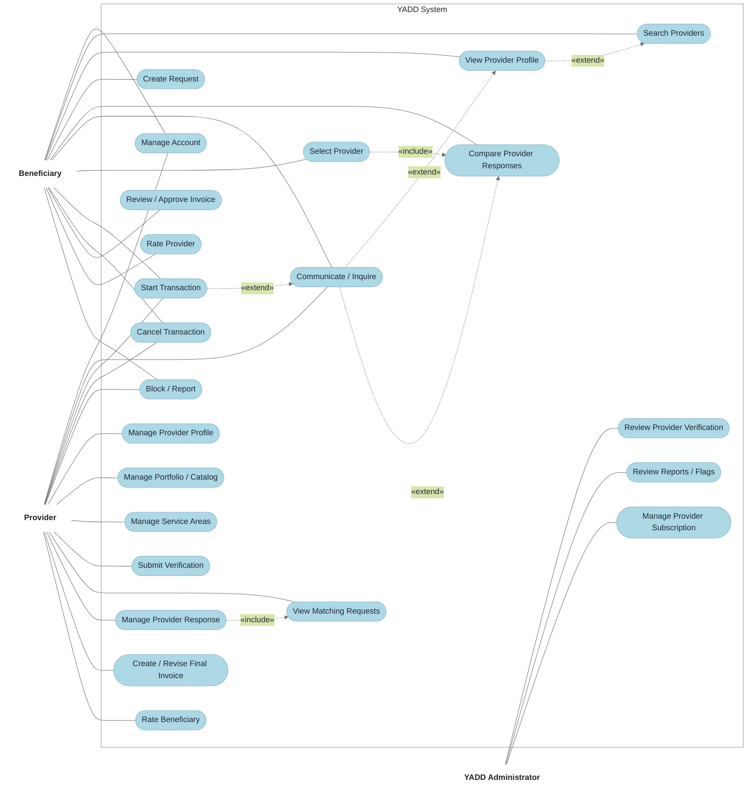
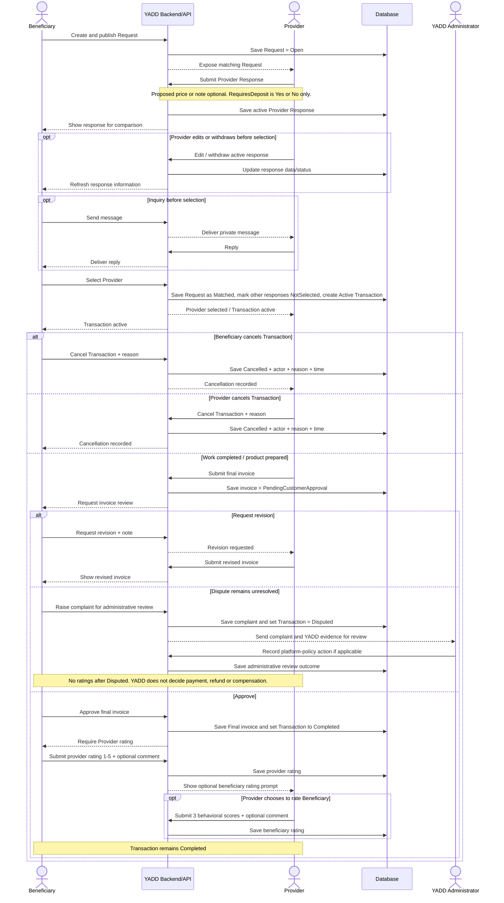
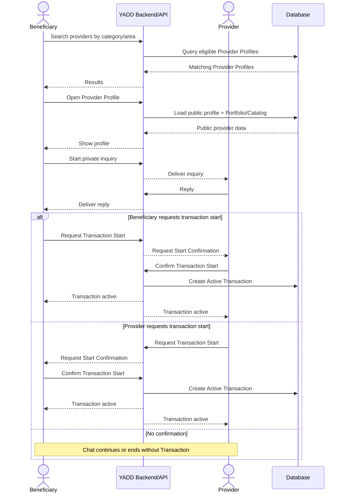

# نماذج UML — YADD Preliminary Defense

> **الحالة:** `DRAFT FOR PRELIMINARY DEFENSE — CORE SYNCHRONIZED 2026-09-04`
>
> **المراجع الحاكمة:** DEC-046/047/048/050/051/063/064/066/067/068/069/070/071/072/073 + `05-SRS.md` + `06-business-rules.md` + `07-lifecycles.md` + `08-use-cases.md`.
>
> يستخدم YADD كلًا من DFD وUML وفق `DEC-060`. يجب أن تكون جميع التسميات داخل المخططات الأكاديمية النهائية باللغة الإنجليزية وفق `DEC-072`.

## 1. نموذج الـActors

### الـActors الرئيسيون
- `Beneficiary`
- `Provider`
  - تخصص `Service Provider` عند الحاجة
  - تخصص `Product Provider` عند الحاجة
- `YADD Administrator`

### الأدوار الإدارية المتخصصة
- `Verification Reviewer`
- `Content Moderator`
- `Subscription Administrator`

استخدام `YADD Administrator` في المخطط الرئيسي هو تبسيط نمذجي، ولا يعني أن موظفًا واحدًا يمتلك جميع الصلاحيات الإدارية.

---

## 2. Main Use Case Diagram — تمثيل عمل

> يستخدم Mermaid هنا كتمثيل دلالي/بصري قابل للمراجعة داخل GitHub. يحاكي القالب الأكاديمي المرجعي من حيث حدود النظام، الحالات البيضاوية، اللون الأزرق الفاتح، وعلاقات `<<include>>` / `<<extend>>` عندما يدعمها السيناريو المعتمد. يبقى التصدير الأكاديمي النهائي بحاجة إلى Actors قياسيين (stick figures) ومراجعة نهائية قبل التسليم.

### دلالات Main Use Case

1. يرث `Service Provider` و`Product Provider` السلوك العام للـ`Provider`؛ لذلك لا تكرر كل Use Cases الموروثة إلا عند الحاجة للوضوح.
2. لا يوجد Actor باسم `Guest` معتمد حاليًا.
3. لا يوجد Use Case أو entity مستقلة باسم `Agreement`. مسار الطلب هو `Request → Provider Response → Selection → Transaction`.
4. تغطي `Manage Provider Response` الإرسال/التعديل/السحب وفق `DEC-070`. وتمثل `RequiresDeposit = Yes/No` بيانات داخل `Provider Response`، **وليست Use Case مستقلة**.
5. ترتبط `Start Transaction` بكل من `Beneficiary` و`Provider` لأن أيًا منهما قد يطلب البدء في `Direct Search`. ويجب أن يؤكد الطرف الآخر قبل إنشاء `Active Transaction`.
6. في مسار `Request`، يبدأ اختيار `Beneficiary` للـ`Provider` المختار الـ`Transaction`. لذلك **لا** توجد علاقة `<<include>>` بين `Select Provider` و`Start Transaction`؛ لأن `Start Transaction` تمثل طلب البدء المتبادل الخاص بمسار `Direct Search`.
7. `Select Provider <<include>> Compare Provider Responses` لأن المقارنة جزء من التدفق الأساسي الحالي لاختيار مقدم من الطلب المنشور.
8. `View Provider Profile <<extend>> Search Providers`، و`Communicate / Inquire <<extend>> View Provider Profile` في مسار البحث المباشر؛ لأن فتح الملف ثم بدء الاستفسار سلوكان اختياريان فوق البحث الأساسي.
9. `Communicate / Inquire <<extend>> Compare Provider Responses` في مسار الطلب المنشور؛ لأن الاستفسار قبل الاختيار اختياري.
10. `Start Transaction <<extend>> Communicate / Inquire` **في مسار البحث المباشر فقط**؛ لأن المحادثة قد تستمر أو تنتهي دون Transaction.
11. `Manage Provider Response <<include>> View Matching Requests` لأن الاستجابة تعتمد على مراجعة Request مؤهل ومفتوح قبل الإرسال/الإدارة.
12. تقييم `Beneficiary→Provider` إلزامي بعد `Completed`؛ وتقييم `Provider→Beneficiary` اختياري. لم تربط التقييمات بعلاقة `include/extend` في الرسم الرئيسي حتى لا نمثل Post-Transaction operations كجزء من اعتماد الفاتورة نفسه.
13. اللون المستخدم لحالات الاستخدام في تمثيل Mermaid هو `LightBlue (#ADD8E6)`، مع خلفية بيضاء وحدود رمادية رفيعة لمحاكاة القالب المرجعي المرفق. هذا قرار عرض للمراجعة وليس Business Rule.

---

## 3. Activity Diagram — Published Request Route

`Completed` هي الحالة النهائية الناجحة للـ`Transaction`؛ أما التقييمات الظاهرة بعدها فهي Post-Transaction workflow فقط. `Disputed` حالة نهائية غير ناجحة عندما يبقى نزاع الفاتورة قبل الاعتماد دون حل. تراجع الإدارة أدلة YADD وتطبق سياسة المنصة، لكنها لا تقرر الدفع أو الاسترداد أو التعويض أو أي استحقاق مالي/تجاري آخر بين الطرفين.

---

## 4. Activity Diagram — Direct Search Route

المحادثة وحدها لا تنشئ `Transaction`.

---

## 5. Sequence Diagram — Published Request Route

---

## 6. Sequence Diagram — Direct Search Route

---

## 7. Class Diagram — النموذج المصدر

يجب إعادة بناء `Class Diagram` من الـConceptual ERD المتزامن في `11-ERD.md`، وعدم إعادة استخدام نموذج الكلاسات القديم `Offer → Agreement → Review`.

الحد الأدنى من Domain classes/concepts الحالية:
- User
- ProviderProfile
- ProviderActivity
- Category
- Area / ProviderServiceArea
- ShowcaseItem
- Request
- ProviderResponse
- Conversation / Message
- Transaction
- Invoice / InvoiceVersion / InvoiceItem according to chosen class abstraction
- ProviderRating
- BeneficiaryRating
- VerificationCase / VerificationArtifact
- Subscription
- Report

خيارات قاعدة البيانات الفيزيائية مثل بنية جدول Media أو `InvoiceVersion` مقابل `Invoice + Revision` هي قرارات تصميم في Chapter Four، ولا يجوز اختلاقها كحقائق تحليلية.

---

## 8. قائمة جاهزية المخططات — Diagram Readiness Checklist

- [x] الـActors متوافقة مع `DEC-067`.
- [x] التسميات الإنجليزية فقط متوافقة مع `DEC-072`.
- [x] لا يوجد `Guest` actor.
- [x] لا توجد `Agreement` مستقلة.
- [x] المصطلح القياسي هو `Provider Response`.
- [x] تعديل/سحب `Provider Response` ممثل.
- [x] `RequiresDeposit` بيانات داخل الاستجابة وليست Use Case/Payment flow مستقلة.
- [x] طلب بدء `Direct Search` + تأكيد الطرف الآخر ممثلان.
- [x] اختيار `Request` ينشئ `Transaction` واحدة.
- [x] اعتماد الفاتورة يؤدي إلى `Completed`.
- [x] لا توجد حالة `Transaction` باسم `Closed`.
- [x] النزاع غير المحلول قبل الاعتماد يؤدي إلى الحالة النهائية `Disputed`.
- [x] الإدارة لا تقرر استحقاق payment/refund/compensation.
- [x] تحدث `Ratings` فقط بعد `Completed`، وليس بعد `Cancelled` أو `Disputed`.
- [x] تقييم `Beneficiary→Provider` إلزامي؛ وتقييم `Provider→Beneficiary` اختياري.
- [x] `<<include>>` / `<<extend>>` في Main Use Case مرتبطة فقط بالتدفقات المدعومة حاليًا، وليست علاقات شكلية مضافة لإرضاء الرسم.
- [x] مفاهيم مصدر `Class Diagram` محددة من ERD المتزامن.
- [ ] ما يزال مطلوبًا اعتماد/تصدير الرسم البصري النهائي وفق ترميز UML القياسي بعد مراجعة الفريق.
