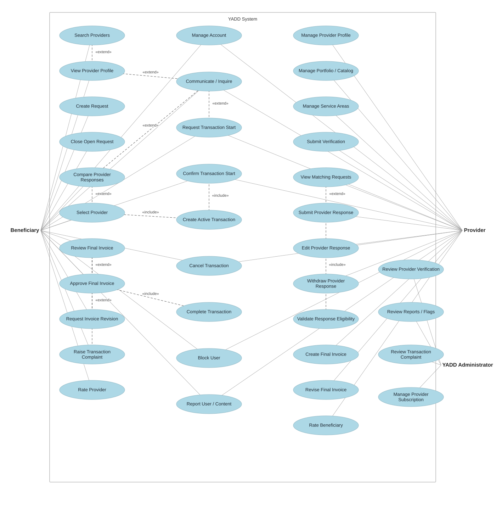

# نماذج UML — YADD Preliminary Defense

> **الحالة:** `DRAFT FOR PRELIMINARY DEFENSE — CLASS PACKAGE SYNCHRONIZED 2026-09-11`
>
> **المراجع الحاكمة:** DEC-046/047/048/050/051/053/054/063/064/066/067/068/069/070/071/072/073 + `05-SRS.md` + `06-business-rules.md` + `07-lifecycles.md` + `08-use-cases.md` + `11-ERD.md`.
>
> يستخدم YADD كلًا من DFD وUML وفق `DEC-060`. يجب أن تكون جميع التسميات داخل المخططات الأكاديمية النهائية باللغة الإنجليزية وفق `DEC-072`.

## 1. نموذج الـActors

### الـActors الرئيسيون
- `Beneficiary`
- `Provider`
  - تخصص `Service Provider` عند الحاجة
  - تخصص `Product Provider` عند الحاجة
- `YADD Administrator`

### الأدوار الإدارية المتخصصة
- `Verification Reviewer`
- `Content Moderator`
- `Subscription Administrator`

استخدام `YADD Administrator` في المخطط الرئيسي هو تبسيط نمذجي، ولا يعني أن موظفًا واحدًا يمتلك جميع الصلاحيات الإدارية.

---

## 2. Main Use Case Diagram — Working UML Decomposition

> هذا الرسم يعيد تفكيك السيناريوهات المركبة إلى Actor goals أصغر حتى تكون علاقات `<<include>>` و`<<extend>>` ذات معنى UML واضح. لا تستخدم العلاقات لتمثيل مجرد التسلسل الزمني؛ التبعيات الزمنية/الحالية تمثل كـPreconditions/Postconditions في المواصفات. اللون والأسلوب البصري يحاكيان القالب المرجعي الذي وفره الفريق، بينما Actors القياسية النهائية تحتاج إعادة رسم/تصدير بصري لاحق.
>
> **Visual organization correction — 2026-09-12:** النسخة المنظمة أدناه هي إعادة ترتيب بصري فقط لنفس المخطط؛ لم يُحذف أو يُضف أي Actor أو Use Case أو Association أو علاقة `<<include>>`/`<<extend>>`. يبقى Mermaid أدناه هو الـWorking Semantic Source، بينما ملف SVG مجرد Presentation Artifact لتقليل تقاطع الخطوط وتحسين القراءة.

Working semantic Mermaid source — same semantics

### دلالات Main Use Case

1. `Service Provider` و`Product Provider` تخصصان من `Provider` وفق `DEC-067`، ولا يلزم تكرارهما داخل الرسم الرئيسي.
2. لا يوجد Actor مستقل باسم `Guest` حاليًا.
3. لا توجد Use Case/Entity باسم `Agreement`; المسار القياسي في الطلب هو `Request → Provider Response → Selection → Transaction`.
4. `View Provider Profile <<extend>> Search Providers` لأن البحث قد ينتهي دون فتح ملف بعينه.
5. `Communicate / Inquire <<extend>> View Provider Profile` في Direct Search، ويمتد أيضًا من `Compare Provider Responses` في Request Route لأن الاستفسار قبل الاختيار اختياري.
6. `Select Provider <<extend>> Compare Provider Responses`: المقارنة يمكن أن تنتهي دون اختيار، بينما الاختيار يحدث عند قرار المستفيد. عند حدوث الاختيار فهو **يتضمن** `Create Active Transaction` لأن `DEC-047/066` يفرضان بدء Transaction في Request Route.
7. `Submit Provider Response <<extend>> View Matching Requests`: مشاهدة الطلب لا تلزم Provider بالاستجابة. وعند الإرسال يجب دائمًا تنفيذ `Validate Response Eligibility` الذي يمثل شرط Verified Provider + Active Subscription + Open Request.
8. `Request Transaction Start <<extend>> Communicate / Inquire` في Direct Search فقط؛ المحادثة قد تستمر أو تنتهي دون Transaction. أما عند `Confirm Transaction Start` الإيجابي فيتم تضمين `Create Active Transaction` وفق `DEC-069`.
9. `Review Final Invoice` هو الأساس؛ `Approve Final Invoice` و`Request Invoice Revision` و`Raise Transaction Complaint` امتدادات شرطية لقرار المراجعة. عند الاعتماد فقط يتم `<<include>> Complete Transaction` لأن الاعتماد يجعل Transaction = `Completed` دائمًا.
10. `Rate Provider` و`Rate Beneficiary` Use Cases مستقلة من ناحية Actor goal، لكنهما تتطلبان `Transaction = Completed`. الأولى إلزامية على Beneficiary بعد Completed، والثانية اختيارية على Provider؛ لذلك لا تمثل تبعية Completed بأسهم `include/extend`.
11. `Cancel Transaction` تتطلب Transaction قائمة وفي حالة تسمح بالإلغاء. `Close Open Request` مختلفة عنها وتتطلب Request Open قبل الاختيار.
12. `Edit Provider Response` و`Withdraw Provider Response` تتطلبان استجابة فعالة مع Request Open وقبل selection وفق `DEC-070`; لا تربطان بعلاقة `include/extend` مصطنعة مع `Submit Provider Response`.
13. `Revise Final Invoice` تتطلب `Revision Requested` سابقة؛ و`Review Provider Verification`/`Review Transaction Complaint` أهداف إدارية لاحقة مستقلة تعتمد على وجود submission/complaint، وليست أجزاء included داخل فعل المرسل.
14. `Block User` و`Report User / Content` منفصلتان؛ يستطيع المستخدم تنفيذ أحدهما دون الآخر، وReport يخضع لاحقًا لمراجعة إدارية.
15. `Create Active Transaction`, `Complete Transaction`, و`Validate Response Eligibility` تمثل سلوكًا نظاميًا مشتركًا/إلزاميًا، وليس Actor goals مستقلة؛ لذلك لا ترتبط مباشرة بـActor.
16. اللون المستخدم لحالات الاستخدام هو `LightBlue (#ADD8E6)` مع خلفية بيضاء وحدود رمادية رفيعة لمحاكاة القالب المرجعي؛ هذا قرار عرض لا Business Rule.

### Preconditions / Postconditions التي يجب ألا تُفهم كـ`include`/`extend`

- `Rate Provider`: Precondition = `Transaction Completed`; Post-Transaction required step.
- `Rate Beneficiary`: Precondition = `Transaction Completed`; optional Provider action.
- `Cancel Transaction`: Precondition = active/cancellable Transaction.
- `Close Open Request`: Precondition = Request Open + no Provider selected.
- `Edit/Withdraw Provider Response`: Precondition = active response + Request Open + before selection.
- `Review Final Invoice`: Precondition = invoice `Pending Customer Approval`.
- `Revise Final Invoice`: Precondition = revision previously requested.
- `Review Provider Verification`: Precondition = verification submission exists.
- `Review Transaction Complaint`: Precondition = complaint exists.

---

## 3. Activity Diagram Package — Standalone Review Drafts

> **Synchronization correction — 2026-09-11:** أصبحت ملفات Activity المستقلة تحت `diagrams/03-analysis/uml/activity/` هي Working Semantic Source لمسارات النشاط. لا نكرر المخططات كاملة هنا لتقليل خطر Divergence بين نسختين.

| Workflow | Standalone working file | Current status |
|---|---|---|
| Published Request Route | `diagrams/03-analysis/uml/activity/activity-published-request-route.md` | `REVIEW DRAFT — NOT BASELINED` |
| Direct Search Route | `diagrams/03-analysis/uml/activity/activity-direct-search-route.md` | `REVIEW DRAFT — NOT BASELINED` |
| Final Invoice, Revision and Dispute | `diagrams/03-analysis/uml/activity/activity-final-invoice-dispute.md` | `REVIEW DRAFT — NOT BASELINED` |
| Provider Verification and Activation | `diagrams/03-analysis/uml/activity/activity-provider-verification.md` | `REVIEW DRAFT — NOT BASELINED` |
| Report and Administrative Review | `diagrams/03-analysis/uml/activity/activity-report-administrative-review.md` | `REVIEW DRAFT — NOT BASELINED` |

هذه الحزمة Route/Decision-focused ولا تعني أن لكل Use Case مخطط Activity مستقل. التغييرات في الحالات يجب أن تبقى متسقة مع `07-lifecycles.md`، بينما تفاصيل الرسائل بين المشاركين تبقى في Sequence Package.

---

## 4. Sequence Diagram Package — Standalone Review Drafts

> المصدر التشغيلي الحالي للـSequence Diagrams هو الملفات المستقلة تحت `diagrams/03-analysis/uml/sequence/`، وكل ملف مشتق مباشرة من Use Case/Alternative flow محددة.

### Current sequence package

| Source scenario | Standalone working file | Current status |
|---|---|---|
| UC-01 — Search and Inquire Directly | `diagrams/03-analysis/uml/sequence/uc-01-search-inquire-directly-sequence.md` | `REVIEW DRAFT — NOT BASELINED` |
| UC-02 — Create Request | `diagrams/03-analysis/uml/sequence/uc-02-create-request-sequence.md` | `REVIEW DRAFT — NOT BASELINED` |
| UC-03 — Respond to Request | `diagrams/03-analysis/uml/sequence/uc-03-respond-to-request-sequence.md` | `REVIEW DRAFT — NOT BASELINED` |
| UC-04 — Select Provider from Request | `diagrams/03-analysis/uml/sequence/uc-04-select-provider-sequence.md` | `REVIEW DRAFT — NOT BASELINED` |
| UC-05 — Cancel Active Transaction | `diagrams/03-analysis/uml/sequence/uc-05-cancel-active-transaction-sequence.md` | `REVIEW DRAFT — NOT BASELINED` |
| UC-06 — Final Invoice | `diagrams/03-analysis/uml/sequence/uc-06-final-invoice-sequence.md` | `REVIEW DRAFT — NOT BASELINED` |
| UC-06 Alternative — Transaction Complaint / Administrative Review | `diagrams/03-analysis/uml/sequence/uc-06-dispute-complaint-sequence.md` | `REVIEW DRAFT — NOT BASELINED` |
| UC-07 — Rate Provider | `diagrams/03-analysis/uml/sequence/uc-07-rate-provider-sequence.md` | `REVIEW DRAFT — NOT BASELINED` |
| UC-07B — Provider Rates Beneficiary | `diagrams/03-analysis/uml/sequence/uc-07b-rate-beneficiary-sequence.md` | `REVIEW DRAFT — NOT BASELINED` |
| UC-08 — Block and Report User / Content | `diagrams/03-analysis/uml/sequence/uc-08-block-report-sequence.md` | `REVIEW DRAFT — NOT BASELINED` |
| UC-09 — Provider Verification / Portal Activation | `diagrams/03-analysis/uml/sequence/uc-09-provider-verification-sequence.md` | `REVIEW DRAFT — NOT BASELINED` |
| UC-10 — Manage Portfolio / Catalog | `diagrams/03-analysis/uml/sequence/uc-10-manage-portfolio-catalog-sequence.md` | `REVIEW DRAFT — NOT BASELINED` |

### Sequence modeling rules

- التسلسل المرجعي هو: `Decision / Business Rule → Use Case → Main & Alternative Flow → Sequence Diagram`.
- لا يشترط أن يحتوي كل UC على رسم واحد فقط؛ يمكن تفكيك UC المركبة إلى Scenarios متماسكة إذا كان ذلك يحسن الوضوح وقابلية الطباعة، دون إنشاء متطلبات أو Use Cases جديدة.
- `Beneficiary`, `Provider`, و`YADD Administrator` هم Actors العامة؛ الأدوار الإدارية المتخصصة تستخدم عند الحاجة.
- أسماء `*UI`, `*Controller`, وRoles المماثلة هي **Derived Interaction Roles** وليست Implementation Classes معتمدة.
- `alt`, `opt`, و`loop` تستخدم للحالات البديلة/الاختيارية/المتكررة عند الحاجة، مع تجنب أنماط Mermaid الهشة التي تسبب Activation-state errors على GitHub.
- لا تنشئ Chat وحدها Transaction؛ في Direct Search يلزم Request Transaction Start ثم Confirmation من الطرف الآخر.
- في Request Route يبدأ Transaction عند اختيار Provider.
- لا توجد `Agreement` مستقلة.
- لا يوجد Payment/Refund/Escrow lifecycle داخل YADD.
- Invoice approval يؤدي إلى `Completed` فقط.
- Complaint لا تعني `Disputed` تلقائيًا؛ `Disputed` ناتجة عن استمرار الخلاف دون اتفاق قبل اعتماد الفاتورة.
- Ratings لا تفتح إلا بعد `Completed`، ولا تغير Transaction Status.

### Academic export rule

ملفات Mermaid الحالية هي **working semantic source** أثناء المراجعة. النسخة النهائية للتقرير يجب إعادة رسمها/تصديرها بأداة UML قياسية عند الحاجة، مع الحفاظ على Actor / Boundary / Control / Entity notation بصورة أوضح وجودة طباعة مناسبة لـA4. لا يجوز أن يختلف التصدير النهائي دلاليًا عن الملفات المستقلة أعلاه.

---

## 5. Class Diagram Package — Conceptual Domain Model

بعد مراجعة Class model مقابل Decision Register وSRS/Business Rules/Lifecycles/Use Cases والـConceptual ERD، تمت مزامنة `11-ERD.md` مع المفاهيم المعتمدة الناقصة ثم أعيد اشتقاق Class package منه.

قاعدة التنظيم هنا هي: **one rendered Class Diagram = one working source file**، مع `README.md` يجمع الـViews الثلاث لأنها تمثل Conceptual Domain Model واحدًا:

| View | Working file | Current status |
|---|---|---|
| Account, Provider, Discovery, Location, Request and Portfolio | `diagrams/03-analysis/uml/class/01-account-provider-discovery.md` | `REVIEW DRAFT — NOT BASELINED` |
| Communication, Transaction, Invoice and Ratings | `diagrams/03-analysis/uml/class/02-transaction-invoice-ratings.md` | `REVIEW DRAFT — NOT BASELINED` |
| Verification, Subscription and Trust / Administration | `diagrams/03-analysis/uml/class/03-verification-subscription-trust.md` | `REVIEW DRAFT — NOT BASELINED` |

Package index: `diagrams/03-analysis/uml/class/README.md`.

المفاهيم المتزامنة تشمل بالإضافة إلى Core السابق: `AreaAdjacency`, `UserBlock`, Cancellation actor/reason/time, Verification review note, وConceptual `SafetyFlag` / `AdminAuditRecord`. هذه إضافات Synchronization مشتقة من قرارات/قواعد معتمدة وليست Scope expansion.

### Class modeling boundaries

- Attributes المعروضة Conceptual وغير exhaustive؛ لا تستخدم visibility markers لأنها ليست Design Decisions معتمدة.
- لا تستخدم Composition إلا إذا اعتمد lifecycle ownership صراحة.
- `InvoiceVersion` يمثل requirement حفظ تاريخ النسخ؛ الشكل الفيزيائي النهائي مؤجل.
- `Report`/Flag/Audit polymorphic target mapping مؤجل للتصميم الفيزيائي.
- `Conversation ↔ Transaction` multiplicity الحالية ما تزال `Needs Verification` قبل Relation Schema النهائي.
- minimum cardinality لـ`ProviderProfile → ProviderActivity` تحتاج Reconciliation بين الـCore ERD وProvider Activity model قبل Relation Schema النهائي.
- لا توجد Payment/Refund/Escrow/Settlement entities داخل معاملات Beneficiary↔Provider.

---

## 6. قائمة جاهزية المخططات — Diagram Readiness Checklist

- [x] الـActors متوافقة مع `DEC-067`.
- [x] التسميات الإنجليزية فقط متوافقة مع `DEC-072`.
- [x] لا يوجد `Guest` actor.
- [x] لا توجد `Agreement` مستقلة.
- [x] المصطلح القياسي هو `Provider Response`.
- [x] تعديل/سحب `Provider Response` ممثلان كتبعيات مشروطة لا كعلاقات UML مصطنعة.
- [x] `RequiresDeposit` بيانات داخل الاستجابة وليست Use Case/Payment flow مستقلة.
- [x] Request Route وDirect Search يفصلان آليتي بدء Transaction بصورة صحيحة.
- [x] `<<include>>` يستخدم فقط للسلوك الإلزامي داخل الـBase Use Case.
- [x] `<<extend>>` يستخدم فقط للسلوك الشرطي/الاختياري.
- [x] التبعيات الزمنية/الحالية مثل Ratings بعد Completed ممثلة كـPreconditions/Postconditions.
- [x] Activity package منظمة كمسارات مستقلة قابلة للتتبع بدل تكرار Activity لكل UC.
- [x] Sequence package مفككة إلى Scenarios مستقلة قابلة للتتبع بدل Giant Route Sequence.
- [x] أسماء UI/Controller في Sequence Diagrams موسومة كـDerived modeling roles وليست Implementation Classes معتمدة.
- [x] Class package مفككة إلى ثلاث Views مستقلة بصريًا ومشتقة من ERD المصحح.
- [x] Area adjacency وBlock ممثلان في النموذج المفاهيمي.
- [x] Cancellation actor/reason/time وVerification review note ممثلة مفاهيميًا.
- [x] Safety Flag/Admin Audit ممثلان كمفاهيم دون اختلاق physical schema أو thresholds.
- [x] اعتماد الفاتورة يؤدي إلى `Completed`.
- [x] لا توجد حالة `Transaction` باسم `Closed`.
- [x] Complaint لا تحول Transaction تلقائيًا إلى `Disputed`؛ النزاع غير المحلول دون اتفاق قبل الاعتماد هو الذي يؤدي إلى `Disputed`.
- [x] الإدارة لا تقرر استحقاق Payment/Refund/Compensation.
- [x] تحدث `Ratings` فقط بعد `Completed`، وليس بعد `Cancelled` أو `Disputed`.
- [x] تقييم `Beneficiary→Provider` إلزامي؛ وتقييم `Provider→Beneficiary` اختياري.
- [x] `Block User` و`Report User / Content` منفصلتان في الرسم الرئيسي.
- [ ] `Conversation ↔ Transaction` multiplicity تحتاج Verification قبل Relation Schema النهائي.
- [ ] minimum cardinality لـ`ProviderProfile → ProviderActivity` تحتاج Reconciliation قبل Relation Schema النهائي.
- [ ] ما يزال مطلوبًا اختبار Render لكل Mermaid standalone file ومراجعة Visual/A4 قبل الـbaseline.
- [ ] ما يزال مطلوبًا اعتماد/تصدير الرسم البصري النهائي وفق ترميز UML القياسي بعد مراجعة الفريق.