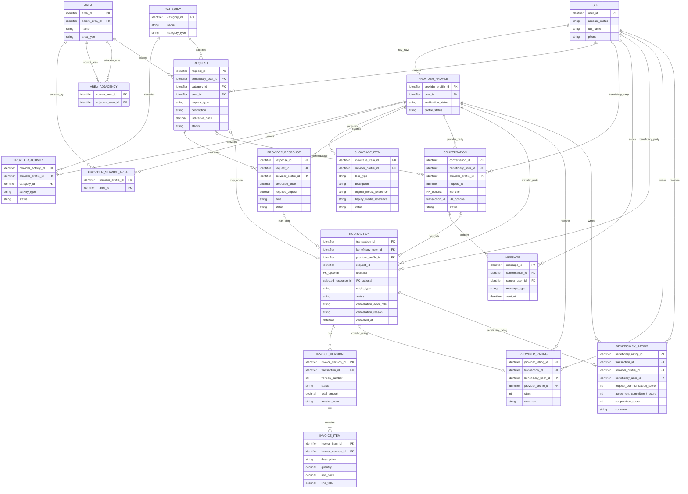
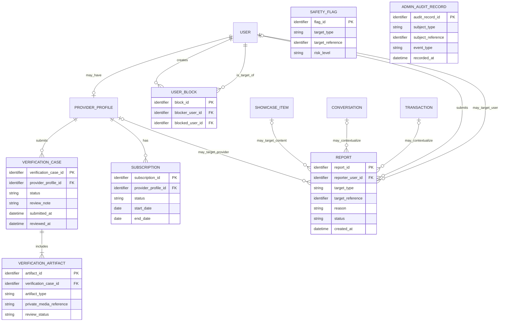

# Conceptual ERD — YADD Preliminary Defense

> **الحالة:** `DRAFT FOR PRELIMINARY DEFENSE — CORE SYNCHRONIZED 2026-09-11`
>
> هذا ERD **مفاهيمي للفصل الثالث** وليس Relation Schema أو Database Design نهائيًا. الأنواع الفيزيائية، PK/FK التفصيلية، الفهارس، القيود التنفيذية وأسماء الجداول النهائية تنتقل إلى Chapter Four.
>
> **المراجع الحاكمة:** DEC-008..016/018/019/021/023..025/029..043/046..056/063..073 + `05-SRS.md` + `06-business-rules.md` + `07-lifecycles.md` + `08-use-cases.md`.
>
> جميع التسميات داخل الرسم النهائي تكون باللغة الإنجليزية وفق DEC-072.

---

## 1. مبادئ النمذجة الحالية

1. يوجد `USER` واحد للشخص؛ Beneficiary وProvider ليسا حسابين منفصلين.
2. يصبح المستخدم Provider عندما يمتلك `PROVIDER_PROFILE` مستوفيًا شروط التفعيل.
3. يمكن لـProvider Profile تشغيل Service Activity أو Product Activity أو كليهما.
4. يستخدم مسار الطلب النموذج `REQUEST → PROVIDER_RESPONSE → SELECTION → TRANSACTION` ولا يوجد `AGREEMENT` مستقل.
5. البحث المباشر يمكن أن ينشئ `TRANSACTION` دون `REQUEST` أو `PROVIDER_RESPONSE`، لكن فقط بعد `Request Transaction Start` وتأكيد الطرف الآخر.
6. الخدمة والمنتج يستخدمان Core Transaction واحدًا؛ الاختلاف يمثل عبر نوع النشاط/الطلب والبيانات المرتبطة به.
7. العربون لا يمثل كيانًا ماليًا؛ يوجد فقط `requires_deposit` ضمن Provider Response.
8. تقييم Beneficiary للمقدم وتقييم Provider للمستفيد نموذجان مختلفان في الحقول والقواعد، لذلك يمثَّلان ككيانين منفصلين مفاهيميًا.
9. Portfolio/Catalog يمثلان مفهوم عرض موحدًا عبر `SHOWCASE_ITEM` مع `item_type`.
10. `Completed` هي النهاية الناجحة للTransaction ولا توجد حالة Transaction باسم `Closed`.
11. `Disputed` نهاية غير ناجحة للTransaction عند استمرار خلاف الفاتورة قبل الاعتماد دون اتفاق؛ لا تفتح Ratings — DEC-073.
12. لكل Provider استجابة فعالة واحدة فقط لكل Request؛ يمكن تعديلها أو سحبها قبل الاختيار وفق DEC-070.
13. Request واحد يمكن أن ينتج **صفر أو Transaction واحدة فقط**؛ لأن اختيار Provider واحد يغلق Request أمام الاستجابات الجديدة.
14. مراجعة النزاع إداريًا تستخدم `REPORT`/complaint context ولا تنشئ كيان Payment/Refund/Compensation أو سلطة تسوية مالية داخل YADD.
15. علاقات الأحياء المجاورة مفهوم معتمد ومُدار داخل YADD؛ يمثلها `AREA_ADJACENCY` دون افتراض GPS Radius.
16. `Block User` و`Report` مفهومان مستقلان؛ يمثل `USER_BLOCK` علاقة الحظر المباشر ولا يعني إنشاء Report أو إدانة الطرف الآخر.
17. عند Transaction Cancellation يجب الاحتفاظ بالطرف الذي ألغى والسبب والتوقيت؛ تبقى طريقة التخزين الفيزيائية قرار تصميم لاحق.
18. `SAFETY_FLAG` و`ADMIN_AUDIT_RECORD` مفهومان داعمان معتمدان من Trust & Safety / D8؛ تمثيلهما هنا مفاهيمي فقط، بينما schema التخزين والاحتفاظ والـthresholds تبقى قرارات تصميم/سياسة مفتوحة.

---

## 2. Core Conceptual ERD

---

## 3. Core Entity Semantics

### USER
يمثل حساب الشخص الواحد في YADD. يمكن أن يعمل الشخص كمستفيد مباشرة، ويمكنه امتلاك Provider Profile واحد كحد أقصى.

### PROVIDER_PROFILE
يمثل هوية Provider داخل الحساب نفسه. ترتبط به Verification، الأنشطة، مناطق الخدمة، Portfolio/Catalog والاشتراك.

### PROVIDER_ACTIVITY
يمثل نشاط Provider بدل `provider_type` مفرد يمنع الجمع بين Service وProduct. الشكل الفيزيائي النهائي لعدد السجلات يحسم في Chapter Four.

### CATEGORY / AREA / PROVIDER_SERVICE_AREA / AREA_ADJACENCY
- `CATEGORY` تصنيف النشاط/الطلب.
- `AREA` تمثل District/Neighborhood بصورة مفاهيمية parent-child.
- `PROVIDER_SERVICE_AREA` تمثل المناطق التي يخدمها Provider.
- `AREA_ADJACENCY` تمثل قائمة الجوار المُدارة بين الأحياء وفق DEC-033؛ العلاقة المنطقية جوار متبادل، بينما طريقة فرض symmetry/uniqueness في قاعدة البيانات تؤجل إلى Chapter Four.
- الموقع الدقيق/GPS ليس بيانات عامة في هذا النموذج.

### SHOWCASE_ITEM
يوحد Portfolio وCatalog مفاهيميًا. يحتوي مرجعًا للأصل غير العام ومرجعًا لنسخة العرض ذات العلامة المائية. العلامة المائية تعريف/ردع وليست إثبات ملكية.

### REQUEST
يمثل طلب Service أو Product. يحتوي التصنيف والمنطقة والوصف والسعر الاسترشادي الاختياري. الصور/المرفقات مطلوبة وظيفيًا، لكن نموذج Media الفيزيائي يؤجل إلى Chapter Four.

### PROVIDER_RESPONSE
المصطلح القياسي بدل `OFFER`.

- يرتبط بـRequest واحد وProvider Profile واحد.
- يمكن أن يحتوي proposed price وملاحظة و`requires_deposit`.
- لا يوجد DepositAmount أو PaymentStatus أو Refund Entity.
- لكل Provider Response فعالة واحدة لكل Request.
- يجوز تعديلها أو سحبها فقط ما دام Request Open ولم يتم اختيار Provider.

### CONVERSATION / MESSAGE
المحادثة يمكن أن تبدأ قبل Transaction من Direct Search أو Request context. Chat وحدها لا تنشئ Transaction. في Direct Search يبدأ Transaction فقط بعد طلب بدء صريح وتأكيد الطرف الآخر.

> **Cardinality note:** النموذج الحالي يربط Conversation بحد أقصى Transaction واحدة، لكن القرارات الأعلى لا تحسم صراحة هل يمكن إعادة استخدام Conversation نفسها لبدء Transaction أخرى مستقبلًا. تبقى هذه multiplicity بحاجة Verification قبل Relation Schema النهائي.

### TRANSACTION
هو الكيان المركزي بعد بدء التعامل الرسمي.

يمكن أن ينشأ:

1. من Provider Response مختارة في Request Route.
2. مباشرة في Direct Search Route بعد Mutual Start Confirmation.

لذلك `request_id` و`selected_response_id` اختياريان مفاهيميًا، بينما Beneficiary وProvider إلزاميان.

الحالات النهائية بحسب المسار تشمل:

- `Completed` للنجاح بعد اعتماد الفاتورة.
- `Cancelled` عند الإلغاء وفق القواعد.
- `Disputed` عند استمرار الخلاف قبل اعتماد الفاتورة وعدم الوصول إلى اتفاق — DEC-073.

عند الإلغاء يسجل YADD الطرف الذي ألغى والسبب والتوقيت وفق DEC-048/BR-019؛ تمثل هنا مفاهيميًا بـ`cancellation_actor_role`, `cancellation_reason`, و`cancelled_at` دون حسم schema الفيزيائي النهائي.

لا توجد حالة Transaction باسم `Closed`. لا Ratings إلا بعد `Completed`.

### INVOICE_VERSION / INVOICE_ITEM
يمثلان الاحتفاظ بتاريخ نسخ الفاتورة بدل الكتابة فوق نسخة واحدة.

- Transaction قد تحتوي عدة Invoice Versions.
- كل Invoice Version تحتوي بندًا واحدًا على الأقل.
- النسخة المعتمدة هي السجل النهائي للبنود والأسعار داخل YADD.
- عدم الرد لا يعد موافقة.

> الشكل الفيزيائي النهائي قد يكون `Invoice + InvoiceRevision` بدل `InvoiceVersion`; هذا Design Decision في Chapter Four، مع الحفاظ على المتطلب الأساسي: عدم فقدان تاريخ النسخ.

### PROVIDER_RATING
تقييم Beneficiary للمقدم بعد Transaction Completed:
- 1–5 stars.
- comment optional.
- بحد أقصى تقييم واحد للمقدم لكل Transaction.

### BENEFICIARY_RATING
تقييم Provider للمستفيد بعد Transaction Completed:
- optional.
- ثلاثة مؤشرات 1–5.
- comment optional.
- بحد أقصى تقييم واحد للمستفيد لكل Transaction.
- لا ينتج عقوبة آلية في MVP.

---

## 4. Supporting Trust / Administration ERD

### Supporting-model notes

- `USER_BLOCK` يمثل Block كعلاقة حماية مباشرة مستقلة عن `REPORT`; لا يعني الحظر إدانة أو عقوبة إدارية.
- `REPORT.target_reference` تمثيل مفاهيمي polymorphic؛ التنفيذ الفيزيائي قد يفصله إلى علاقات أكثر صرامة. يمكن أن يكون الهدف User/Provider context/Conversation/Behavior/Showcase Item وفق UC-08 والسياسة الحالية.
- `VERIFICATION_CASE.review_note` يمثل الملاحظة/السبب الذي يجب أن يستطيع الموظف تسجيله عند طلب إعادة التقديم أو الرفض.
- `SAFETY_FLAG` يمثل Concept للـAI/behavioral flags المعتمدة. `risk_level` مفهومي ولا يثبت threshold رقميًا أو provider أو storage policy.
- `ADMIN_AUDIT_RECORD` يمثل Concept لسجل التدقيق المطلوب في المراجعات/الوصولات الحساسة. الحقول هنا مفاهيمية، وليست Relation Schema نهائية.
- أنواع وثائق الهوية الدقيقة: `VER-DOC-Q01 — Needs Verification`.
- مدة الاحتفاظ ببيانات التحقق: `VER-RET-Q01 — Needs Legal Verification`.
- تفاصيل باقات/أسعار/إثبات دفع الاشتراك: `SUB-PLAN-Q01 / SUB-PAY-Q01` مفتوحة.
- Physical schema للـFlags/Audit لا يعتمد قبل حسم provider/retention/threshold/authorization policies.
- Transaction complaint under DEC-073 can use the REPORT/complaint concept and Transaction status; it does not justify a financial settlement entity.

---

## 5. Removed Legacy Concepts

| Legacy Concept | Current Model |
|---|---|
| `ROLE / USER_ROLE` لتمييز Beneficiary/Provider | لا يستخدم لهذا الغرض؛ User واحد + optional Provider Profile. أدوار الإدارة/الصلاحيات تصمم منفصلة عند الحاجة. |
| `SERVICE_REQUEST` | `REQUEST` يغطي Service وProduct. |
| `OFFER` | `PROVIDER_RESPONSE`. |
| `AGREEMENT` | غير موجود كEntity مستقل في MVP. |
| Single mutable `INVOICE` | Invoice history محفوظ مفاهيميًا عبر versions/revisions. |
| Generic `REVIEW` | `PROVIDER_RATING` + `BENEFICIARY_RATING`. |
| `PORTFOLIO_ITEM` فقط | `SHOWCASE_ITEM` يدعم Portfolio/Catalog. |

---

## 6. Cardinality / Constraint Decisions for Chapter Four

هذه القواعد مستقرة بما يكفي لتتحول إلى Constraints عند Relation Schema، باستثناء البنود الموسومة صراحة بأنها تحتاج Verification:

1. `USER ↔ PROVIDER_PROFILE`: User يمتلك صفر أو Provider Profile واحدًا.
2. كل `REQUEST` ينشئه Beneficiary واحد ويرتبط بتصنيف ومنطقة عامة واحدة.
3. كل `PROVIDER_RESPONSE` ترتبط بـRequest واحد وProvider Profile واحد.
4. **لكل Provider استجابة فعالة واحدة فقط لكل Request** — Team Decision DEC-070.
5. يمكن تعديل/سحب Provider Response قبل Selection فقط — DEC-070.
6. في Request Route تصبح Provider Response واحدة فقط `Selected`.
7. **Request واحد ينتج صفر أو Transaction واحدة فقط**؛ اختيار Provider واحد يغلق Request — DEC-047/066/070.
8. كل `TRANSACTION` لها Beneficiary واحد وProvider واحد.
9. Direct Search Transaction قد تكون بلا Request/Provider Response — DEC-066/069.
10. Transaction الناتجة من Direct Search لا تنشأ إلا بعد Mutual Start Confirmation — DEC-069.
11. كل Invoice Version تنتمي إلى Transaction واحدة وتحتوي بندًا واحدًا على الأقل.
12. Transaction `Completed` تسمح Provider Rating واحدة بحد أقصى من Beneficiary.
13. Transaction `Completed` تسمح Beneficiary Rating واحدة بحد أقصى من Provider، وهي اختيارية.
14. Ratings لا تغير Transaction status بعد Completed — DEC-071.
15. Transaction `Disputed` لا تسمح Ratings — DEC-073.
16. لا توجد علاقة مالية للعربون أو النزاع داخل ERD — DEC-041/073.
17. `AREA_ADJACENCY` يمثل علاقة جوار مُدارة بين الأحياء؛ كيفية فرض symmetry/uniqueness في Relation Schema مؤجلة للتصميم.
18. `USER_BLOCK` و`REPORT` مستقلان؛ لا يشترط أحدهما الآخر — DEC-053.
19. Transaction Cancellation تسجل Actor/Reason/Time — DEC-048 / BR-019.
20. Verification resubmission/rejection review supports a recorded note/reason — VER-BR-04 / verification model.

---

## 7. Remaining Design Decisions / Needs Verification

هذه لا تمنع اعتماد Core Conceptual ERD، لكنها تمنع اعتبار Database Design الفيزيائي نهائيًا دون تحليل:

- Accepted identity document types / Verification Artifact details.
- Retention period for verification data, conversations and AI flags.
- Subscription plans/prices/payment-proof details.
- AI provider/threshold/storage model.
- Numeric request-expiry/reminder timing.
- Physical administrative authorization model.
- Shared `Media` table vs entity-specific media relations/references.
- Physical invoice-history implementation: `InvoiceVersion` vs `Invoice + InvoiceRevision`.
- Physical normalization of ProviderActivity.
- **ProviderProfile → ProviderActivity minimum cardinality:** current Core ERD permits `0..*`, while `19-provider-activity-model.md` illustrates `1..*`; whether Draft/onboarding ProviderProfile may temporarily have zero activities needs reconciliation before final Relation Schema.
- **Conversation ↔ Transaction multiplicity:** current ERD uses at most one linked Transaction per Conversation, but approved decisions do not explicitly settle reuse of the same Conversation for a later second Transaction.
- Physical implementation and symmetry/uniqueness constraint for `AREA_ADJACENCY`.
- Physical implementation of `USER_BLOCK` pair uniqueness/unblock history if such behavior is later required.
- Physical implementation of polymorphic Reports.
- Physical persistence/linking model for `SAFETY_FLAG` and `ADMIN_AUDIT_RECORD`.

---

## 8. Traceability Summary

| Concept | Requirement / Decision Basis |
|---|---|
| USER + optional ProviderProfile | DEC-008..011 |
| Service/Product Activity | DEC-029/030 |
| Category/Area/Service Areas | DEC-031..033/045 |
| Area Adjacency | DEC-033/045 + Location Model |
| Request | DEC-012/013/048/049 |
| Provider Response | DEC-013/014/041/047/066/070 |
| Conversation/Message | DEC-023/024/046/069 |
| Transaction | DEC-047/048/056/066/068/069/071/073 |
| Invoice versions/items | DEC-015/016/025/050/055/071/073 |
| Provider Rating | DEC-051/052/071/073 |
| Beneficiary Rating | DEC-063/071/073 |
| Showcase Item | DEC-064 |
| Verification Case / Artifact | DEC-034..036 |
| Subscription | DEC-021/042/043 |
| User Block | DEC-053 / FR-SAFE-01 |
| Report / Complaint Context | DEC-053/054/073 |
| Safety Flag / Admin Audit | DEC-036/037..040/054 + AI Trust & Safety + D8 |

---

## 9. Core Analysis Gate Status

- [x] No `Agreement` entity.
- [x] Request موحد للخدمة والمنتج.
- [x] Provider Response هو المصطلح القياسي.
- [x] حساب User واحد + optional Provider Profile.
- [x] Service/Product Activity يمكن الجمع بينهما.
- [x] Direct Search can start Transaction without Request only after mutual confirmation.
- [x] RequiresDeposit Boolean only; no payment entities.
- [x] Invoice history represented conceptually.
- [x] Both rating directions represented separately.
- [x] `Completed` is terminal successful Transaction state; no `Closed` state.
- [x] `Disputed` is terminal unsuccessful and produces no Ratings.
- [x] One active Provider Response per Provider/Request is approved.
- [x] Request produces at most one Transaction.
- [x] Portfolio/Catalog unified concept represented.
- [x] Verification/Subscription/Report represented as supporting model.
- [x] Area adjacency and Block concepts are represented.
- [x] Cancellation Actor/Reason/Time and Verification review note are represented conceptually.
- [x] Safety Flag/Admin Audit concepts are represented without inventing final physical schema.
- [x] No financial settlement entity introduced for complaints/disputes.
- [ ] Final visual ERD redraw in standard notation for supervisor delivery.
- [ ] Class Diagram re-synchronization against this corrected ERD.
- [ ] Relation Schema/Data Dictionary derivation in Chapter Four.

> **الحكم:** Core Conceptual ERD متزامن الآن مع الفجوات الدلالية التي كانت موجودة في Location/Safety/Cancellation/Verification، مع إبقاء الـcardinalities والتفاصيل الفيزيائية غير المحسومة صريحة قبل Chapter Four.