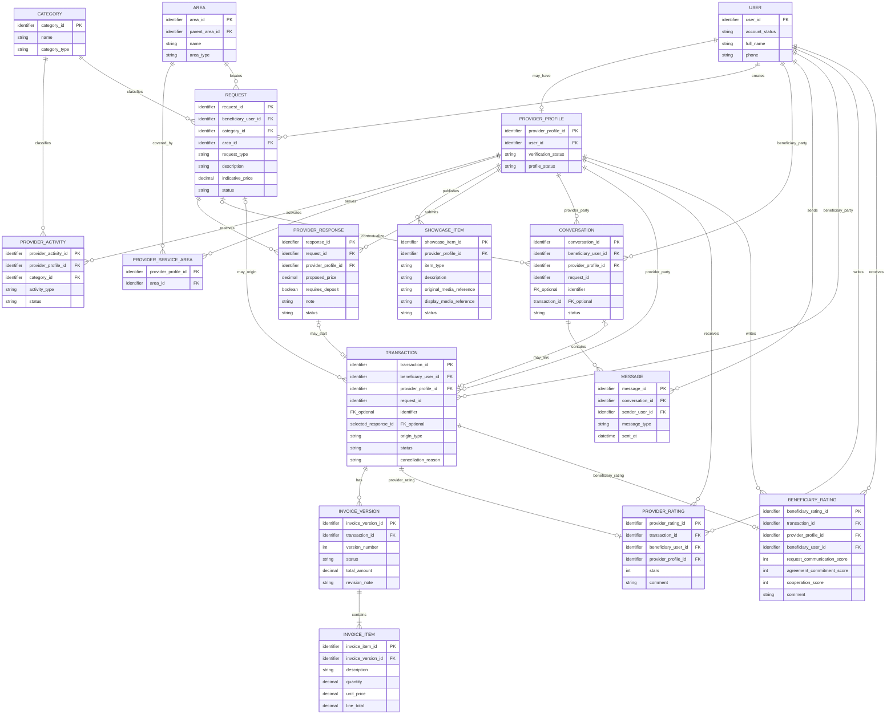
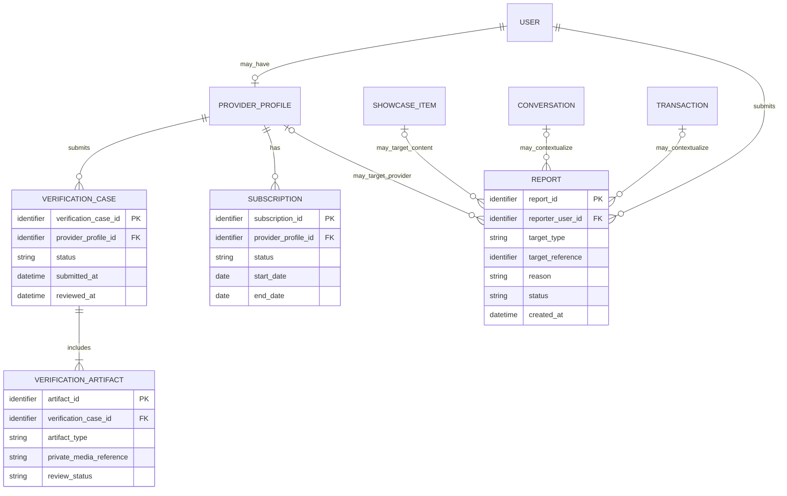

# Conceptual ERD — YADD Preliminary Defense

> **الحالة:** `DRAFT FOR PRELIMINARY DEFENSE — SYNCHRONIZED 2026-09-03`
>
> هذا ERD **مفاهيمي للفصل الثالث** ولا يعد Relation Schema أو Database Design نهائيًا. الأنواع الفيزيائية، PK/FK التفصيلية، الفهارس، القيود التنفيذية وأسماء الجداول النهائية تنتقل إلى Chapter Four بعد مراجعة هذا النموذج.
>
> **المراجع الحاكمة:** DEC-008..011/012/029/030/031..036/041/042/043/046..056/063/064/066/068 + `05-SRS.md` + `06-business-rules.md` + `07-lifecycles.md` + `08-use-cases.md`.

---

## 1. مبادئ النمذجة الحالية

1. يوجد `USER` واحد للشخص؛ المستفيد والمقدم ليسا حسابين منفصلين.
2. يصبح المستخدم مقدمًا عندما يمتلك `PROVIDER_PROFILE` مستوفيًا شروط التفعيل.
3. يمكن لـProvider Profile تشغيل نشاط خدمة أو منتج أو كليهما.
4. يستخدم النظام `REQUEST → PROVIDER_RESPONSE → SELECTION → TRANSACTION` ولا يوجد `AGREEMENT` مستقل.
5. البحث المباشر قد ينشئ `TRANSACTION` دون `REQUEST` أو `PROVIDER_RESPONSE`.
6. الخدمة والمنتج يستخدمان Core Transaction واحدًا؛ الاختلاف يمثل عبر نوع النشاط/الطلب والبيانات المرتبطة به.
7. العربون لا يمثل كيانًا ماليًا؛ يوجد فقط `requires_deposit` ضمن Provider Response.
8. تقييم المستفيد للمقدم وتقييم المقدم للمستفيد نموذجان مختلفان في الحقول، لذلك يمثَّلان ككيانين منفصلين مفاهيميًا.
9. Portfolio/Catalog يمثلان مفهوم عرض واحدًا مع `item_type` يحدد نوع العنصر.
10. لا يساوي ERD هذا تصميم قاعدة البيانات النهائي؛ بعض كيانات الدعم قد تتوسع في Chapter Four.

---

## 2. Core Conceptual ERD — الرسم الرئيسي

---

## 3. شرح الكيانات الأساسية

### USER

يمثل حساب الشخص الواحد في YADD. لا يوجد `Customer Account` و`Provider Account` منفصلان.

- يمكن أن يعمل المستخدم كمستفيد مباشرة.
- يمكن أن يمتلك `PROVIDER_PROFILE` واحدًا لتفعيل بوابة المقدم.
- الاسم الكامل ورقم الهاتف ظاهران هنا كمفاهيم بيانات مطلوبة؛ تفاصيل العرض والخصوصية تحدد في التصميم.

### PROVIDER_PROFILE

يمثل هوية المقدم داخل الحساب نفسه.

- واحد كحد أقصى لكل USER وفق النموذج الحالي.
- حالة التحقق والتفعيل ترتبط به.
- الأنشطة والمناطق وPortfolio/Catalog ترتبط به.

### PROVIDER_ACTIVITY

يمثل نشاط المقدم بدل وضع `provider_type` واحد قد يمنع الجمع بين خدمة ومنتج.

- `activity_type = SERVICE | PRODUCT` مفاهيميًا.
- Provider Profile يمكنه امتلاك نشاط خدمة أو منتج أو كليهما.
- التصنيف يرتبط بالنشاط.

> **ملاحظة:** هل يحتاج المقدم عدة Activities من النوع نفسه أو نموذجًا أبسط في التنفيذ هو قرار Database Design لاحق؛ وجود النشاط نفسه مبرر بالـSRS، أما البنية الفيزيائية النهائية فلا تثبت هنا.

### AREA و PROVIDER_SERVICE_AREA

- `AREA` يمثل المديرية/الحي وعلاقة parent-child مفاهيميًا.
- `PROVIDER_SERVICE_AREA` يمثل المناطق التي يخدمها المقدم.
- الموقع الدقيق/GPS ليس بيانات عامة في هذا النموذج.

### SHOWCASE_ITEM

يوحد مفهومي:

- Portfolio لمقدم الخدمة.
- Catalog لمقدم المنتج.

ويستخدم `item_type` للتمييز. يحتفظ النظام بمفهوم مرجع للأصل غير العام ومرجع لنسخة العرض ذات العلامة المائية. العلامة المائية تعريف/ردع وليست إثبات ملكية.

### REQUEST

يمثل طلب المستفيد سواء كان لخدمة أو منتج.

- `request_type` يحدد Service/Product.
- يرتبط بتصنيف ومنطقة.
- `indicative_price` اختياري وغير ملزم.
- الصور/المرفقات الاختيارية موجودة في المتطلبات، لكن تفاصيل Media Entity لم تثبت في Core ERD الحالي حتى لا نكرر تصميم التخزين قبل Chapter Four.

### PROVIDER_RESPONSE

هو المصطلح القياسي بدل `OFFER`.

يحتوي مفاهيميًا على:

- السعر المقترح عند الحاجة.
- ملاحظة.
- `requires_deposit` نعم/لا.
- حالة الاستجابة.

لا يوجد `deposit_amount`, `deposit_percentage`, `payment_status` أو Refund Entity.

### CONVERSATION و MESSAGE

المحادثة قد تبدأ قبل Transaction من:

- البحث المباشر.
- سياق Request/Provider Response.

المحادثة وحدها لا تنشئ Transaction. ربطها بـRequest/Transaction اختياري حسب المسار.

### TRANSACTION

هو الكيان المركزي بعد بدء التعامل الرسمي.

يمكن أن ينشأ بطريقتين:

1. من `selected Provider Response` لمسار الطلب.
2. مباشرة بعد اتفاق الطرفين على بدء التعامل في مسار البحث المباشر.

لذلك `request_id` و`selected_response_id` اختياريان في المستوى المفاهيمي، بينما Beneficiary وProvider إلزاميان.

الإلغاء بعد البداية يسجل على Transaction مع السبب والطرف/التوقيت في التصميم التفصيلي.

### INVOICE_VERSION و INVOICE_ITEM

لم نستخدم كيان `INVOICE` واحدًا قابلًا للكتابة فوقه لأن المتطلبات تنص على الاحتفاظ بتاريخ النسخ والتعديلات.

- Transaction يمكن أن يملك عدة `INVOICE_VERSION`.
- كل نسخة لها بنودها.
- النسخة النهائية المعتمدة هي السجل النهائي للمعاملة داخل YADD.
- عدم الرد لا يعد موافقة.

> اسم `INVOICE_VERSION` مفاهيمي قابل للتغيير في Database Design إلى Invoice + InvoiceRevision إذا ظهر نموذج فيزيائي أنسب؛ المهم هو **عدم فقدان تاريخ النسخ**.

### PROVIDER_RATING

تقييم المستفيد للمقدم:

- مرتبط بمعاملة Completed.
- 1–5 نجوم إلزامية عند التقييم المطلوب.
- تعليق اختياري.
- معاملة واحدة تسمح بتقييم مقدم واحد بحد أقصى.

### BENEFICIARY_RATING

تقييم المقدم للمستفيد:

- مرتبط بمعاملة Completed.
- اختياري.
- ثلاثة مؤشرات 1–5:
  - وضوح الطلب والتواصل.
  - الالتزام بالاتفاق.
  - حسن التعامل والتعاون.
- تعليق اختياري.
- لا يؤدي تلقائيًا إلى عقوبة أو منع.

---

## 4. Supporting Trust / Administration ERD

هذه الكيانات معتمدة من حيث **الحاجة الوظيفية**، لكنها ليست محور Core Transaction Diagram. تفصل هنا لتقليل ازدحام الرسم الرئيسي.

### ملاحظات دعم الإدارة

- أنواع وثائق الهوية الدقيقة: `VER-DOC-Q01 — Needs Verification`.
- مدة الاحتفاظ ببيانات التحقق: `VER-RET-Q01 — Needs Legal Verification`.
- تفاصيل إثبات دفع الاشتراك وأسعاره: `SUB-PAY-Q01 / SUB-PLAN-Q01` مفتوحة.
- AI Flags/Audit tables لم تثبت ككيانات في ERD قبل حسم سياسة المزود والاحتفاظ والعتبات؛ وجود AI الوظيفي معتمد لكن تصميم بياناته التفصيلي ما يزال جزئيًا.
- `REPORT.target_reference` هنا تمثيل مفاهيمي polymorphic لتوضيح أن البلاغ قد يرتبط بمستخدم/مقدم/محتوى/محادثة/معاملة. التنفيذ الفيزيائي قد يفصله إلى علاقات/جداول أو قيود أكثر صرامة.

---

## 5. كيانات أزيلت من النموذج القديم ولماذا

| الكيان القديم | القرار الحالي |
|---|---|
| `ROLE / USER_ROLE` لتمييز Beneficiary/Provider | لا يستخدم لهذا الغرض؛ الحساب واحد وProvider Profile يفعّل بوابة المقدم. أدوار الإدارة/الصلاحيات ستصمم منفصلة عند الحاجة. |
| `SERVICE_REQUEST` | استبدل بـ`REQUEST` لأنه يغطي Service وProduct. |
| `OFFER` | استبدل بـ`PROVIDER_RESPONSE` كمصطلح قياسي. |
| `AGREEMENT` | أزيل؛ لا يوجد Agreement Entity مستقل في MVP. |
| `INVOICE` واحد قابل للتعديل | استبدل مفاهيميًا بـ`INVOICE_VERSION + INVOICE_ITEM` لحفظ تاريخ النسخ. |
| `REVIEW` عام بخصائص واحدة | فصل إلى `PROVIDER_RATING` و`BENEFICIARY_RATING` لأن حقولهما وقواعدهما مختلفة. |
| `PORTFOLIO_ITEM` فقط | استبدل بـ`SHOWCASE_ITEM` لدعم Portfolio وCatalog معًا. |

---

## 6. Cardinality / Constraint Notes

هذه قواعد يجب أن تتحول إلى Constraints عند Relation Schema:

1. USER ↔ PROVIDER_PROFILE: المستخدم يمتلك صفر أو Provider Profile واحدًا حاليًا.
2. REQUEST: كل Request ينشئه Beneficiary واحد وينتمي لتصنيف ومنطقة عامة واحدة.
3. PROVIDER_RESPONSE: استجابة واحدة مرتبطة بـRequest واحد وProvider Profile واحد.
4. كل Provider Profile لا يرسل أكثر من استجابة فعالة لنفس Request إلا إذا اعتمد لاحقًا نموذج Revision للاستجابة؛ لم يعتمد حاليًا نموذج تعدد الاستجابات من نفس المقدم.
5. في مسار الطلب، Provider Response واحدة فقط تصبح Selected وتبدأ Transaction واحدة.
6. TRANSACTION لها Beneficiary واحد وProvider واحد.
7. البحث المباشر يسمح Transaction بلا Request/Provider Response.
8. كل Invoice Version تنتمي إلى Transaction واحدة وتحتوي بندًا واحدًا على الأقل.
9. Transaction مكتملة تسمح بـProvider Rating واحدة بحد أقصى من المستفيد.
10. Transaction مكتملة تسمح بـBeneficiary Rating واحدة بحد أقصى من المقدم، وهي اختيارية.
11. لا توجد علاقة مالية للعربون داخل ERD.

> البند 4 أعلاه **Derived Design Constraint** منطقي لتجنب استجابات مكررة من المقدم نفسه، لكنه لم يسجل بعد Team Decision مستقلًا. لذلك لا يحول إلى قاعدة نهائية قبل المراجعة؛ يمكن الاكتفاء بقيد uniqueness كاقتراح في Chapter Four أو إزالته إذا قرر الفريق السماح بتعديل/إعادة إرسال الاستجابة.

---

## 7. عناصر ما تزال Needs Verification / Design Decision

لا نملأها بتخمين داخل ERD:

- أنواع الوثائق المقبولة وتفاصيل Verification Artifact.
- مدة الاحتفاظ ببيانات التحقق والمحادثات وAI Flags.
- الباقات/أسعار/إثبات دفع الاشتراك.
- AI provider/threshold/storage model.
- القيم الرقمية لExpiry والتذكيرات.
- الشكل الفيزيائي النهائي لإدارة الصلاحيات الإدارية.
- هل نستخدم Media table مشتركة لكل الصور/المرفقات أم References داخل الكيانات.
- الشكل النهائي لحفظ Invoice history: `InvoiceVersion` أو `Invoice + Revision`.
- هل Provider Activity يحتاج عدة سجلات لكل مقدم أم تمثيل أبسط؛ يحسم عند Database Design وفق حالات الاستخدام الفعلية.

---

## 8. Traceability Summary

| Concept | Requirement / Decision Basis |
|---|---|
| USER + optional ProviderProfile | DEC-008..011 |
| Service/Product Activity | DEC-029/030 |
| Category/Area/Service Areas | DEC-031..033 |
| Request | DEC-012/013/048/049 |
| Provider Response | DEC-013/014/041/047/066 |
| Conversation/Message | DEC-023/024/046 |
| Transaction | DEC-047/048/056/066/068 |
| Invoice versions/items | DEC-015/016/025/050/055 |
| Provider Rating | DEC-051/052 |
| Beneficiary Rating | DEC-063 |
| Showcase Item | DEC-064 |
| Verification Case | DEC-034..036 |
| Subscription | DEC-021/042/043 |
| Report | DEC-053/054 |

---

## 9. Review Checklist Before Supervisor Delivery

- [x] لا يوجد `Agreement` Entity.
- [x] Request موحد للخدمة والمنتج.
- [x] Provider Response هو المصطلح القياسي.
- [x] الحساب الواحد وProvider Profile ممثلان دون حساب Provider مستقل.
- [x] Service/Product Activity يدعمان تفعيل النوعين معًا.
- [x] Direct Search يمكن أن يبدأ Transaction دون Request.
- [x] RequiresDeposit ممثل Boolean فقط دون Payment entities.
- [x] Invoice history ممثل مفاهيميًا.
- [x] اتجاهَا التقييم ممثلان بحقولهما المختلفة.
- [x] Portfolio/Catalog موحدان دون ادعاء أن Watermark يثبت الملكية.
- [x] Verification/Subscription/Report موجودة كSupporting Model.
- [ ] مراجعة Cardinalities مع الفريق/المشرف قبل اعتبار ERD Stable.
- [ ] تحويل الرسم إلى إخراج ERD واضح عالي الدقة لتسليم 5 سبتمبر.
- [ ] اشتقاق Class Diagram من هذا النموذج بعد المراجعة.
- [ ] اشتقاق Relation Schema/Data Dictionary في Chapter Four بعد تثبيت ERD.
