# ERD — YADD Preliminary Defense

> **الحالة:** `DRAFT FOR PRELIMINARY DEFENSE — SEMANTIC + 32-TABLE PHYSICAL ALIGNMENT SYNCHRONIZED 2026-09-20 THROUGH DEC-091 — NOT BASELINED`
>
> **المراجع الحاكمة:** Decision Register through DEC-091 + `05-SRS.md` + `06-business-rules.md` + `07-lifecycles.md` + `08-use-cases.md`.
>
> **مزامنة 2026-09-20:** اعتمد الفريق Working Physical Database Model من **32 جدولًا**. هذا لا يغير Actor goals أو Business Rules؛ بل يثبت mapping الفيزيائي الحالي ويضيف جداول الدعم/المرفقات اللازمة. مفهوم `USER` في التحليل يُنفذ في Chapter Four كـ `ApplicationUser` باستخدام ASP.NET Core Identity.

## 1. Modeling Boundary

- `Guest` Actor فقط ولا يملك جدولًا لمجرد التصفح العام.
- يوجد حساب واحد للشخص؛ Beneficiary هو دور استخدام، وProvider هو الحساب نفسه مع optional `ProviderProfile`.
- `ApplicationUser` هو التنفيذ الفيزيائي لمفهوم `USER` وليس Domain Actor جديدًا.
- لا يوجد `Agreement`, `Payment`, `Wallet`, `Escrow`, `Refund` أو `Settlement` entity داخل MVP.
- `RequiresDeposit` يبقى Boolean داخل `ProviderResponse`.
- Conversation واحدة مستمرة لكل Beneficiary–Provider pair ويمكن أن تضم عدة Transactions.
- Ratings لا تُفتح إلا بعد `Transaction = Completed`; لا Ratings لـCancelled/Disputed.
- Service Provider فقط يحتاج Government-ID Verification في MVP.
- الأنواع/الأطوال أدناه موثقة في Chapter Four؛ هذا الملف يحافظ على ERD وعلاقاته.

## 2. Adopted 32-Table Model

1. `ApplicationUser`
2. `ProviderProfile`
3. `Category`
4. `ProviderActivity`
5. `Area`
6. `ProviderServiceArea`
7. `AreaAdjacency`
8. `ShowcaseItem`
9. `Request`
10. `RequestImage`
11. `ProviderResponse`
12. `Conversation`
13. `Message`
14. `MessageAttachment`
15. `SystemEvent`
16. `TransactionStartRequest`
17. `Transaction`
18. `InvoiceVersion`
19. `InvoiceItem`
20. `InvoiceImage`
21. `ProviderRating`
22. `ProviderRatingCriterion`
23. `BeneficiaryRating`
24. `VerificationCase`
25. `VerificationArtifact`
26. `Subscription`
27. `UserBlock`
28. `Report`
29. `ReportAttachment`
30. `SafetyFlag`
31. `AdminAuditRecord`
32. `Notification`

الخمسة التي أضيفت إلى النموذج الفيزيائي مقارنة بالحزمة المنطقية الأقدم هي: `RequestImage`, `MessageAttachment`, `SystemEvent`, `InvoiceImage`, `ReportAttachment`. كما أن `USER` يُنفذ باسم `ApplicationUser`.

## 3. Single ERD Relationship Map

```mermaid
erDiagram
    APPLICATION_USER ||--o| PROVIDER_PROFILE : has
    APPLICATION_USER ||--o{ REQUEST : creates
    APPLICATION_USER ||--o{ CONVERSATION : beneficiary_party
    APPLICATION_USER ||--o{ MESSAGE : sends
    APPLICATION_USER ||--o{ TRANSACTION_START_REQUEST : requests_start
    APPLICATION_USER ||--o{ TRANSACTION : beneficiary_party
    APPLICATION_USER ||--o{ PROVIDER_RATING : writes
    APPLICATION_USER ||--o{ BENEFICIARY_RATING : receives
    APPLICATION_USER ||--o{ USER_BLOCK : creates
    APPLICATION_USER ||--o{ USER_BLOCK : is_blocked
    APPLICATION_USER ||--o{ REPORT : submits
    APPLICATION_USER ||--o{ NOTIFICATION : receives
    APPLICATION_USER ||--o{ ADMIN_AUDIT_RECORD : performs

    PROVIDER_PROFILE ||--o{ PROVIDER_ACTIVITY : defines
    CATEGORY ||--o{ PROVIDER_ACTIVITY : classifies
    PROVIDER_PROFILE ||--o{ PROVIDER_SERVICE_AREA : serves
    AREA ||--o{ PROVIDER_SERVICE_AREA : covered_by
    AREA ||--o{ AREA_ADJACENCY : source
    AREA ||--o{ AREA_ADJACENCY : adjacent
    AREA o|--o{ AREA : parent_of

    PROVIDER_PROFILE ||--o{ SHOWCASE_ITEM : publishes
    CATEGORY ||--o{ REQUEST : classifies
    AREA ||--o{ REQUEST : locates
    REQUEST ||--o{ REQUEST_IMAGE : has
    REQUEST ||--o{ PROVIDER_RESPONSE : receives
    PROVIDER_PROFILE ||--o{ PROVIDER_RESPONSE : submits

    PROVIDER_PROFILE ||--o{ CONVERSATION : provider_party
    CONVERSATION ||--o{ MESSAGE : contains
    MESSAGE ||--o{ MESSAGE_ATTACHMENT : has
    CONVERSATION ||--o{ SYSTEM_EVENT : records
    CONVERSATION ||--o{ TRANSACTION_START_REQUEST : receives

    PROVIDER_PROFILE ||--o{ TRANSACTION : provider_party
    CONVERSATION ||--o{ TRANSACTION : groups
    REQUEST o|--o| TRANSACTION : may_origin
    PROVIDER_RESPONSE o|--o| TRANSACTION : may_start
    TRANSACTION o|--o{ SYSTEM_EVENT : contextualizes

    TRANSACTION ||--o{ INVOICE_VERSION : has
    INVOICE_VERSION ||--|{ INVOICE_ITEM : contains
    INVOICE_VERSION ||--o{ INVOICE_IMAGE : has

    TRANSACTION ||--o| PROVIDER_RATING : provider_rating
    PROVIDER_PROFILE ||--o{ PROVIDER_RATING : receives
    PROVIDER_RATING ||--|{ PROVIDER_RATING_CRITERION : contains

    TRANSACTION ||--o| BENEFICIARY_RATING : beneficiary_rating
    PROVIDER_PROFILE ||--o{ BENEFICIARY_RATING : writes

    PROVIDER_PROFILE ||--o{ VERIFICATION_CASE : submits
    VERIFICATION_CASE ||--o{ VERIFICATION_ARTIFACT : includes
    PROVIDER_PROFILE ||--o{ SUBSCRIPTION : has

    REPORT ||--o{ REPORT_ATTACHMENT : has
    REPORT o|--o{ SAFETY_FLAG : may_flag
    SAFETY_FLAG o|--o{ ADMIN_AUDIT_RECORD : audited
```

## 4. Key Cardinality / Integrity Decisions

1. `ApplicationUser ↔ ProviderProfile`: صفر أو ملف مقدم واحد لكل حساب.
2. `ProviderProfile.ProviderType`: نوع واحد فقط `SERVICE` أو `PRODUCT`.
3. Provider may have multiple valid categories through `ProviderActivity`.
4. `ProviderServiceArea` and `AreaAdjacency` use composite-key candidates.
5. Request واحد يمكن أن ينتج صفر أو Transaction واحدة فقط في Request Route.
6. Direct Search Transaction may have no Request/SelectedResponse and requires confirmed `TransactionStartRequest`.
7. Conversation واحدة مستمرة بين نفس Beneficiary وProvider؛ pair uniqueness remains an enforced design constraint.
8. `SystemEvent` records conversation boundaries and can reference a Transaction in the adopted physical model.
9. Invoice history is preserved through `InvoiceVersion`; items and optional images belong to a version.
10. ProviderRating and BeneficiaryRating are separate models and each is limited to at most one rating of its kind per completed Transaction.
11. `Report`, `SafetyFlag`, and `AdminAuditRecord` use explicit target/reference columns in the adopted physical design.
12. Public/private projection remains governed by DEC-077; Identity/security fields, private media, verification, chat, transactions, invoices, reports and audit data are not public Guest data.

## 5. Physical Mapping Notes

- Conceptual `USER` → physical `ApplicationUser`.
- ASP.NET Core Identity fields (`NormalizedUserName`, `SecurityStamp`, `ConcurrencyStamp`, lockout and 2FA fields) are implementation fields and do not create new business concepts.
- Supporting persistence tables (`RequestImage`, `MessageAttachment`, `InvoiceImage`, `ReportAttachment`) store repeated media references rather than inflating parent rows.
- `SystemEvent` is now an explicit table, resolving the earlier open persistence question for conversation/transaction boundary events.
- Exact nullability, named constraints, cascade rules and indexes still require final SQL migration review; field names and SQL Server types are now synchronized in `docs/04-design/01-database-design.md` and `02-data-dictionary.md`.

## 6. Removed Legacy Concepts

| Legacy | Current |
|---|---|
| `GUEST` table | No table; Guest is an unauthenticated actor |
| `ROLE/USER_ROLE` for Beneficiary/Provider | One ApplicationUser + optional ProviderProfile |
| `SERVICE_REQUEST` | `Request` |
| `OFFER` | `ProviderResponse` |
| `AGREEMENT` | No standalone entity |
| Generic `REVIEW` | `ProviderRating` + `BeneficiaryRating` |
| Single mutable invoice | `InvoiceVersion` + `InvoiceItem` + optional `InvoiceImage` |

## 7. Gate

The 32-table working physical model is synchronized with the current analysis semantics through DEC-091. It is still **not baselined** until final PK/FK/Unique/Check names, nullability, indexes, cascade behavior, retention policies, and migration review are approved.
