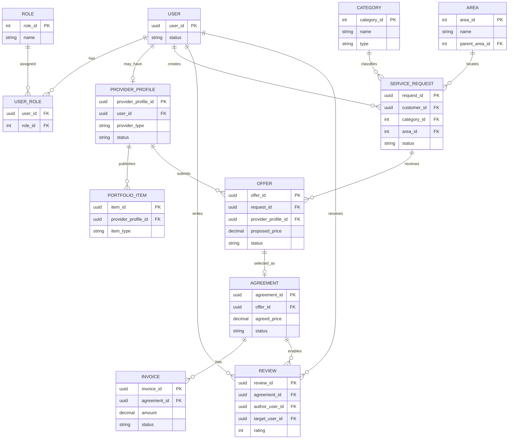

# Conceptual ERD — YADD

> **الحالة:** `DRAFT — NOT DATABASE DESIGN`
>
> هذا ERD مفاهيمي لا يعد Schema نهائيًا. يجب تحديثه بعد اعتماد SRS وBusiness Rules.

## عناصر لم تدخل عمدًا

- AI verification entities: محجوبة حتى AI-Q01.
- Subscription/payment entities: محجوبة حتى SUB-Q01/PAY-Q01.
- Product order/cart/delivery: لا توجد دورة عمل معتمدة لها بعد.
- Media storage details: تصميم تقني لاحق.

هذا يمنع الـERD من تثبيت Features لم تعتمد.
