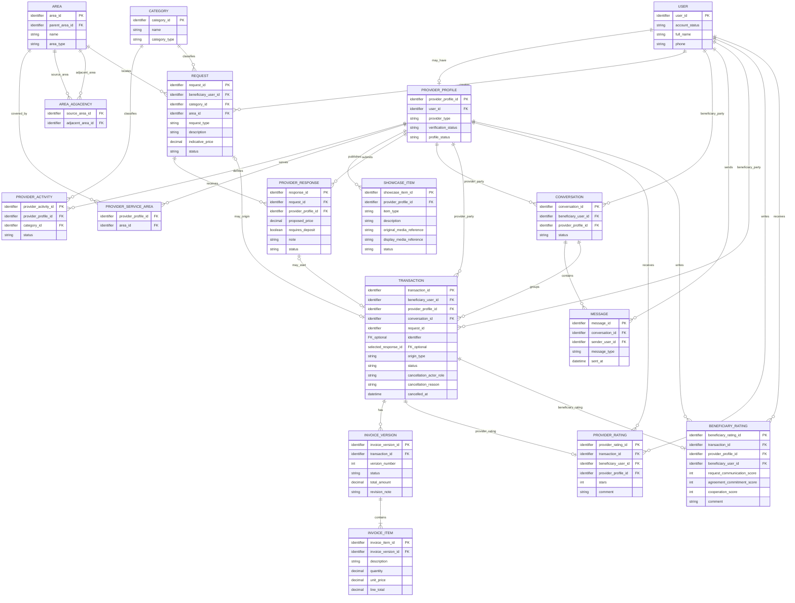
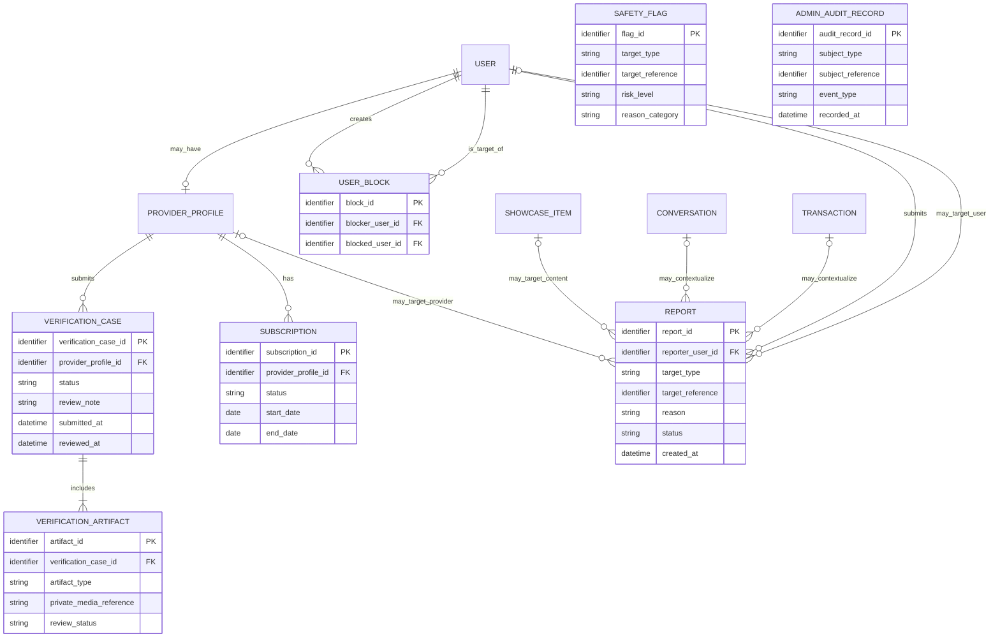

# Conceptual ERD — YADD Preliminary Defense

> **الحالة:** `DRAFT FOR PRELIMINARY DEFENSE — CORE SYNCHRONIZED 2026-09-18 THROUGH DEC-090`
>
> هذا ERD **مفاهيمي للفصل الثالث** وليس Relation Schema أو Database Design نهائيًا. الأنواع الفيزيائية، PK/FK التفصيلية، الفهارس، القيود التنفيذية وأسماء الجداول النهائية تنتقل إلى Chapter Four.
>
> **المراجع الحاكمة:** DEC-008..016/018/019/021/023..025/030..043/046..056/063..090 + `05-SRS.md` + `06-business-rules.md` + `07-lifecycles.md` + `08-use-cases.md`.
>
> جميع التسميات داخل الرسم النهائي تكون باللغة الإنجليزية وفق DEC-072.

---

## 1. مبادئ النمذجة الحالية

1. `Guest` في DEC-077 Actor خارجي غير authenticated للتصفح العام، وليس Domain Entity؛ لا ينشأ `GUEST` record لمجرد التصفح. عندما ينشئ الشخص حسابًا/يسجل الدخول يطبق نموذج `USER` الحالي.
2. يوجد `USER` واحد للشخص؛ Beneficiary وProvider ليسا حسابين منفصلين.
3. يصبح المستخدم Provider عندما يمتلك `PROVIDER_PROFILE` مستوفيًا شروط التفعيل.
4. في MVP يكون كل Provider Profile من نوع واحد فقط: `SERVICE` أو `PRODUCT`، ولا يجمع النوعين معًا — DEC-074.
5. يمكن لـProvider Profile اختيار تصنيف واحد أو أكثر داخل نوعه عبر `PROVIDER_ACTIVITY`; يسمح Draft مؤقتًا بصفر Activities، لكن أهلية وظائف التقديم تتطلب Activity واحدة على الأقل، وكل Category يجب أن تتوافق مع Provider Type — DEC-076.
6. يستخدم مسار الطلب النموذج `REQUEST → PROVIDER_RESPONSE → SELECTION → TRANSACTION` ولا يوجد `AGREEMENT` مستقل.
7. البحث المباشر يمكن أن ينشئ `TRANSACTION` دون `REQUEST` أو `PROVIDER_RESPONSE`، لكن فقط بعد `Request Transaction Start` وتأكيد الطرف الآخر.
8. الخدمة والمنتج يستخدمان Core Transaction واحدًا؛ الاختلاف يمثل عبر نوع المقدم/الطلب والبيانات المرتبطة به.
9. العربون لا يمثل كيانًا ماليًا؛ يوجد فقط `requires_deposit` ضمن Provider Response.
10. تقييم Beneficiary للمقدم وتقييم Provider للمستفيد نموذجان مختلفان في الحقول والقواعد، لذلك يمثَّلان ككيانين منفصلين مفاهيميًا.
11. Portfolio/Catalog يمثلان مفهوم عرض موحدًا عبر `SHOWCASE_ITEM` مع اختلاف العرض حسب Provider Type.
12. `Completed` هي النهاية الناجحة للTransaction ولا توجد حالة Transaction باسم `Closed`.
13. `Disputed` نهاية غير ناجحة للTransaction عند استمرار خلاف الفاتورة قبل الاعتماد دون اتفاق؛ لا تفتح Ratings — DEC-073.
14. لكل Provider استجابة فعالة واحدة فقط لكل Request؛ يمكن تعديلها أو سحبها قبل الاختيار وفق DEC-070.
15. Request واحد يمكن أن ينتج **صفر أو Transaction واحدة فقط**؛ لأن اختيار Provider واحد يغلق Request أمام الاستجابات الجديدة.
16. بين نفس Beneficiary ونفس Provider توجد Conversation واحدة مستمرة يمكن أن ترتبط بعدة Transactions عبر الزمن، مع فواصل/أحداث واضحة داخل المحادثة — DEC-075.
17. مراجعة النزاع إداريًا تستخدم `REPORT`/complaint context ولا تنشئ كيان Payment/Refund/Compensation أو سلطة تسوية مالية داخل YADD.
18. علاقات الأحياء المجاورة مفهوم معتمد ومُدار داخل YADD؛ يمثلها `AREA_ADJACENCY` دون افتراض GPS Radius.
19. `Block User` و`Report` مفهومان مستقلان؛ يمثل `USER_BLOCK` علاقة الحظر المباشر ولا يعني إنشاء Report أو إدانة الطرف الآخر.
20. عند Transaction Cancellation يجب الاحتفاظ بالطرف الذي ألغى والسبب والتوقيت؛ تبقى طريقة التخزين الفيزيائية قرار تصميم لاحق.
21. `SAFETY_FLAG` و`ADMIN_AUDIT_RECORD` مفهومان داعمان معتمدان من Trust & Safety / D8؛ تمثيلهما هنا مفاهيمي فقط، بينما schema التخزين والاحتفاظ والـthresholds تبقى قرارات تصميم/سياسة مفتوحة.
22. يجب أن يحفظ `SAFETY_FLAG` سبب/فئة الاشتباه بما يكفي للمراجعة البشرية؛ قائمة الفئات وقيم المخاطر والعتبات التفصيلية لا تزال مفتوحة.
23. وجود `USER.phone` في النموذج لا يعني أنه حقل عام؛ وفق DEC-077 لا يعرض رقم الهاتف ضمن Public Provider Profile للGuest.

---

## 2. Core Conceptual ERD

---

## 3. Core Entity Semantics

### USER
يمثل حساب الشخص الواحد في YADD بعد إنشاء/استخدام الحساب. يمكن أن يعمل الشخص كمستفيد مباشرة، ويمكنه امتلاك Provider Profile واحد كحد أقصى. `Guest` لا يمثل USER قبل Authentication/Create Account لمجرد التصفح العام. USER يحتفظ بالاسم في أربعة حقول (first/father/grandfather/family)، وPhone موثق بـOTP، وEmail اختياري مع حالة تحقق؛ هذه بيانات حساب وليست Public Provider Profile fields وفق DEC-077/078.

### PROVIDER_PROFILE
يمثل هوية Provider داخل الحساب نفسه. يحتوي Product Provider على `trade_name` اختياري كاسم عرض عام، بينما تبقى الهوية القانونية في USER. يحدد `provider_type` نوعًا واحدًا فقط في MVP: `SERVICE` أو `PRODUCT` وفق DEC-074. قد يرتبط به Identity Verification عندما يكون النوع `SERVICE`، وترتبط به الأنشطة/التصنيفات، مناطق الخدمة، Portfolio/Catalog والاشتراك. Product Provider لا يحتاج Government-ID Verification في MVP. سياسة تغيير النوع بعد اختياره لم تعتمد بعد.

### PROVIDER_ACTIVITY
يمثل ارتباط Provider Profile بتصنيف داخل نوعه المختار. يمكن للملف أن يمتلك عدة Provider Activities، لكن يجب أن تتوافق جميع Categories مع `provider_type`. يسمح Draft بصفر Activities مؤقتًا، بينما أهلية وظائف التقديم تتطلب Activity واحدة على الأقل وفق DEC-076.

### CATEGORY / AREA / PROVIDER_SERVICE_AREA / AREA_ADJACENCY
- `CATEGORY` تصنيف النشاط/الطلب، وله `category_type` يجب أن يتوافق مع نوع Provider Profile عند استخدامه في ProviderActivity.
- `AREA` تمثل District/Neighborhood بصورة مفاهيمية parent-child.
- `PROVIDER_SERVICE_AREA` تمثل المناطق التي يخدمها Provider.
- `AREA_ADJACENCY` تمثل قائمة الجوار المُدارة بين الأحياء وفق DEC-033؛ العلاقة المنطقية جوار متبادل، بينما طريقة فرض symmetry/uniqueness في قاعدة البيانات تؤجل إلى Chapter Four.
- الموقع الدقيق/GPS ليس بيانات عامة في هذا النموذج.

### SHOWCASE_ITEM
يوحد Portfolio وCatalog مفاهيميًا. إذا كان Provider Type = SERVICE يعرض كPortfolio، وإذا كان PRODUCT يعرض كProduct Catalog. يحتوي مرجعًا للأصل غير العام ومرجعًا لنسخة العرض ذات العلامة المائية. يمكن عرض نسخة العرض العامة للGuest وفق DEC-077، بينما الأصل يبقى غير عام.

### REQUEST
يمثل طلب Service أو Product. يجب أن يتوافق `request_type` مع نوع Provider المؤهل، ويجب أن يملك Provider تصنيف الطلب ضمن Provider Activities. يحتوي التصنيف والمنطقة والوصف والسعر الاسترشادي الاختياري. إنشاء Request يتطلب authenticated User؛ Guest لا ينشئ Request قبل Authentication.

### PROVIDER_RESPONSE
المصطلح القياسي بدل `OFFER`.

- يرتبط بـRequest واحد وProvider Profile واحد.
- يجب أن يكون نوع Provider Profile متوافقًا مع نوع Request، وأن يكون Provider مؤهلًا لتصنيف الطلب.
- يمكن أن يحتوي proposed price وملاحظة و`requires_deposit`.
- لا يوجد DepositAmount أو PaymentStatus أو Refund Entity.
- لكل Provider Response فعالة واحدة لكل Request.
- يجوز تعديلها أو سحبها فقط ما دام Request Open ولم يتم اختيار Provider.

### CONVERSATION / MESSAGE
المحادثة يمكن أن تبدأ قبل Transaction من Direct Search أو Request context للمستخدم authenticated. Guest لا ينشئ Message/Conversation خاصة قبل Authentication. Chat وحدها لا تنشئ Transaction. في Direct Search يبدأ Transaction فقط بعد طلب بدء صريح وتأكيد الطرف الآخر.

وفق DEC-075، تبقى Conversation واحدة مستمرة بين نفس Beneficiary ونفس Provider، ويمكن أن تضم صفرًا أو عدة Transactions عبر الزمن. يجب أن تظهر داخلها فواصل/أحداث نظام واضحة لبدء وانتهاء كل Transaction.

القيد المفاهيمي هو **`{unique Conversation per Beneficiary–Provider pair}`**. طريقة فرض uniqueness فعليًا، وكذلك ربط Message/System Event بمعاملة محددة، تؤجل إلى Chapter Four.

> لا يفرض Core ERD علاقة مباشرة بين `REQUEST` و`CONVERSATION`: قد تبدأ أو تستمر المحادثة في سياق Request، لكن نفس Conversation المستمرة قد تمر بعدة Request contexts عبر الزمن. طريقة تمثيل وربط تلك السياقات تؤجل إلى Physical/Interaction Design في Chapter Four دون كسر القرار المفاهيمي أعلاه.

### TRANSACTION
هو الكيان المركزي بعد بدء التعامل الرسمي.

يمكن أن ينشأ:
1. من Provider Response مختارة في Request Route.
2. مباشرة في Direct Search Route بعد Mutual Start Confirmation.

كل Transaction ترتبط بالمحادثة المستمرة بين الطرفين. `request_id` و`selected_response_id` اختياريان مفاهيميًا، بينما Beneficiary وProvider وConversation إلزاميون.

الحالات النهائية بحسب المسار تشمل:
- `Completed` للنجاح بعد اعتماد الفاتورة.
- `Cancelled` عند الإلغاء وفق القواعد.
- `Disputed` عند استمرار الخلاف قبل اعتماد الفاتورة وعدم الوصول إلى اتفاق — DEC-073.

عند الإلغاء يسجل YADD الطرف الذي ألغى والسبب والتوقيت وفق DEC-048/BR-019.

### INVOICE_VERSION / INVOICE_ITEM
يمثلان الاحتفاظ بتاريخ نسخ الفاتورة بدل الكتابة فوق نسخة واحدة.

### PROVIDER_RATING
تقييم Beneficiary للمقدم بعد Transaction Completed: 1–5 stars، comment optional، وبحد أقصى تقييم واحد لكل Transaction. لا ينشئه Guest.

### BENEFICIARY_RATING
تقييم Provider للمستفيد بعد Transaction Completed: optional، ثلاثة مؤشرات 1–5، comment optional، وبحد أقصى تقييم واحد لكل Transaction. سجل التفاعل ليس Public Guest data.

---

### NOTIFICATION
مفهوم مشتق لدعم DEC-090: إشعار مرتبط بـUSER مع channel/status/timestamps؛ In-App افتراضي، SMS للأمان/OTP، Email موثق اختياري. لا يثبت هذا التصميم مزود رسائل بعينه.

## 4. Supporting Trust / Administration ERD

### Supporting-model notes

- `USER_BLOCK` يمثل Block كعلاقة حماية مباشرة مستقلة عن `REPORT`، وكلاهما يتطلب authenticated User؛ Guest لا ينشئهما قبل Authentication.
- `REPORT.target_reference` تمثيل مفاهيمي polymorphic؛ التنفيذ الفيزيائي قد يفصله إلى علاقات أكثر صرامة.
- `VERIFICATION_CASE.review_note` يمثل الملاحظة/السبب عند طلب إعادة التقديم أو الرفض.
- `SAFETY_FLAG.reason_category` يمثل سبب/فئة الاشتباه المطلوبة للمراجعة البشرية؛ taxonomy والـthresholds لم تعتمد بعد.
- `SAFETY_FLAG` و`ADMIN_AUDIT_RECORD` مفاهيم تحليلية؛ schema/retention/thresholds لم تعتمد بعد.
- Verification, Subscription, Reports, Flags and Audit are not public Guest data.

---

## 5. Removed Legacy Concepts

| Legacy Concept | Current Model |
|---|---|
| `ROLE / USER_ROLE` لتمييز Beneficiary/Provider | لا يستخدم لهذا الغرض؛ User واحد + optional Provider Profile. |
| `SERVICE_REQUEST` | `REQUEST` يغطي Service وProduct. |
| `OFFER` | `PROVIDER_RESPONSE`. |
| `AGREEMENT` | غير موجود كEntity مستقل في MVP. |
| Single mutable `INVOICE` | Invoice history محفوظ مفاهيميًا عبر versions/revisions. |
| Generic `REVIEW` | `PROVIDER_RATING` + `BENEFICIARY_RATING`. |
| `PORTFOLIO_ITEM` فقط | `SHOWCASE_ITEM` يدعم Portfolio/Catalog وفق Provider Type. |
| Service + Product active together on one Provider Profile | غير مسموح في MVP وفق DEC-074. |
| `GUEST` ككيان بيانات لمجرد anonymous browsing | غير مطلوب؛ Guest Actor فقط حتى Create Account/Authentication — DEC-077. |

---

## 6. Cardinality / Constraint Decisions for Chapter Four

1. `USER ↔ PROVIDER_PROFILE`: User يمتلك صفر أو Provider Profile واحدًا.
2. Provider Profile له نوع واحد فقط `SERVICE` أو `PRODUCT` — DEC-074.
3. Draft Provider Profile يمكن أن يمتلك صفر أو عدة Provider Activities، لكن أهلية وظائف التقديم تتطلب Provider Activity واحدة على الأقل — DEC-076.
4. يمكن لـProvider Profile امتلاك عدة Provider Activities/تصنيفات داخل نوعه، وكل Provider Activity ترتبط بـCategory واحدة متوافقة مع Provider Type — DEC-076.
5. كل `REQUEST` ينشئه Beneficiary واحد ويرتبط بتصنيف ومنطقة عامة واحدة.
6. كل `PROVIDER_RESPONSE` ترتبط بـRequest واحد وProvider Profile واحد ويجب أن يتوافق نوعهما وتصنيفهما.
7. لكل Provider استجابة فعالة واحدة فقط لكل Request — DEC-070.
8. في Request Route تصبح Provider Response واحدة فقط `Selected`.
9. Request واحد ينتج صفر أو Transaction واحدة فقط.
10. كل `TRANSACTION` لها Beneficiary واحد وProvider واحد وConversation واحدة.
11. Conversation واحدة بين نفس الطرفين يمكن أن ترتبط بعدة Transactions عبر الزمن — DEC-075.
12. يجب أن يكون زوج `(beneficiary_user_id, provider_profile_id)` فريدًا مفاهيميًا داخل `CONVERSATION`; آلية فرضه الفيزيائية تحسم في Chapter Four.
13. Direct Search Transaction قد تكون بلا Request/Provider Response — DEC-066/069.
14. Transaction الناتجة من Direct Search لا تنشأ إلا بعد Mutual Start Confirmation — DEC-069.
15. كل Invoice Version تنتمي إلى Transaction واحدة وتحتوي بندًا واحدًا على الأقل.
16. Transaction `Completed` تسمح Provider Rating واحدة بحد أقصى من Beneficiary.
17. Transaction `Completed` تسمح Beneficiary Rating واحدة بحد أقصى من Provider، وهي اختيارية.
18. Transaction `Disputed` لا تسمح Ratings — DEC-073.
19. `AREA_ADJACENCY` يمثل علاقة جوار مُدارة بين الأحياء.
20. `USER_BLOCK` و`REPORT` مستقلان — DEC-053.
21. Transaction Cancellation تسجل Actor/Reason/Time — DEC-048 / BR-019.
22. DEC-077 لا يضيف جدول/كيان Guest؛ يجب أن تراعى public/private field exposure في API/query/interface design بدل اختراع persistence غير مطلوب.

---

## 7. Remaining Design Decisions / Needs Verification

- Provider Type switching policy after initial selection.
- Retention period for verification data, conversations and AI flags.
- Final subscription price/payment-proof details and public-search visibility when Expired.
- AI provider/threshold/storage model and final reason-category taxonomy.
- Physical enforcement of Conversation pair uniqueness and Message/SystemEvent↔Transaction mapping.
- Exact technical implementation of public Provider Profile projection and authentication continuation after a protected Guest CTA; the semantic boundary is already fixed by DEC-077.
