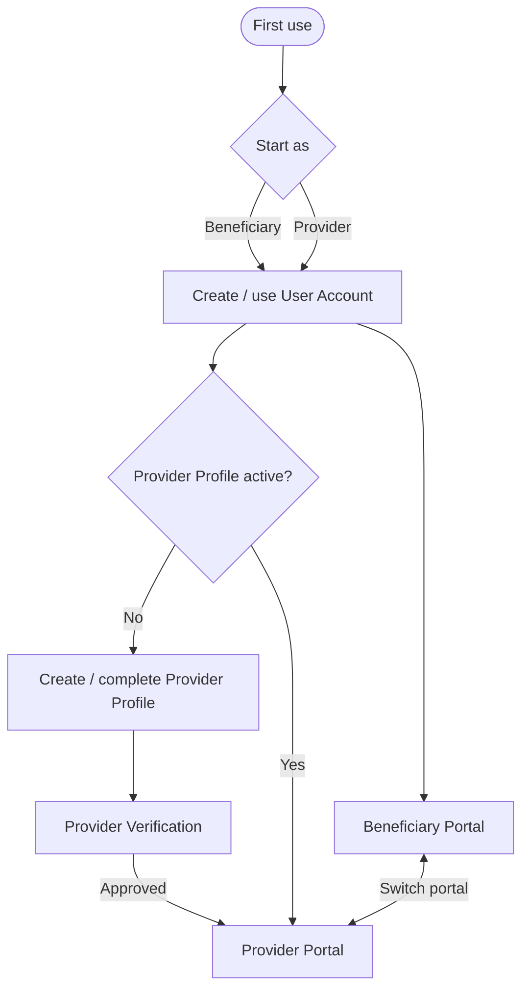

# Account & Portal Model — BUS-Q01

> **Decision:** `BUS-Q01 CLOSED`
>
> **Status:** `ANALYZED_APPROVED`
>
> **Date:** 2026-08-12

## 1. القرار

يعتمد YADD **حساب مستخدم واحدًا** للشخص. لا يوجد حساب منفصل للمستفيد وحساب آخر للمقدم.

عند أول استخدام يختار الشخص المسار الذي يريد أن يبدأ منه:

1. **مستفيد من الخدمات/المنتجات**.
2. **مقدم خدمة/منتج**.

هذا الاختيار يحدد الـOnboarding والبوابة الابتدائية فقط، ولا يثبت نوع الحساب بصورة دائمة.

## 2. بوابتا الاستخدام

### Beneficiary Portal

تستخدم للاستفادة من الخدمات/المنتجات والعمليات التي ستحددها متطلبات كل workflow لاحقًا.

### Provider Portal

تستخدم لتقديم خدمة/منتج وإدارة العمليات الخاصة بالمقدم. تتطلب وجود `Provider Profile` مفعل داخل حساب المستخدم نفسه.

## 3. الانتقال بين البوابتين

- من بدأ كمستفيد يمكنه من ملفه إنشاء/استكمال Provider Profile ثم الانتقال إلى بوابة المقدم بعد استيفاء شروط التفعيل.
- من بدأ كمقدم يستطيع الانتقال إلى بوابة المستفيد بالحساب نفسه دون إنشاء حساب آخر.
- التطبيق يجب أن يوفر وسيلة واضحة للانتقال بين البوابتين بعد تفعيل Provider Profile.

## 4. النموذج المفاهيمي

## 5. قواعد معتمدة

| ID | القاعدة | الحالة |
|---|---|---|
| ACC-BR-01 | كل شخص يستخدم User Account واحدًا. | `ANALYZED_APPROVED` |
| ACC-BR-02 | اختيار أول استخدام يحدد Start Portal ولا ينشئ Account Type دائمًا. | `ANALYZED_APPROVED` |
| ACC-BR-03 | Provider Profile كيان/ملف مرتبط بالحساب، وليس حسابًا مستقلاً. | `ANALYZED_APPROVED` |
| ACC-BR-04 | الانتقال إلى Beneficiary Portal لا يحتاج حسابًا جديدًا حتى لو بدأ المستخدم كمقدم. | `ANALYZED_APPROVED` |
| ACC-BR-05 | المستفيد يستطيع بدء عملية إنشاء Provider Profile من حسابه نفسه. | `ANALYZED_APPROVED` |
| ACC-BR-06 | وظائف التقديم الكاملة تتطلب Provider Profile مفعلًا. | `ANALYZED_APPROVED` من حيث المبدأ؛ شروط التفعيل نفسها تنتظر VER-Q01 |

## 6. ما لم يقرره BUS-Q01

لا يجوز الاستدلال من هذا القرار على أي من الآتي:

- نوع Provider Profile: Service/Product/Both — `BUS-Q02`.
- الاسم الرباعي كحقل إلزامي.
- صورة الهوية كحقل إلزامي.
- صورة المستخدم مع الهوية أو Selfie.
- OCR.
- Face Matching.
- طريقة مراجعة الهوية.
- مدة صلاحية التحقق أو إعادة التحقق.

كل ما سبق يعالج ضمن `VER-Q01` و`AI-Q01` وBUS-Q02 حسب الموضوع.

## 7. أثر القرار

### SRS

تم تثبيت متطلبات حساب واحد، اختيار Start Portal، الانتقال بين البوابتين، وإنشاء Provider Profile بالحساب نفسه.

### Use Cases

يجب إضافة/ضبط Use Cases لاحقًا لـ:
- Select initial portal.
- Create Provider Profile.
- Switch portal.

### ERD

النموذج المتوقع يبقي `USER` كهوية حساب واحدة ويربط به `PROVIDER_PROFILE`. لا يعتمد هذا القرار وحده نوع Provider أو جداول التحقق.

### UX

يجب أن يكون اختيار البداية قابلاً للفهم على أنه «ماذا تريد أن تفعل الآن؟» وليس «اختر نوع حساب لا يمكن تغييره».
