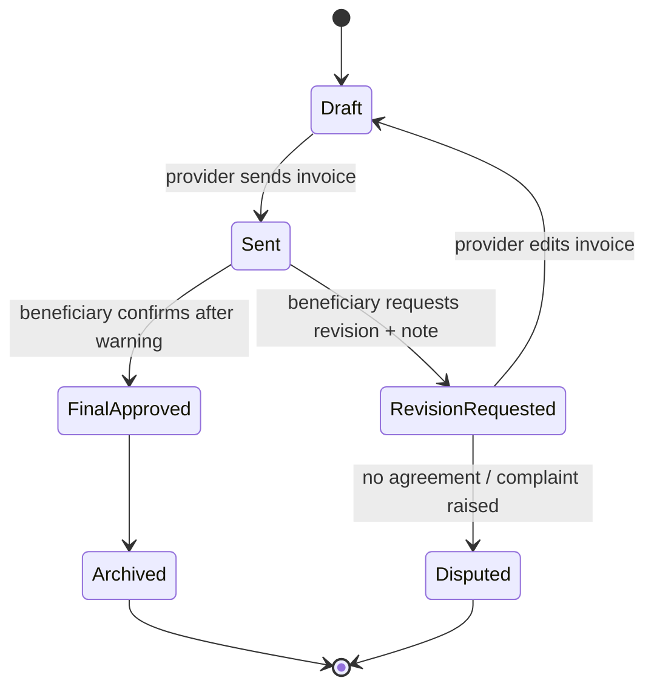

# Invoice Approval & Dispute Model

> **الحالة:** `ANALYZED_APPROVED`
>
> **القرار المرجعي:** `INV-Q01` — جلسة الفريق 2026-08-12.

## 1. المبدأ

الفاتورة في YADD هي سجل نهائي لبنود وأسعار المعاملة التي يقر بها الطرفان داخل المنصة. لا تعتبر إثبات دفع مالي لأن المدفوعات بين المستفيد والمقدم تقع خارج YADD.

## 2. قبل الاعتماد

عندما يرسل المقدم الفاتورة، يستطيع المستفيد:

1. **اعتماد الفاتورة** إذا كانت البنود والأسعار صحيحة.
2. **طلب تعديل** إذا وجد خطأ أو اختلافًا، مع كتابة ملاحظة توضح سبب التعديل المطلوب.

عند طلب التعديل تعاد الفاتورة إلى المقدم، ويمكنه تعديلها وإرسال نسخة جديدة للمراجعة. يجب أن يحتفظ النظام بتاريخ النسخ السابقة وطلبات التعديل كـ`Audit Trail` ولا يستبدل السجل القديم بلا أثر.

## 3. التحذير قبل الاعتماد

قبل تنفيذ عملية الاعتماد النهائية، يجب أن يعرض النظام رسالة تأكيد صريحة للمستفيد، بمضمون مثل:

> **تأكد من جميع بنود الفاتورة وأسعارها قبل الاعتماد. بعد اعتماد الفاتورة تصبح نهائية داخل YADD ولا يمكن تعديلها أو التراجع عن اعتمادها.**

ثم يطلب النظام تأكيدًا صريحًا مستقلًا قبل الإغلاق النهائي.

## 4. بعد الاعتماد

بمجرد اعتماد الفاتورة:

- تصبح الفاتورة `Final/Immutable` داخل YADD.
- لا يسمح لأي من الطرفين بتعديلها أو إلغائها أو إعادة فتحها.
- تحفظ في سجل الطرفين.
- تغلق المعاملة داخل YADD.
- يصبح التقييم متاحًا للطرفين.

وجود شكوى لاحقة لا يغير النسخة المعتمدة من الفاتورة ولا يعيد فتحها.

## 5. عند استمرار الخلاف قبل الاعتماد

إذا طلب المستفيد تعديل الفاتورة ولم يتوصل الطرفان إلى اتفاق، يستطيع المستفيد رفع شكوى إلى إدارة YADD مرتبطة بالمعاملة.

تستطيع الإدارة مراجعة السجلات المتاحة داخل المنصة، مثل:

- الطلب الأصلي.
- استجابة/عرض المقدم.
- نسخ الفاتورة.
- ملاحظات طلب التعديل.
- المرفقات والأدلة المسجلة داخل YADD.

إدارة YADD تتعامل مع **السلوك داخل المنصة وتطبيق سياساتها**، ولا تعد جهة تحكيم مالي ولا تلزم طرفًا بإعادة أموال لم تمر عبر النظام.

## 6. حالات الفاتورة

## 7. قواعد معتمدة

- `INV-BR-01`: قبل الاعتماد يمكن للمستفيد طلب تعديل مع ملاحظة.
- `INV-BR-02`: يحتفظ النظام بتاريخ نسخ الفاتورة والتعديلات.
- `INV-BR-03`: يجب عرض تحذير واضح قبل الاعتماد النهائي.
- `INV-BR-04`: الفاتورة المعتمدة نهائية وغير قابلة للتعديل أو التراجع داخل YADD.
- `INV-BR-05`: الشكوى عند عدم الاتفاق ترفع قبل الاعتماد النهائي.
- `INV-BR-06`: الشكوى الإدارية لا تحول YADD إلى جهة تحكيم مالي أو وسيط دفع.
