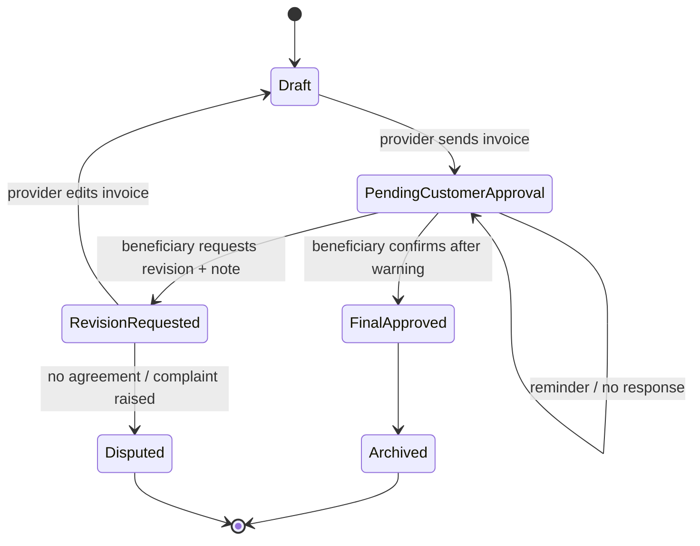

# Invoice Approval & Dispute Model

> **الحالة:** `ANALYZED_APPROVED / PARTIAL POLICY`
>
> **القرارات المرجعية:** `DEC-015/016/025/050/051/055` — مزامنة 2026-08-26.

## 1. المبدأ

الفاتورة في YADD هي سجل نهائي لبنود وأسعار المعاملة التي يقر بها الطرفان داخل المنصة. لا تعتبر إثبات دفع مالي لأن المدفوعات بين المستفيد والمقدم تقع خارج YADD وفق baseline الحالي، مع بقاء موضوع العربون مفتوحًا في `DEP-Q02`.

الفاتورة تأتي بعد التنفيذ/التجهيز وبعد استقرار الاتفاق النهائي بين الطرفين. لا ينشئ MVP نظام Change Order مستقل؛ أي تغيرات سابقة في السعر أو التفاصيل يمكن التفاوض عليها في التواصل الخاص، ثم تنعكس النتيجة النهائية في الفاتورة.

## 2. قبل الاعتماد

عندما يرسل المقدم الفاتورة تصبح `Pending Customer Approval`، ويستطيع المستفيد:

1. **اعتماد الفاتورة** إذا كانت البنود والأسعار صحيحة.
2. **طلب تعديل** إذا وجد خطأ أو اختلافًا، مع كتابة ملاحظة توضح سبب التعديل المطلوب.

عند طلب التعديل تعاد الفاتورة إلى المقدم، ويمكنه تعديلها وإرسال نسخة جديدة للمراجعة. يجب أن يحتفظ النظام بتاريخ النسخ السابقة وطلبات التعديل كـ`Audit Trail` ولا يستبدل السجل القديم بلا أثر.

## 3. عدم الاستجابة

إذا لم يرد المستفيد على الفاتورة:

- تبقى `Pending Customer Approval`.
- عدم الرد **لا يعد موافقة**.
- لا يوجد `Auto-Approval`.
- يرسل النظام تذكيرات للمستفيد بوجود فاتورة معلقة.

سياسة التصعيد عند استمرار عدم الاستجابة مدة طويلة لم تعتمد بعد: `INV-PENDING-Q01`.

## 4. التحذير قبل الاعتماد

قبل تنفيذ عملية الاعتماد النهائية، يجب أن يعرض النظام رسالة تأكيد صريحة للمستفيد، بمضمون مثل:

> **تأكد من جميع بنود الفاتورة وأسعارها قبل الاعتماد. بعد اعتماد الفاتورة تصبح نهائية داخل YADD ولا يمكن تعديلها أو التراجع عن اعتمادها.**

ثم يطلب النظام تأكيدًا صريحًا مستقلًا قبل الإغلاق النهائي.

## 5. بعد الاعتماد

بمجرد اعتماد الفاتورة:

- تصبح الفاتورة `Final/Immutable` داخل YADD.
- لا يسمح لأي من الطرفين بتعديلها أو إلغائها أو إعادة فتحها.
- تحفظ في سجل الطرفين.
- تصبح المعاملة `Completed`.
- ينتقل المستفيد إلى خطوة **تقييم مقدم الخدمة/المنتج الإلزامية**: 1–5 نجوم، والتعليق اختياري.
- لا يوجد في النموذج الحالي تقييم مقابل للمستفيد من المقدم.

وجود شكوى لاحقة لا يغير النسخة المعتمدة من الفاتورة ولا يعيد فتحها.

## 6. عند استمرار الخلاف قبل الاعتماد

إذا طلب المستفيد تعديل الفاتورة ولم يتوصل الطرفان إلى اتفاق، يستطيع المستفيد رفع شكوى إلى إدارة YADD مرتبطة بالمعاملة.

تستطيع الإدارة مراجعة السجلات المتاحة داخل المنصة، مثل:

- الطلب الأصلي إن وجد.
- استجابة/عرض المقدم إن وجد.
- المحادثة الخاصة ذات الصلة.
- نسخ الفاتورة.
- ملاحظات طلب التعديل.
- المرفقات والأدلة المسجلة داخل YADD.

إدارة YADD تتعامل مع **السلوك داخل المنصة وتطبيق سياساتها**، ولا تعد جهة تحكيم مالي ولا تلزم طرفًا بإعادة أموال لم تمر عبر النظام وفق baseline الحالي.

## 7. حالات الفاتورة

## 8. قواعد معتمدة

- `INV-BR-01`: قبل الاعتماد يمكن للمستفيد طلب تعديل مع ملاحظة.
- `INV-BR-02`: يحتفظ النظام بتاريخ نسخ الفاتورة والتعديلات.
- `INV-BR-03`: يجب عرض تحذير واضح قبل الاعتماد النهائي.
- `INV-BR-04`: الفاتورة المعتمدة نهائية وغير قابلة للتعديل أو التراجع داخل YADD.
- `INV-BR-05`: الشكوى عند عدم الاتفاق ترفع قبل الاعتماد النهائي.
- `INV-BR-06`: الشكوى الإدارية لا تحول YADD إلى جهة تحكيم مالي أو وسيط دفع وفق baseline الحالي.
- `INV-BR-07`: عدم الاستجابة لا يعد موافقة ولا يوجد Auto-Approval.
- `INV-BR-08`: اعتماد الفاتورة يجعل Transaction Completed ويؤدي إلى تقييم إلزامي من المستفيد للمقدم فقط في النموذج الحالي.

## 9. سياسة مفتوحة

- `INV-PENDING-Q01`: سياسة التصعيد إذا بقيت الفاتورة معلقة مدة طويلة رغم التذكيرات.
- `DEP-Q02`: دور YADD النهائي في العربون/الدفعة المقدمة.
