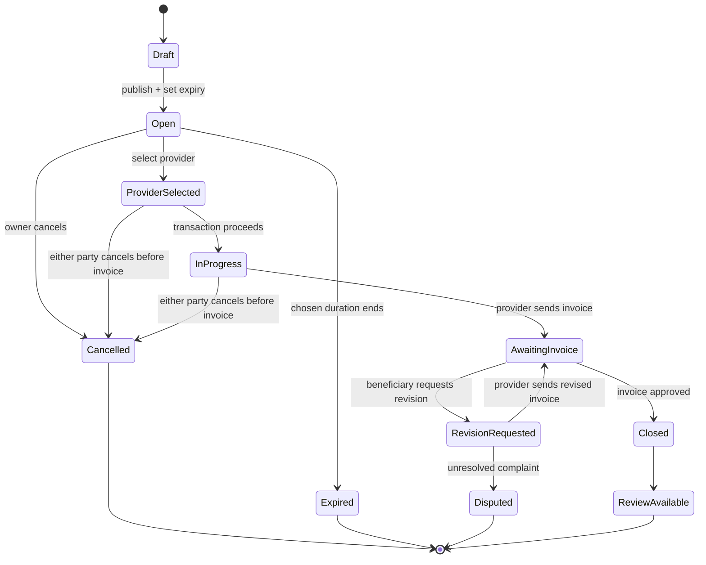

# Request Cancellation & Expiry Model

> **الحالة:** `ANALYZED_APPROVED`
>
> **القرار المرجعي:** `BUS-Q03` — قرار الفريق 2026-08-12.

## 1. مدة الطلب

عند نشر طلب خدمة أو منتج، يحدد صاحب الطلب مدة صلاحيته. يبقى الطلب `Open` حتى أحد الأحداث التالية:

- اختيار مقدم.
- إلغاء صاحب الطلب.
- انتهاء المدة التي حددها صاحب الطلب.

إذا انتهت المدة دون اختيار مقدم، يتحول الطلب إلى `Expired` ولا يقبل استجابات جديدة.

## 2. الإلغاء قبل اختيار مقدم

- يستطيع صاحب الطلب إلغاء الطلب المفتوح بصورة عادية.
- سبب الإلغاء **اختياري** وليس شرطًا لتنفيذ الإلغاء.
- يستطيع المقدم سحب استجابته/عرضه قبل أن يختاره صاحب الطلب.

## 3. الإلغاء بعد اختيار مقدم

بعد اختيار مقدم وبدء المعاملة، يسمح النظام بإلغاء المعاملة قبل إرسال الفاتورة النهائية.

- لا يشترط إدخال سبب للإلغاء.
- يمكن توفير حقل سبب/ملاحظة بصورة اختيارية.
- يجب تسجيل حدث الإلغاء نفسه وتوقيته والطرف الذي نفذه، حتى لو لم يكتب سببًا، للحفاظ على اتساق سجل المعاملة.

## 4. ما بعد إرسال الفاتورة

بعد أن يرسل المقدم الفاتورة النهائية لا يستخدم `Cancel Transaction` كمسار عادي لإغلاق المعاملة.

من هذه النقطة تطبق دورة الفاتورة المعتمدة:

- اعتماد الفاتورة.
- طلب تعديل.
- شكوى عند استمرار الخلاف.

مرجع ذلك: `15-invoice-approval-and-dispute.md`.

## 5. حالات الطلب/المعاملة

## 6. قواعد معتمدة

- `REQ-BR-01`: يحدد صاحب الطلب مدة الصلاحية عند النشر.
- `REQ-BR-02`: انتهاء المدة دون اختيار مقدم يحول الطلب إلى `Expired`.
- `REQ-BR-03`: يستطيع صاحب الطلب إلغاء الطلب المفتوح قبل اختيار مقدم.
- `REQ-BR-04`: يستطيع المقدم سحب عرضه قبل اختياره.
- `REQ-BR-05`: بعد اختيار مقدم يمكن إلغاء المعاملة قبل إرسال الفاتورة.
- `REQ-BR-06`: سبب الإلغاء اختياري وغير مطلوب لتنفيذ الإلغاء.
- `REQ-BR-07`: يسجل النظام من ألغى ومتى، حتى إذا لم يسجل سببًا.
- `REQ-BR-08`: بعد إرسال الفاتورة لا يستخدم الإلغاء العادي؛ تطبق دورة الفاتورة والنزاع.
