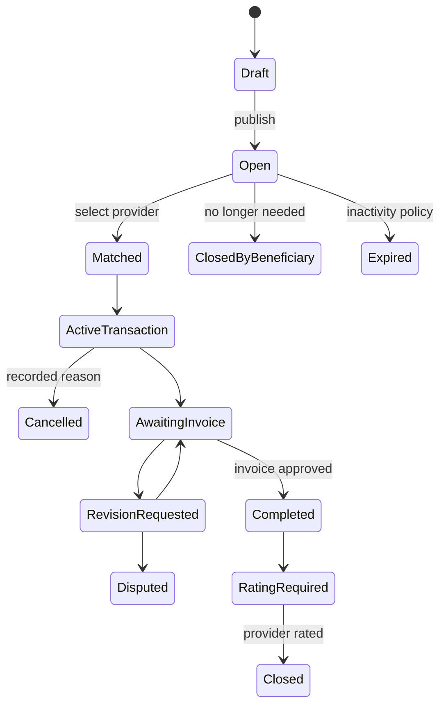

# Request Closure, Cancellation & Expiry Model

> **الحالة:** `ANALYZED_APPROVED / PARTIAL POLICY`
>
> **القرارات المرجعية:** DEC-047..050/054 — تحديث 2026-08-26.

## 1. الطلب المفتوح

بعد نشر طلب خدمة أو منتج يكون `Open`. يبقى مفتوحًا حتى:

- يختار المستفيد مقدمًا → `Matched` ويبدأ Transaction.
- يقرر المستفيد أنه لم يعد يحتاج الطلب → `ClosedByBeneficiary`.
- يصل إلى سياسة عدم النشاط → `Expired`.

لا يطلب من المستخدم حاليًا تحديد مدة صلاحية رقمية عند النشر كقرار معتمد. مدة عدم النشاط وتذكيرات استمرار الحاجة تحتاج `REQ-EXP-Q01`.

## 2. Request Closure قبل اختيار مقدم

إذا لم يختر المستفيد مقدمًا بعد، فإغلاق الطلب ليس إلغاء معاملة لأن Transaction لم تبدأ أصلًا.

- يغلق الطلب أمام الاستجابات الجديدة.
- لا يسجل Transaction Cancellation على أي طرف.
- يمكن تسجيل حدث الإغلاق وسببه/سياقه التشغيلي وفق التصميم النهائي.

## 3. اختيار مقدم

في الطلب المنشور، اختيار المستفيد لمقدم من الاستجابات:

1. يوقف استقبال استجابات جديدة.
2. يجعل الاستجابات الأخرى `NotSelected`.
3. يحول الطلب إلى `Matched`.
4. يبدأ المعاملة الرسمية مع المقدم المختار.

لا توجد خطوة اتفاق/نموذج إضافي إلزامي في هذا المسار.

## 4. Transaction Cancellation بعد بدء المعاملة

بعد بدء Transaction، إذا أراد أحد الطرفين الإلغاء قبل دخول مسار الفاتورة النهائي:

- يسجل سبب الإلغاء إلزاميًا.
- يظهر السبب للطرف الآخر.
- يسجل النظام الطرف الذي ألغى والتوقيت.
- يمكن للإدارة مراجعة الإلغاءات المتكررة أو المشبوهة.

التكرار وحده لا ينتج عقوبة آلية.

## 5. Expiry وعدم النشاط

YADD لا يترك الطلب المفتوح ظاهرًا إلى أجل غير محدد. يرسل تذكيرًا بسيطًا لصاحب الطلب لتأكيد أنه ما زال يحتاجه. إذا استمر عدم النشاط وفق السياسة المعتمدة لاحقًا يصبح `Expired` ويتوقف عن الظهور للمقدمين.

**Needs Verification:** مدة عدم النشاط وعدد/توقيت التذكيرات (`REQ-EXP-Q01`).

## 6. إساءة استخدام إنشاء/إغلاق الطلبات

يمكن للنظام تسجيل نمط النشاط ورفع Flag للمراجعة عند وجود نمط غير طبيعي. لا يعني الـFlag أن المستخدم مسيء للاستخدام، ولا يطبق حظر آلي لمجرد عدد الإغلاقات.

Thresholds: `SAFE-REQ-Q01`.

## 7. ما بعد إرسال الفاتورة

بعد إرسال الفاتورة لا يستخدم الإلغاء العادي كمسار افتراضي. تطبق دورة الفاتورة: اعتماد، طلب تعديل، شكوى عند استمرار المشكلة، مع بقاء عدم الرد غير مساوي للموافقة.

## 8. الحالات

## 9. قواعد معتمدة

- `REQ-BR-01`: Request Closure قبل الاختيار ليس Transaction Cancellation.
- `REQ-BR-02`: اختيار مقدم في الطلب المنشور يغلق الطلب ويبدأ المعاملة.
- `REQ-BR-03`: Transaction Cancellation يحتاج سببًا مسجلًا.
- `REQ-BR-04`: الطلب المفتوح يخضع لتذكير/Expiry بسبب عدم النشاط.
- `REQ-BR-05`: لا عقوبة آلية لمجرد تكرار إغلاق الطلبات؛ يمكن Flag + Admin Review.
- `REQ-BR-06`: بعد إرسال الفاتورة يسري مسار الفاتورة بدل الإلغاء العادي.
