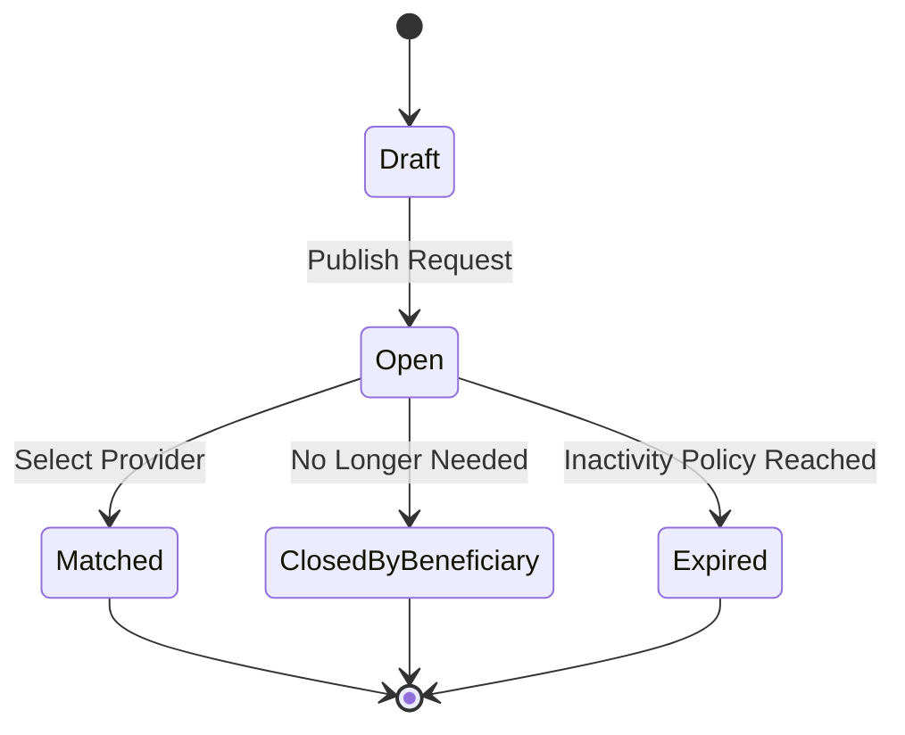
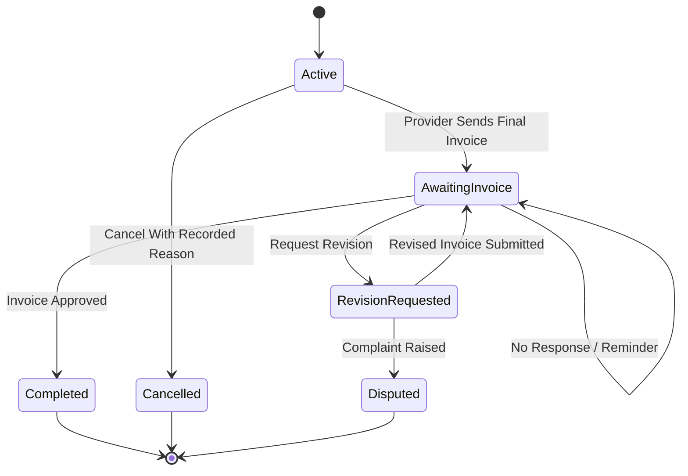

# Request Closure, Cancellation & Expiry Model

> **الحالة:** `ANALYZED_APPROVED / PARTIAL POLICY — SYNCHRONIZED 2026-09-04`
>
> **القرارات المرجعية:** DEC-047..050/054/071.

## 1. Open Request

After a Service/Product Request is published it becomes `Open`. It remains Open until one of these occurs:

- Beneficiary selects a Provider → `Matched` and an `Active Transaction` starts.
- Beneficiary no longer needs the Request → `ClosedByBeneficiary`.
- inactivity policy is reached → `Expired`.

The exact inactivity duration and reminder schedule remain `REQ-EXP-Q01` and must not be invented in diagrams.

## 2. Request Closure Before Selection

If no Provider has been selected yet, closing the Request is **not Transaction Cancellation** because no Transaction exists yet.

- stop accepting new Provider Responses;
- do not create Transaction cancellation data;
- Request becomes `ClosedByBeneficiary`.

## 3. Provider Selection

When Beneficiary selects one Provider Response:

1. Request stops accepting new responses.
2. remaining active responses become `NotSelected`.
3. Request becomes `Matched`.
4. one `Active Transaction` starts with the selected Provider.

No additional Agreement form/entity is required in this route.

## 4. Transaction Cancellation

After Transaction starts, either party may cancel before the final-invoice path reaches completion, subject to current rules:

- cancellation reason is required;
- actor and time are recorded;
- reason is visible to the other party;
- repeated/suspicious patterns may be flagged for review;
- repetition alone does not cause automatic punishment.

## 5. Request Expiry

YADD does not leave an Open Request active indefinitely. The system may remind the Beneficiary to confirm that the Request is still needed and may later set it to `Expired` according to an approved inactivity policy.

**Needs Verification:** `REQ-EXP-Q01` defines the numeric duration and reminder timing.

## 6. Abuse Signals

The system may record request-creation/closure patterns and raise a Flag for administrative review. Thresholds remain `SAFE-REQ-Q01` and are not shown numerically in analysis diagrams.

## 7. After Final Invoice Submission

Once the final invoice is submitted, the normal transaction path uses invoice states and decisions:

- `PendingCustomerApproval`
- `RevisionRequested`
- `Disputed`
- `Approved`

No-response is not approval and there is no Auto-Approval.

## 8. State Model

Transaction is modeled separately:

`Completed` is the successful terminal Transaction state. Ratings occur after it as Post-Transaction workflows and do not create a `Closed` Transaction state.

## 9. Approved Rules

- `REQ-BR-01`: Request Closure before selection is not Transaction Cancellation.
- `REQ-BR-02`: selecting one Provider in a published Request closes the Request to new responses and starts one Transaction.
- `REQ-BR-03`: Transaction Cancellation requires a recorded reason.
- `REQ-BR-04`: Open Requests are subject to reminders/Expiry in principle.
- `REQ-BR-05`: repeated closure may produce Flag + Admin Review, not automatic punishment.
- `REQ-BR-06`: after final invoice submission, the invoice workflow governs the remaining path.
- `REQ-BR-07`: `Completed` is the successful terminal Transaction state; ratings are Post-Transaction.