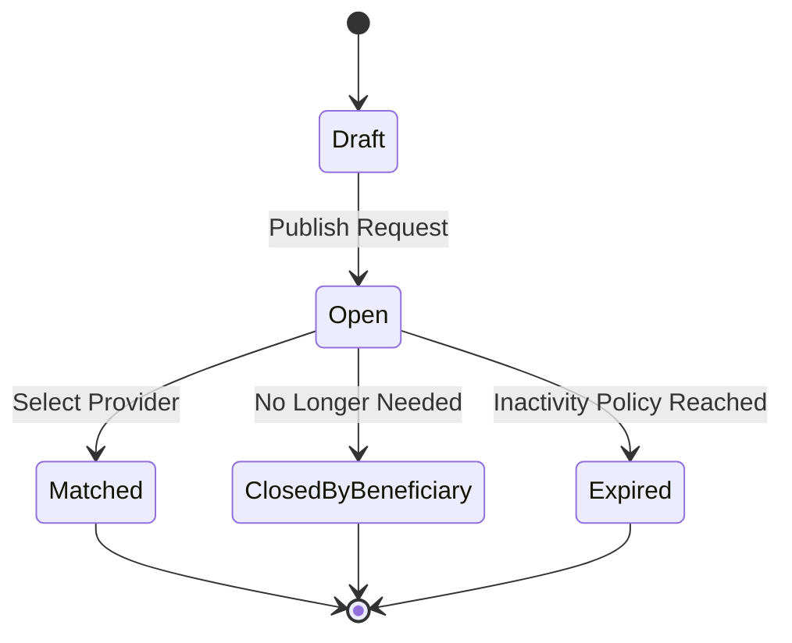
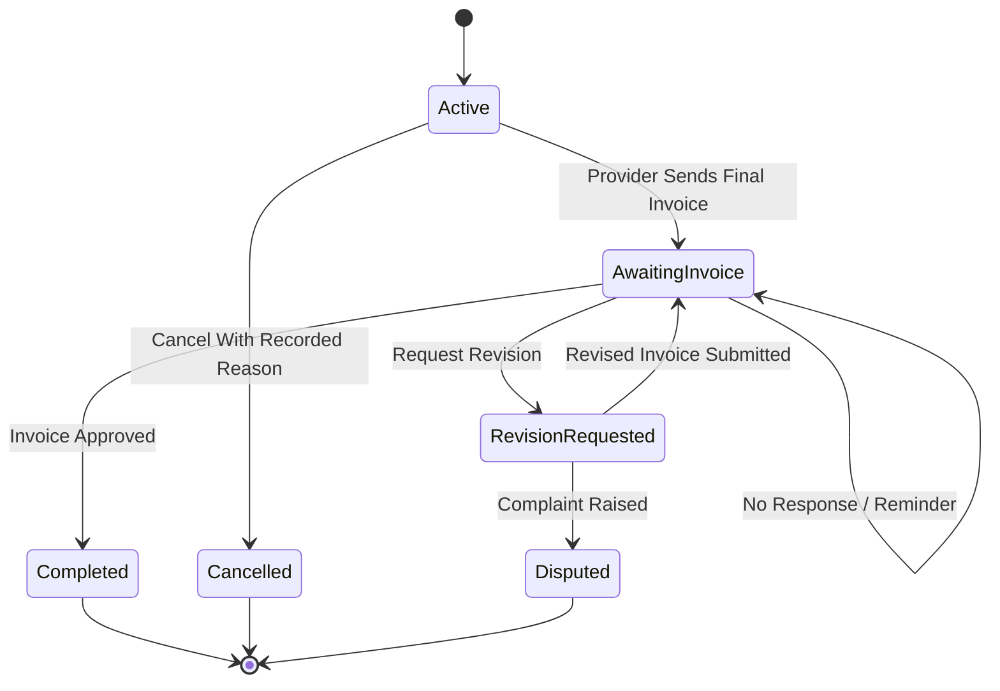

# نموذج إغلاق الطلب والإلغاء والانتهاء — Request Closure, Cancellation & Expiry Model

> **الحالة:** `ANALYZED_APPROVED — SYNCHRONIZED 2026-09-18 THROUGH DEC-083`
>
> **القرارات المرجعية:** DEC-047..050/054/071/081/083.

## 1. الطلب المفتوح — Open Request

بعد نشر `Service/Product Request` تصبح حالته `Open`. وتبقى كذلك حتى يحدث أحد الآتي:

- يختار `Beneficiary` مقدمًا → تصبح الحالة `Matched` ويبدأ `Active Transaction`.
- لا يعود `Beneficiary` بحاجة إلى الـ`Request` → تصبح `ClosedByBeneficiary`.
- تتحقق سياسة عدم النشاط → تصبح `Expired`.

سياسة عدم النشاط المعتمدة: Reminder بعد 24 ساعة، Reminder ثانٍ بعد 48 ساعة، و`Expired` بعد 72 ساعة من عدم نشاط Beneficiary. نشاط Beneficiary الدال على استمرار الحاجة يعيد العداد؛ وصول Provider Response وحده لا يعيده.

## 1.1 Republish بعد Expiry

الطلب Expired لا يعاد فتحه. عند `Republish Request` ينسخ النظام بيانات الطلب إلى Draft جديد يراجعه Beneficiary ويعدله عند الحاجة ثم ينشره كـRequest جديد. يبقى الطلب القديم Expired واستجاباته القديمة غير فعالة.

## 2. إغلاق الطلب قبل الاختيار — Request Closure Before Selection

إذا لم يتم اختيار أي `Provider` بعد، فإن إغلاق الـ`Request` **ليس Transaction Cancellation** لأنه لا توجد `Transaction` أصلًا في هذه المرحلة.

- يتوقف قبول `Provider Responses` جديدة؛
- لا تنشأ بيانات إلغاء `Transaction`؛
- تصبح حالة `Request` هي `ClosedByBeneficiary`.

## 3. اختيار المقدم — Provider Selection

عندما يختار `Beneficiary` استجابة `Provider Response` واحدة:

1. يتوقف `Request` عن قبول استجابات جديدة.
2. تتحول الاستجابات الفعالة الأخرى إلى `NotSelected`.
3. تصبح حالة `Request` هي `Matched`.
4. يبدأ `Active Transaction` واحد مع الـ`Provider` المختار.

لا يتطلب هذا المسار نموذجًا أو كيانًا إضافيًا باسم `Agreement`.

## 4. إلغاء المعاملة — Transaction Cancellation

بعد بدء `Transaction`، يمكن لأي من الطرفين الإلغاء قبل وصول مسار الفاتورة النهائية إلى الاكتمال، وفق القواعد الحالية:

- سبب الإلغاء مطلوب؛
- يسجل النظام الطرف الذي ألغى والوقت؛
- يظهر السبب للطرف الآخر؛
- يمكن رفع الأنماط المتكررة/المشبوهة للمراجعة؛
- التكرار وحده لا يسبب عقوبة تلقائية.

## 5. انتهاء الطلب — Request Expiry

لا يترك YADD أي `Open Request` فعالًا إلى أجل غير محدد. يمكن للنظام تذكير `Beneficiary` لتأكيد أن الطلب ما يزال مطلوبًا، ويمكن لاحقًا تحويله إلى `Expired` وفق سياسة عدم نشاط معتمدة.

**Needs Verification:** يحدد `REQ-EXP-Q01` المدة الرقمية وجدول التذكيرات.

## 6. مؤشرات إساءة الاستخدام — Abuse Signals

يمكن للنظام تسجيل أنماط إنشاء/إغلاق الطلبات ورفع `Flag` للمراجعة الإدارية. تظل العتبات ضمن `SAFE-REQ-Q01` ولا تظهر كقيم رقمية في مخططات التحليل.

## 7. بعد إرسال الفاتورة النهائية — After Final Invoice Submission

بعد إرسال الفاتورة النهائية، يستخدم مسار `Transaction` الطبيعي حالات وقرارات الفاتورة التالية:

- `PendingCustomerApproval`
- `RevisionRequested`
- `Disputed`
- `Approved`

عدم الرد لا يعد موافقة، ولا يوجد `Auto-Approval`. يرسل النظام Reminder بعد 24h و48h، وعند 72h تصبح الفاتورة `Pending Customer Approval — Overdue`.

## 8. نموذج الحالات — State Model

تمثل `Transaction` بصورة منفصلة:

`Completed` هي الحالة النهائية الناجحة للـ`Transaction`. تحدث عمليات `Ratings` بعدها كـPost-Transaction workflows ولا تنشئ حالة `Transaction` باسم `Closed`.

## 9. القواعد المعتمدة

- `REQ-BR-01`: إغلاق `Request` قبل الاختيار ليس `Transaction Cancellation`.
- `REQ-BR-02`: اختيار `Provider` واحد في `Published Request` يغلق الطلب أمام الاستجابات الجديدة ويبدأ `Transaction` واحدة.
- `REQ-BR-03`: يتطلب `Transaction Cancellation` سببًا مسجلًا.
- `REQ-BR-04`: Reminder 24h/48h وExpiry 72h من عدم نشاط Beneficiary؛ النشاط الفعلي يعيد العداد.
- `REQ-BR-05`: قد ينتج عن الإغلاق المتكرر `Flag + Admin Review`، وليس عقوبة تلقائية.
- `REQ-BR-06`: بعد إرسال الفاتورة النهائية، يحكم `Invoice workflow` المسار المتبقي.
- `REQ-BR-07`: `Completed` هي الحالة النهائية الناجحة للـ`Transaction`، و`Ratings` عمليات Post-Transaction.
- `REQ-BR-08`: Republish بعد Expiry ينشئ Request جديدًا ولا يعيد فتح القديم.
- `REQ-BR-09`: Cancel Transaction مسموح حتى ما قبل Invoice Approval/Completed مع سبب إلزامي.