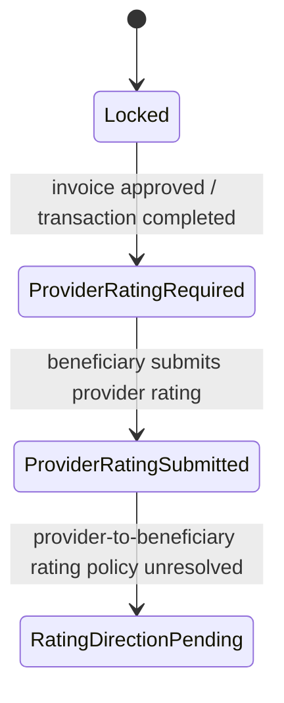

# Rating & Reputation Model

> **الحالة:** `PARTIALLY ANALYZED — PROVIDER-TO-BENEFICIARY RATING OPEN`
>
> **القرارات المرجعية:** DEC-051/052/058 — تحديث 2026-09-02.

## 1. الهدف

التقييم في YADD يرتبط بمعاملة مكتملة فعليًا داخل المنصة، ولا يستطيع مستخدم عشوائي إنشاء تقييم لمجرد زيارة ملف أو بدء محادثة.

## 2. أهلية تقييم المستفيد للمقدم — معتمد

يفتح تقييم المستفيد لمقدم الخدمة/المنتج عندما:

1. توجد Transaction بين المستفيد والمقدم.
2. أرسل المقدم الفاتورة النهائية.
3. اعتمد المستفيد الفاتورة وأصبحت المعاملة Completed.

لا تقييم لمقدم في طلب مغلق قبل الاختيار، أو طلب Expired، أو معاملة ملغاة/غير مكتملة.

## 3. تقييم المستفيد للمقدم — معتمد

بعد اعتماد الفاتورة:

- يصبح تقييم مقدم الخدمة/المنتج خطوة إلزامية على المستفيد.
- الدرجة 1–5 نجوم إلزامية.
- التعليق/الملاحظة النصية اختياري.
- التعليق يخضع لسياسة المحتوى والمراقبة.
- لا يعتبر التقييم دليلًا موضوعيًا على جودة العمل؛ هو تقييم صادر من مستفيد مرتبط بمعاملة مكتملة داخل YADD.

## 4. تقييم المقدم للمستفيد — مفتوح

`RAT-CUST-Q01 — NEEDS DECISION`

لم يعد صحيحًا اعتبار غياب تقييم المقدم للمستفيد قرارًا نهائيًا. أعيد فتح الموضوع، ولا يعتمد النظام وجود هذا التقييم أو عدمه حتى الحسم.

يجب أن يحدد القرار النهائي، إذا تم اعتماد التقييم المقابل:

1. هل يقيّم مقدم الخدمة/المنتج المستفيد أصلًا؟
2. هل يكون التقييم إلزاميًا أم اختياريًا؟
3. هل يستخدم 1–5 نجوم، أم مؤشرات سلوكية محددة، أم كليهما؟
4. هل يسمح بتعليق نصي؟
5. متى يفتح التقييم: بعد اعتماد الفاتورة، بعد تقييم المستفيد للمقدم، أم في توقيت مستقل؟
6. هل تكون تقييمات الطرفين مرئية مباشرة أم توجد آلية إخفاء مؤقت/Double-Blind؟
7. لمن يظهر تقييم المستفيد: للمقدمين فقط، للمستخدم نفسه، للإدارة، أم للعامة؟
8. هل ينتج عنه مؤشر سمعة للمستفيد؟ وإذا نعم، ما المؤشر الذي يعرض؟
9. هل يؤثر على أهلية المستفيد لإنشاء الطلبات أو التعامل مستقبلًا؟ إذا كان التأثير عالي الأثر فيجب تجنب العقوبة الآلية غير المبررة وربطه بسياسة ومراجعة مناسبة.
10. هل يسمح بالتقييم في المعاملة الملغاة؟ الافتراض الحالي: لا يثبت شيء حتى القرار.

> لا يعاد تلقائيًا نموذج التقييم المتبادل القديم `DEC-027/028/044`. أي نموذج جديد يجب أن يعتمد مستقلًا ويحدد أثره على الخصوصية والسمعة ودورة المعاملة.

## 5. عدد الأعمال المكتملة للمقدم — معتمد

يعرض ملف المقدم مؤشرًا لعدد الأعمال/المعاملات المكتملة داخل YADD.

- يحتسب من Transactions المكتملة فقط.
- لا يسمى «عدد العملاء».
- لا تحتسب المحادثات أو الاستجابات أو الطلبات الملغاة/المنتهية أو المعاملات غير المكتملة.

هذا مؤشر خبرة داخل YADD، وليس إثباتًا لكل خبرة المقدم خارج المنصة.

## 6. دورة التقييم الحالية المؤكدة

حتى حسم `RAT-CUST-Q01` لا يثبت ما إذا كان `RatingDirectionPending` ينتقل إلى تقييم مقابل أو إغلاق مباشر للمعاملة.

## 7. القواعد الحالية

- `RAT-BR-01`: تقييم المستفيد للمقدم مرتبط بمعاملة مكتملة بفاتورة معتمدة — `APPROVED`.
- `RAT-BR-02`: تقييم المستفيد للمقدم إلزامي بعد اكتمال المعاملة — `APPROVED`.
- `RAT-BR-03`: النجوم 1–5 إلزامية والتعليق النصي اختياري في تقييم المستفيد للمقدم — `APPROVED`.
- `RAT-BR-04`: وجود/غياب تقييم المقدم للمستفيد — `OPEN / RAT-CUST-Q01`.
- `RAT-BR-05`: Double-Blind أو أي مهلة زمنية خاصة بالتقييم المقابل — `OPEN` إذا اعتمد التقييم المقابل.
- `RAT-BR-06`: عدد الأعمال في ملف المقدم = عدد المعاملات المكتملة داخل YADD — `APPROVED`.

## 8. أثر الإغلاق

حسم `RAT-CUST-Q01` يجب أن ينعكس على:

- SRS User/Functional Requirements.
- Business Rules.
- Transaction/Rating Lifecycle.
- Use Cases.
- ERD وعلاقة Review بالمستفيد/المقدم.
- Data Dictionary وConstraints.
- واجهات التقييم والملفات الشخصية.
- Chapter 3 وChapter 4.
