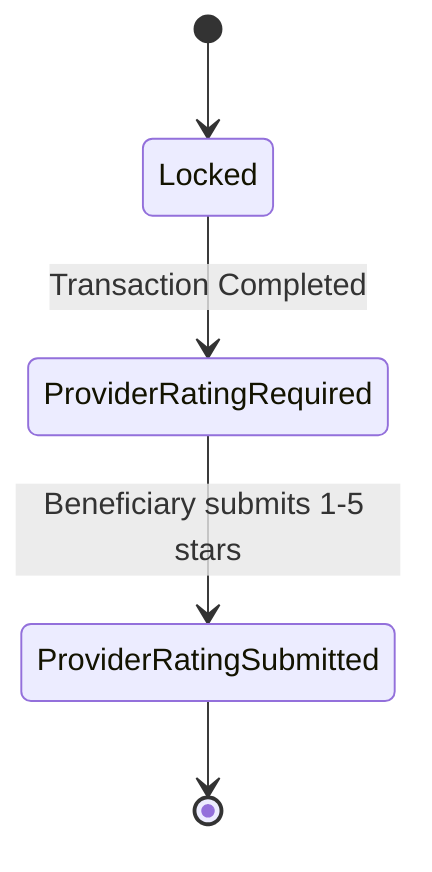
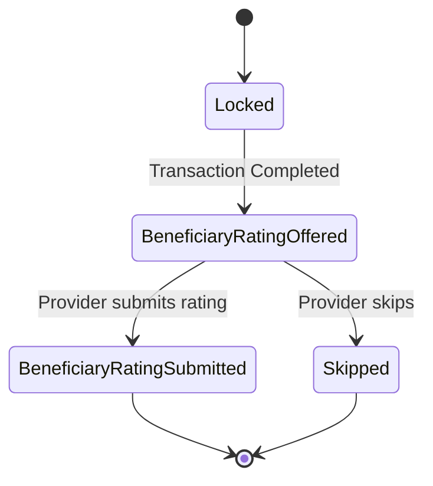

# Rating & Reputation Model

> **الحالة:** `ANALYZED_APPROVED — SYNCHRONIZED 2026-09-04`
>
> **القرارات المرجعية:** DEC-051/052/063/071.

## 1. الهدف

التقييم في YADD يرتبط بمعاملة مكتملة فعليًا داخل المنصة، ولا يستطيع مستخدم عشوائي إنشاء تقييم لمجرد زيارة ملف أو بدء محادثة.

## 2. أهلية التقييم

يفتح أي تقييم فقط عندما:
1. توجد Transaction بين المستفيد والمقدم.
2. أرسل المقدم الفاتورة النهائية.
3. اعتمد المستفيد الفاتورة وأصبحت المعاملة `Completed`.

لا تقييم في Request مغلق قبل الاختيار، أو Request Expired، أو Transaction ملغاة/غير مكتملة.

## 3. تقييم المستفيد للمقدم — إلزامي

بعد اعتماد الفاتورة:
- يصبح تقييم مقدم الخدمة/المنتج خطوة إلزامية على المستفيد.
- الدرجة 1–5 نجوم إلزامية.
- التعليق النصي اختياري.
- التعليق يخضع لسياسة المحتوى والمراقبة.
- لا يعتبر التقييم دليلًا موضوعيًا على جودة العمل؛ هو تقييم صادر من مستفيد مرتبط بمعاملة مكتملة داخل YADD.

## 4. تقييم المقدم للمستفيد — اختياري

بعد `Transaction Completed` يعرض النظام للمقدم Prompt بارزًا لتقييم المستفيد، ويمكن للمقدم تخطيه.

إذا اختار التقييم، يستخدم ثلاثة مؤشرات سلوكية، كل منها من 1 إلى 5:
1. وضوح الطلب والتواصل.
2. الالتزام بالاتفاق.
3. حسن التعامل والتعاون.

- التعليق النصي اختياري.
- لا يستخدم وصف شخصي مطلق مثل «محترم/غير محترم» كحقل رسمي؛ المؤشرات تصف سلوك التعامل في المعاملة.
- لا يعاد نموذج Double-Blind أو مهلة 14 يومًا من القرارات التاريخية القديمة.

## 5. سجل تعامل المستفيد

تجمع تقييمات المقدمين للمستفيد في سجل تعامل محدود داخل YADD.

- يظهر لمقدمي الخدمات/المنتجات فقط عندما يوجد سياق تعامل مشروع مع المستفيد، مثل Request/Provider Response/Transaction ذات صلة.
- لا يعرض كسمعة عامة للجمهور.
- يعرض المؤشرات/المتوسطات المرتبطة بالمعاملات المكتملة، وليس حكمًا مطلقًا على الشخص.
- لا ينتج عنه في MVP منع أو تعليق حساب أو تخفيض ظهور أو حرمان من إنشاء الطلبات أو أي عقوبة آلية.
- أي استخدام مستقبلي عالي الأثر يحتاج قرارًا وسياسة اعتراض ومراجعة مستقلة.

## 6. عدد الأعمال المكتملة للمقدم

يعرض ملف المقدم مؤشرًا لعدد الأعمال/المعاملات المكتملة داخل YADD.

- يحتسب من Transactions المكتملة فقط.
- لا يسمى «عدد العملاء».
- لا تحتسب المحادثات أو Provider Responses أو الطلبات الملغاة/المنتهية أو المعاملات غير المكتملة.

هذا مؤشر خبرة داخل YADD، وليس إثباتًا لكل خبرة المقدم خارج المنصة.

## 7. Rating Lifecycles — Post-Transaction

### Beneficiary rates Provider — mandatory

### Provider rates Beneficiary — optional

> `Completed` remains the successful terminal state of the Transaction. The final nodes above mean the rating workflow ended; they are not a Transaction state named `Closed`.

## 8. القواعد الحالية

- `RAT-BR-01`: تقييم المستفيد للمقدم مرتبط بمعاملة مكتملة بفاتورة معتمدة — `APPROVED`.
- `RAT-BR-02`: تقييم المستفيد للمقدم إلزامي بعد اكتمال المعاملة — `APPROVED`.
- `RAT-BR-03`: النجوم 1–5 إلزامية والتعليق النصي اختياري في تقييم المستفيد للمقدم — `APPROVED`.
- `RAT-BR-04`: تقييم المقدم للمستفيد موجود واختياري بعد Completed — `APPROVED`.
- `RAT-BR-05`: تقييم المستفيد من المقدم = 3 مؤشرات سلوكية 1–5 + تعليق اختياري — `APPROVED`.
- `RAT-BR-06`: سجل تعامل المستفيد محدود الظهور للمقدمين في سياق تعامل مشروع ولا ينتج عنه عقوبة آلية — `APPROVED`.
- `RAT-BR-07`: عدد الأعمال في ملف المقدم = عدد المعاملات المكتملة داخل YADD — `APPROVED`.
- `RAT-BR-08`: Ratings عمليات Post-Transaction ولا تنقل Transaction إلى حالة `Closed` — `APPROVED` وفق DEC-071.

## 9. أثر النموذج على التصميم

يجب أن ينعكس على:
- SRS User/Functional Requirements.
- Business Rules.
- Transaction/Rating Lifecycle.
- Use Cases.
- ERD وعلاقات Rating بالمستفيد والمقدم.
- Data Dictionary وConstraints.
- واجهات التقييم والملفات الشخصية.
- Chapter 3 وChapter 4.
