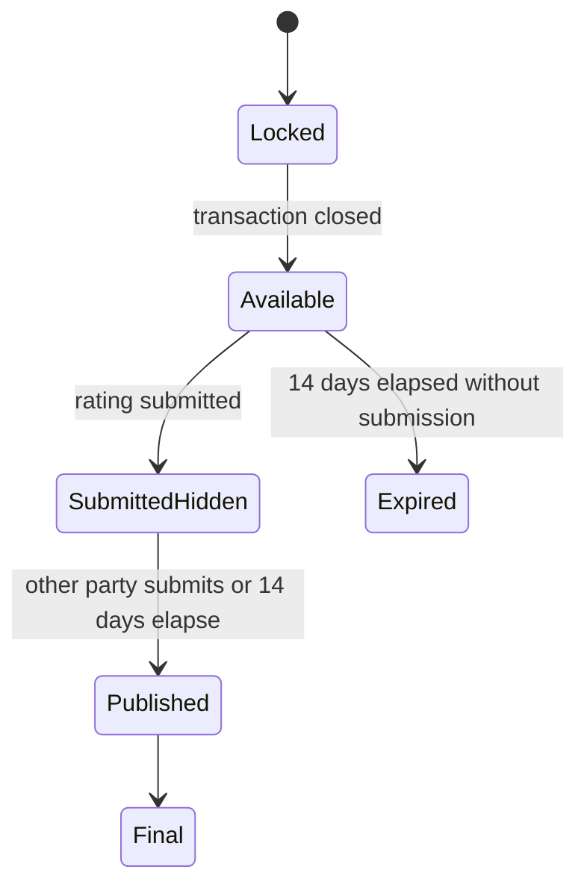

# Rating & Contextual Reputation Model

> **الحالة:** `ANALYZED_APPROVED`
>
> **القرارات المرجعية:** `RAT-Q01` + `RAT-VIS-Q01` — 2026-08-12.

## 1. هدف التقييم

التقييم في YADD آلية لبناء الثقة بين طرفي المعاملة بعد معاملة مكتملة ومغلقة بفاتورة معتمدة.

يستخدم تقييم مقدم الخدمة/المنتج لمساعدة المستفيد عند المقارنة والاختيار، بينما يستخدم تقييم المستفيد كمؤشر سمعة سياقي يساعد المقدم المؤهل على تقدير سجل التعامل مع صاحب الطلب.

## 2. القواعد العامة

- التقييم اختياري وليس إلزاميًا.
- لا يفتح التقييم إلا بعد إغلاق المعاملة بفاتورة نهائية معتمدة.
- لا يوجد تقييم للطلبات الملغاة أو المنتهية أو المعاملات غير المغلقة.
- فترة التقييم 14 يومًا من إغلاق المعاملة.
- التقييم متبادل ويعمل بنظام `Double-Blind` حتى يرسل الطرفان تقييميهما أو تنتهي فترة 14 يومًا.
- يمكن تعديل التقييم ما دام غير منشور؛ بعد النشر يصبح نهائيًا.
- يوجد تقييم واحد لكل طرف عن الطرف الآخر لكل معاملة مغلقة.

## 3. تقييم المستفيد لمقدم الخدمة/المنتج

عندما يقيّم المستفيد مقدم الخدمة أو المنتج:

- الدرجة من 1 إلى 5 نجوم.
- الدرجة مطلوبة إذا اختار المستفيد إرسال تقييم.
- يمكن إضافة تعليق نصي اختياري عن تجربة الخدمة/المنتج.
- التعليق يخضع لسياسة المحتوى والمراقبة في YADD.

> ظهور تعليقات تقييم مقدم الخدمة للعامة/للمستفيدين وتفاصيل واجهتها يمكن ضبطه ضمن تصميم السمعة وواجهات الاكتشاف، لكن القرار الحالي لا يلغي التعليق الاختياري على مقدم الخدمة.

## 4. تقييم مقدم الخدمة/المنتج للمستفيد — Approved

عندما يقيّم مقدم الخدمة أو المنتج المستفيد:

- يكون التقييم **بالنجوم فقط من 1 إلى 5**.
- لا توجد خانة تعليق نصي عن المستفيد.
- لا ينشئ النظام سجل تعليقات نصية تاريخية عن المستفيد.

الهدف هو توفير مؤشر مختصر عن تجربة التعامل، لا إنشاء ملف سمعة نصي دائم عن العميل.

## 5. ظهور سمعة المستفيد

سمعة المستفيد ليست عامة لكل مستخدمي YADD.

تظهر فقط لمقدم خدمة/منتج **مؤهل لرؤية طلب المستفيد** وفق قواعد النشاط والموقع والأهلية.

المعروض هو فقط:

- متوسط النجوم.
- عدد التقييمات.

مثال:

```text
أحمد — ⭐ 4.6 — 12 تقييمًا
```

ولا تعرض أي تعليقات نصية سابقة لأن تقييم المستفيد لا يحتوي تعليقات أصلًا.

إذا لم يحصل المستخدم على أي تقييم بعد، لا يعرض كـ `0/5`، وإنما مثلًا:

```text
مستخدم جديد — لا توجد تقييمات بعد
```

## 6. الخصوصية والتحكم في الوصول

- لا يعتبر تقييم المستفيد ملف سمعة عامًا.
- صلاحية رؤية متوسط تقييم المستفيد وعدد تقييماته تتبع صلاحية رؤية طلبه.
- لا يفترض استمرار رؤية بيانات سمعته بعد انتهاء/إغلاق الطلب إلا إذا كان هناك سياق آخر مصرح به.
- لا تعرض تعليقات نصية عن المستفيد ولا يحتفظ النظام بهذا النوع من التعليقات من تقييمات المقدمين.

## 7. دورة التقييم المفاهيمية



## 8. قواعد معتمدة

- `RAT-BR-01`: التقييم متاح فقط بعد معاملة مغلقة بفاتورة معتمدة.
- `RAT-BR-02`: التقييم اختياري ومتاح لمدة 14 يومًا.
- `RAT-BR-03`: التقييم Double-Blind حتى يرسل الطرفان أو تنتهي المهلة.
- `RAT-BR-04`: تقييم المستفيد لمقدم الخدمة/المنتج = 1–5 نجوم + تعليق اختياري.
- `RAT-BR-05`: تقييم مقدم الخدمة/المنتج للمستفيد = 1–5 نجوم فقط دون تعليق نصي.
- `RAT-BR-06`: يظهر للمقدم المؤهل عن المستفيد متوسط النجوم + عدد التقييمات فقط.
- `RAT-BR-07`: المستخدم غير المقيم يعرض كمستخدم جديد/لا توجد تقييمات، وليس 0/5.
- `RAT-BR-08`: لا تقييم لمعاملة ملغاة أو غير مكتملة.
