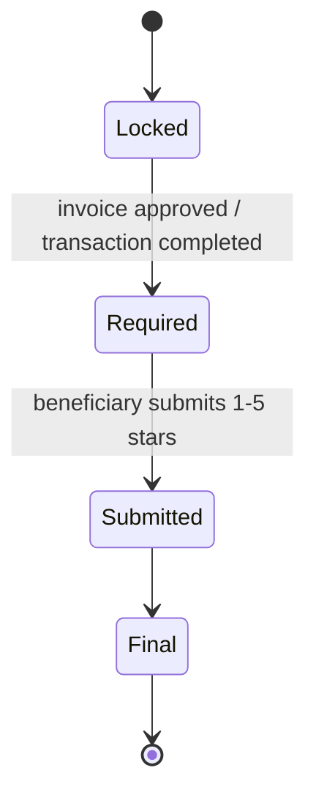

# Rating & Provider Reputation Model

> **الحالة:** `ANALYZED_APPROVED`
>
> **القرار المرجعي:** DEC-051/052 — تحديث 2026-08-26. هذا النموذج يستبدل نموذج التقييم المتبادل السابق.

## 1. الهدف

التقييم في YADD يبني سمعة مقدم الخدمة/المنتج من معاملات مكتملة فعليًا داخل المنصة. لا يستطيع مستخدم عشوائي تقييم مقدم لمجرد زيارة ملفه أو مراسلته.

## 2. أهلية التقييم

لا يفتح التقييم إلا عندما:

1. توجد Transaction بين المستفيد والمقدم.
2. أرسل المقدم الفاتورة النهائية.
3. اعتمد المستفيد الفاتورة وأصبحت المعاملة Completed.

لا تقييم لطلب مغلق قبل الاختيار، أو طلب Expired، أو معاملة ملغاة/غير مكتملة.

## 3. تقييم المستفيد للمقدم

بعد اعتماد الفاتورة:

- يصبح تقييم مقدم الخدمة/المنتج خطوة إلزامية على المستفيد.
- الدرجة 1–5 نجوم إلزامية.
- التعليق/الملاحظة النصية اختياري.
- التعليق يخضع لسياسة المحتوى والمراقبة.
- لا يعتبر التقييم دليلًا موضوعيًا على جودة العمل؛ هو تقييم صادر من مستفيد مرتبط بمعاملة مكتملة داخل YADD.

## 4. تقييم المستفيد

لا يوجد في النموذج الحالي تقييم مقابل للمستفيد من مقدم الخدمة/المنتج. لذلك ألغيت قواعد Double-Blind ومدة 14 يومًا وسمعة المستفيد المبنية على تقييم المقدمين.

## 5. عدد الأعمال المكتملة

يعرض ملف المقدم مؤشرًا لعدد الأعمال/المعاملات المكتملة داخل YADD.

- يحتسب من Transactions المكتملة فقط.
- لا يسمى «عدد العملاء».
- لا تحتسب المحادثات أو الاستجابات أو الطلبات الملغاة/المنتهية أو المعاملات غير المكتملة.

هذا مؤشر خبرة داخل YADD، وليس إثباتًا لكل خبرة المقدم خارج المنصة.

## 6. دورة التقييم

## 7. قواعد معتمدة

- `RAT-BR-01`: التقييم مرتبط بمعاملة مكتملة بفاتورة معتمدة.
- `RAT-BR-02`: تقييم المستفيد للمقدم إلزامي بعد اكتمال المعاملة.
- `RAT-BR-03`: النجوم 1–5 إلزامية والتعليق النصي اختياري.
- `RAT-BR-04`: لا يوجد تقييم للمستفيد من المقدم في النموذج الحالي.
- `RAT-BR-05`: لا Double-Blind ولا مهلة 14 يومًا في السياسة الحالية.
- `RAT-BR-06`: لا تقييم لمعاملة ملغاة أو غير مكتملة.
- `RAT-BR-07`: عدد الأعمال في ملف المقدم = عدد المعاملات المكتملة داخل YADD.
